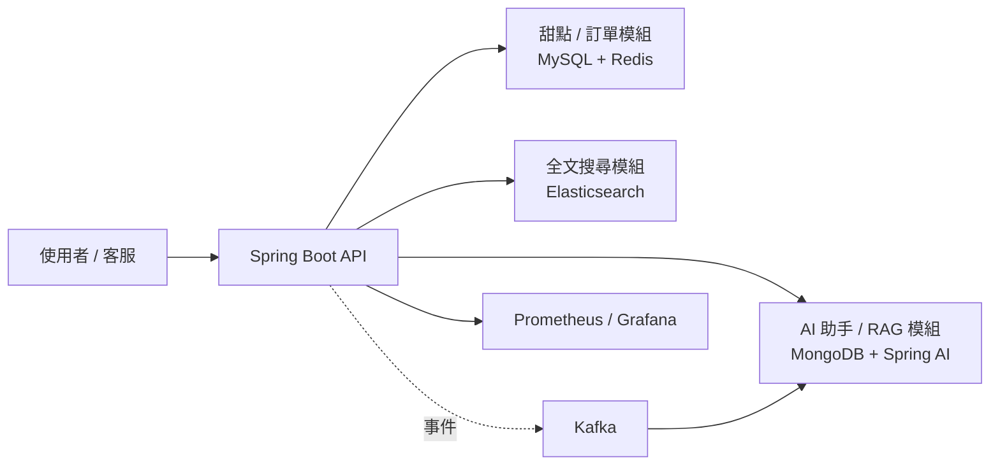

一個以 Spring Boot 打造的甜點訂購系統，整合 MySQL + Redis 的主流程交易資料，
搭配 MongoDB + Spring AI 的 RAG 智慧客服模組，並加入 Elasticsearch 全文搜尋、
Kafka 事件驅動、Spring Security JWT 角色權限控制，以及 Prometheus + Grafana 監控儀表板。
 # 甜點訂購系統（redis-dessert）
## 目錄

- [技術棧](#技術棧)
- [系統架構](#系統架構)
- [功能特色](#功能特色)
- [執行環境](#執行環境)
- [快速開始](#快速開始)
- [API 文件](#api-文件)
- [測試](#測試)
- [監控](#監控)
- [已知限制](#已知限制)

## 技術棧

| 類別 | 技術 |
|---|---|
| 框架 | Spring Boot 4.1.0 / Java 21 |
| 資料存取 | Spring Data JPA + Hibernate |
| 關聯式資料庫 | MySQL 8 |
| 快取 | Spring Data Redis |
| 文件資料庫 | MongoDB（同時作為向量庫） |
| 全文搜尋 | Elasticsearch 9.4.3 |
| AI / RAG | Spring AI 2.0.0（Google Gemini 2.5 Flash / embedding-001） |
| 身分驗證 | Spring Security + JWT（RBAC 三層角色） |
| 事件驅動 | Kafka 3.8.0（KRaft 模式） |
| 監控 | Actuator + Micrometer + Prometheus + Grafana |

## 系統架構



## 功能特色

**甜點 / 訂單模組**
- 甜點 CRUD、軟刪除、批次實體清除
- 單筆甜點 Redis 快取，含快取命中率指標
- 訂單建立、庫存原子扣減、訂單明細快照保存
- 甜點全文 / 模糊搜尋（Elasticsearch，MySQL 為唯一真實來源）

**AI / 智慧客服模組**
- RAG 知識匯入與語意檢索問答
- 關鍵字規則快速回答
- CSV 批次匯入甜點知識、FAQ、關鍵字規則

**身分驗證與權限控管**
- JWT 無狀態驗證，三層角色（`ADMIN` / `STAFF` / `USER`）
- URL 層級 + 方法層級雙重授權（defense in depth）

**事件驅動與監控**
- Kafka 訂單事件 / AI 問答事件，落地至 MongoDB 稽核軌跡
- Prometheus + Grafana 業務指標儀表板（訂單、庫存、AI 對話品質）

## 執行環境

`docker-compose.yml` 會啟動以下服務：

| 服務 | 用途 | 主機對外埠 |
|---|---|---|
| `mysql` | 甜點、訂單主資料 | 3306 |
| `redis` | 單筆甜點快取 | 6339 |
| `mongodb` | AI / 行為紀錄 + 向量庫 | 27017 |
| `elasticsearch` | 甜點全文搜尋索引 | 9200 |
| `elasticsearch-exporter` | Elasticsearch 指標匯出 | 9114 |
| `kafka` | 訂單事件 / AI 問答事件 | 9092 / 29092 |
| `kafka-ui` | Kafka 事件檢視 | 8081 |
| `prometheus` | 指標蒐集 | 9090 |
| `grafana` | 指標視覺化 | 3000 |
| `app` | Spring Boot API | 8080 |

## 快速開始

### 1. 準備環境變數

專案使用 Google Gemini 作為 AI 模型，執行前請先設定 API Key（依實際使用的變數名稱調整）：

```bash
export GOOGLE_API_KEY=your_api_key
```

### 2. 啟動所有服務

```bash
docker compose up -d
```

`app` 服務會等待 MySQL、Redis、MongoDB、Kafka、Elasticsearch 健康檢查通過後才啟動。

### 3. 確認服務狀態

```bash
docker compose ps
```

啟動完成後可透過以下位置存取：

| 項目 | 位址 |
|---|---|
| API | http://localhost:8080 |
| Kafka UI | http://localhost:8081 |
| Prometheus | http://localhost:9090 |
| Grafana | http://localhost:3000 |

### 4. 預設管理員帳號

應用程式首次啟動會自動建立預設 `ADMIN` 帳號，方便測試：

| 設定鍵 | 環境變數 | 預設值 |
|---|---|---|
| `app.admin-init.username` | `ADMIN_INIT_USERNAME` | `admin` |
| `app.admin-init.password` | `ADMIN_INIT_PASSWORD` | `admin123` |


## API 文件

專案內附 Postman Collection（含 RBAC 三環境切換測試）：

- Collection：`Redis Dessert API (RBAC v22) postman collection.json`
- Environment：`RBAC-Admin` / `RBAC-Staff` / `RBAC-User`
 


匯入 Postman 後切換對應 Environment 並執行登入請求，即可自動套用該角色的 token。

## 測試

```bash
# 執行單元測試（不需外部服務）
mvn test

# 執行整合測試（需先啟動 docker compose 依賴服務）
mvn test -Dgroups=integration
```

## 監控

- 系統指標（API 延遲、錯誤率、JVM 狀態）透過 `/actuator/prometheus` 暴露，由 Prometheus 定期蒐集
- 業務指標包含訂單金額、甜點庫存、AI 對話成功率等，於 Grafana 儀表板呈現


## 已知限制

- 目前無 refresh token / 登出黑名單機制
- 尚無帳號管理 API（改密碼、停用帳號）
- RAG 管理 API 相關的自動化測試尚未補上，僅靠 Postman 手動驗證

## 授權

（依實際情況填寫，例如 MIT License）
