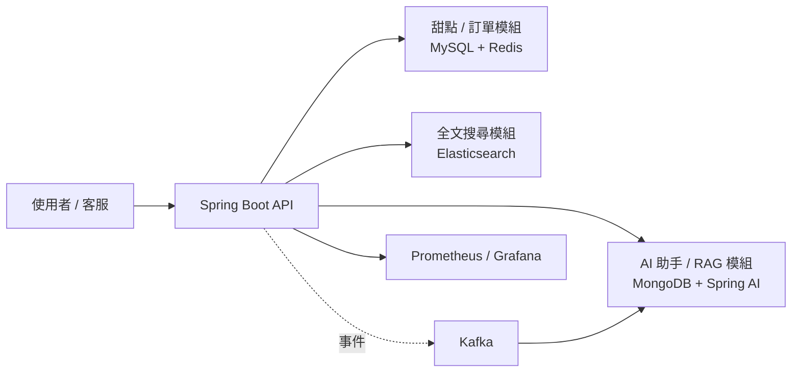

# 甜點訂購系統（redis-dessert）

一個以 Spring Boot 打造的甜點訂購系統，整合 MySQL + Redis 的主流程交易資料，
搭配 MongoDB + Spring AI 的 RAG 智慧客服模組，並加入 Elasticsearch 全文搜尋、
Kafka 事件驅動、Spring Security JWT 角色權限控制，以及 Prometheus + Grafana 監控儀表板。

## 目錄

- [技術棧](#技術棧)
- [系統架構](#系統架構)
- [功能特色](#功能特色)
- [執行環境](#執行環境)
- [主要資料流](#主要資料流)
- [模組結構](#模組結構)
- [甜點 / 訂單流程](#甜點--訂單流程)
- [AI 對話](#ai-對話)
- [API 文件](#api-文件)
- [監控](#監控)

## 技術棧

| 類別 | 技術 |
|---|---|
| 框架 | Spring Boot 4.1.0 / Java 21 |
| 資料存取 | Spring Data JPA + Hibernate |
| 關聯式資料庫 | MySQL 8 |
| 快取 | Spring Data Redis |
| 文件資料庫 | MongoDB（同時作為向量庫） |
| 全文搜尋 | Elasticsearch 9.4.3 |
| AI / RAG | Spring AI 2.0.0（Google Gemini 2.5 Flash / embedding-001） |
| 身分驗證 | Spring Security + JWT（RBAC 三層角色） |
| 事件驅動 | Kafka 3.8.0（KRaft 模式） |
| 監控 | Actuator + Micrometer + Prometheus + Grafana |

## 系統架構

## 功能特色

**甜點 / 訂單模組**
- 甜點 CRUD、軟刪除、批次實體清除
- 單筆甜點 Redis 快取，含快取命中率指標
- 訂單建立、庫存原子扣減、訂單明細快照保存
- 甜點全文 / 模糊搜尋（Elasticsearch，MySQL 為唯一真實來源）

**AI / 智慧客服模組**
- RAG 知識匯入與語意檢索問答
- 關鍵字規則快速回答
- CSV 批次匯入甜點知識、FAQ、關鍵字規則

**身分驗證與權限控管**
- JWT 無狀態驗證，三層角色（`ADMIN` / `STAFF` / `USER`）
- URL 層級 + 方法層級雙重授權（defense in depth）

**事件驅動與監控**
- Kafka 訂單事件 / AI 問答事件，落地至 MongoDB 稽核軌跡
- Prometheus + Grafana 業務指標儀表板（訂單、庫存、AI 對話品質）

## 執行環境

`docker-compose.yml` 會啟動以下服務：

| 服務 | 用途 | 主機對外埠 |
|---|---|---|
| `mysql` | 甜點、訂單主資料 | 3306 |
| `redis` | 單筆甜點快取 | 6339 |
| `mongodb` | AI / 行為紀錄 + 向量庫 | 27017 |
| `elasticsearch` | 甜點全文搜尋索引 | 9200 |
| `elasticsearch-exporter` | Elasticsearch 指標匯出 | 9114 |
| `kafka` | 訂單事件 / AI 問答事件 | 9092 / 29092 |
| `kafka-ui` | Kafka 事件檢視 | 8081 |
| `prometheus` | 指標蒐集 | 9090 |
| `grafana` | 指標視覺化 | 3000 |
| `app` | Spring Boot API | 8080 |

## 主要資料流

**甜點 / 訂單系統**

| API | 動作 | 實際寫入位置 |
|---|---|---|
| `POST /api/desserts` | 新增甜點 | MySQL `dessert` 表 |
| `POST /api/orders` | 建立訂單 | MySQL `orders` / `order_items`，交易提交後發布 Kafka `order-events`（`ORDER_CREATED`） |
| `DELETE /api/orders/{id}`、`DELETE /api/orders` | 軟刪除訂單 | MySQL `orders.deleted = true`，交易提交後發布 Kafka `order-events`（`ORDER_DELETED`） |
| `GET /api/desserts/search` | 甜點全文 / 模糊搜尋 | 讀取 Elasticsearch `dessert` index |
| `POST /api/admin/desserts/csv` | 批次匯入甜點菜單 | 解析 CSV 逐筆寫入 MySQL |

**AI / 數據日誌系統**

| API | 動作 | 實際寫入位置 |
|---|---|---|
| `POST /api/admin/rag/knowledge/*` | 匯入自由文字 / 結構化甜點知識 | 向量資料庫（VectorStore） |
| `POST /api/admin/rag/knowledge/csv/keyword-rules` | 上傳關鍵字規則 CSV | MySQL `keyword_rule` 表，成功後刷新記憶體快取 |
| `POST /api/ai/chat` | AI 對話 | 讀取 VectorStore / 關鍵字規則 → 寫入 MongoDB 對話紀錄 → 發布 `ai-qa-events` 到 Kafka |
| `GET /api/ai/chat?sessionId=...` | 查詢對話歷史 | MongoDB |
| `POST /api/desserts/{dessertId}/reviews` | 提交商品評論 | MongoDB `product_reviews`（寫入前驗證 MySQL 甜點存在且已上架） |

## 模組結構

| 套件 | 職責 |
|---|---|
| `com.gtalent.redis.dessert.controller` | 甜點與訂單 API |
| `com.gtalent.redis.dessert.service` | 甜點與訂單商業邏輯（`DessertService` / `OrderService` 及其實作） |
| `com.gtalent.redis.dessert.exception` | 全域例外處理（`GlobalExceptionHandler`） |
| `com.gtalent.redis.dessert.repository` | MySQL Repository |
| `com.gtalent.redis.dessert.model` | MySQL Entity |
| `com.gtalent.redis.dessert.search` | Elasticsearch 索引文件、Repository、索引同步 / 查詢 |
| `com.gtalent.redis.dessert.metrics` | 訂單 / 甜點業務指標（`BusinessMetrics`） |
| `com.gtalent.redis.dessert.dto` | 訂單請求 / 回應 DTO |
| `com.gtalent.redis.dessert.ai.*` | AI / RAG 相關子套件：`config`、`controller`、`metrics`、`message.keyword`、`message.chat`、`message.ingest`、`service`、`model`、`repository`、`dto`、`exception` |
| `com.gtalent.redis.dessert.config` | Kafka producer / topic 設定；`AdminAccountInitializer`（啟動時建立預設管理員帳號） |
| `com.gtalent.redis.dessert.event` | Kafka 事件、Producer / Consumer |
| `com.gtalent.redis.dessert.security` | RBAC 角色權限控制與 JWT 驗證，內含 `model`／`repository`／`dto`／`jwt`／`service`／`config`／`controller` 子套件 |

## 甜點 / 訂單流程

**甜點 API**

| Method | Path | 功能 |
|---|---|---|
| POST | `/api/desserts` | 新增甜點 |
| GET | `/api/desserts` | 查詢全部甜點 |
| GET | `/api/desserts/{id}` | 查詢單一甜點 |
| PUT | `/api/desserts/{id}` | 修改甜點（`name` 建立後唯讀） |
| DELETE | `/api/desserts/{id}` | 軟刪除單一甜點 |
| DELETE | `/api/desserts` | 批次軟刪除全部甜點 |
| POST | `/api/admin/desserts/csv` | 管理用：批次匯入甜點菜單 |
| DELETE | `/api/admin/desserts/{id}/purge` | 管理用：實體刪除單一甜點 |
| DELETE | `/api/admin/desserts/purge` | 管理用：批次實體刪除甜點（寬鬆模式，可選重置自增序號） |

**訂單 API**

| Method | Path | 功能 |
|---|---|---|
| GET | `/api/orders` | 查詢全部訂單（`ADMIN` / `STAFF` 專用） |
| GET | `/api/orders/{id}` | 查詢單一訂單 |
| GET | `/api/orders/my` | 查詢「我自己」的訂單清單，依登入者 `username` 過濾 |
| POST | `/api/orders` | 建立訂單 |
| DELETE | `/api/orders/{id}` | 軟刪除單一訂單 |
| DELETE | `/api/orders` | 批次軟刪除全部訂單 |
| DELETE | `/api/admin/orders/{id}/purge` | 管理用：實體刪除單一訂單及其明細 |

**建立訂單流程（`POST /api/orders`）**

1. **Bean Validation**：`customerName` 不可空、`phone` 需符合台灣手機格式、`items` 不可為空且每筆 `quantity >= 1`
2. **金額覆核**：後端重新從資料庫讀取單價，不信任前端金額；小計滿 2000 元免運，否則加收 60 元
3. **庫存扣減**：逐筆呼叫 `deductStock(...)`，由資料庫層原子 `UPDATE` 完成

整個流程包在 `@Transactional` 裡，任一步驟失敗會連同前面的扣庫存一併回滾。訂單與甜點皆採**軟刪除**策略，保留歷史資料供對帳與糾紛追查使用；管理端點才會真正實體刪除。

## AI 對話

`POST /api/ai/chat` 的處理流程：

1. 先用 `KeywordChatService` 比對關鍵字規則
2. 命中關鍵字規則時，把固定答案作為上下文，交由 LLM 整理語氣後回覆
3. 未命中則改走向量資料庫（VectorStore）相似度檢索
4. 檢索有命中，把知識內容塞進 prompt；沒命中則改用 fallback prompt，避免 AI 編造不存在的菜單資訊
5. 對話完成後，把問答紀錄、搜尋紀錄與操作日誌寫入 MongoDB，並發布 `ai-qa-events` 到 Kafka

| Method | Path | 功能 |
|---|---|---|
| POST | `/api/ai/chat` | 甜點 AI 顧問對話 |
| GET | `/api/ai/chat?sessionId=...` | 查詢某場對話的完整歷史 |

## API 文件

專案內附 Postman Collection（含 RBAC 三環境切換測試）：

- Collection：`Redis Dessert API (RBAC v22) postman collection.json`
- Environment：`RBAC-Admin` / `RBAC-Staff` / `RBAC-User`

匯入 Postman 後切換對應 Environment 並執行登入請求，即可自動套用該角色的 token。

## 監控

- 系統指標（API 延遲、錯誤率、JVM 狀態）透過 `/actuator/prometheus` 暴露，由 Prometheus 定期蒐集
- 業務指標包含訂單金額、甜點庫存、AI 對話成功率等，於 Grafana 儀表板呈現

## 授權

（依實際情況填寫，例如 MIT License）
