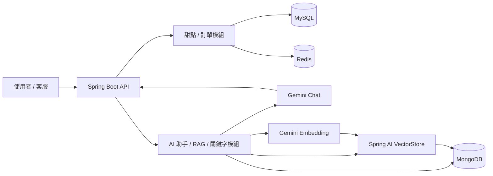
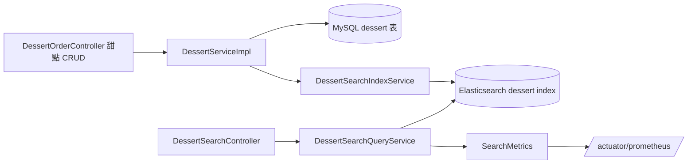

# 甜點訂購系統（redis-dessert）技術文件 v26

> **v26 異動（2026-07-24）**：建立正式的 Postman Collection 與 RBAC 三環境切換測試，
> 取代先前「暫不併入文件」的決議（見 v23 異動說明），並修正過程中發現的測試邏輯錯誤：
> 1. **正式產出 Postman Collection**：`Redis Dessert API (RBAC v22) postman collection.json`，
>    涵蓋 0. Auth、1. 甜點 API、2. 訂單 API、3. AI 對話 API、4. RAG 知識匯入管理 API（僅 ADMIN）、
>    5. 權限邊界驗證共 6 個資料夾，詳見新增的 10.4 節。
> 2. **正式產出三個 Postman Environment**：`RBAC-Admin`／`RBAC-Staff`／`RBAC-User`，
>    每個都只有 `base_url`（統一預設 `http://localhost:8080`）與 `token` 兩個變數；
>    切換 Environment 後重新執行對應角色的登入請求，folders 1～3 的請求即可自動
>    套用該角色的 token，不需要手動修改任何請求內容。
> 3. **統一 token 變數的使用規則（重要，修正先前混用造成的測試失真）**：
>    - Folders 1～3（甜點/訂單/AI 對話 API）：一律使用 **`{{token}}`**（Environment 變數），
>      隨目前作用中的 Environment 自動代表該角色的身分。
>    - Folder 0 的「建立 STAFF 帳號」、Folder 4（RAG 管理 API）、Folder 5（權限邊界驗證）：
>      一律使用 **`{{admin_token}}`／`{{staff_token}}`／`{{user_token}}`**（Collection 變數），
>      固定代表特定角色，不受目前作用中的 Environment 影響。
>    - 修正前的問題：同一份 Collection 內兩種變數混用（例如某些請求寫死
>      `{{admin_token}}`，某些寫 `{{token}}`），導致切換 Environment 登入不同角色後，
>      仍有請求引用到殘留的舊 token，出現「USER 登入後仍能打通 ADMIN 專屬 API」的
>      假性測試通過，並非後端 RBAC 有漏洞，而是 Postman 測試腳本本身的變數管理問題。
> 4. **登入請求測試腳本統一**：三支登入請求（USER／ADMIN／STAFF）改用同一份腳本，
>    每次登入成功時**同時**寫入兩種變數：
>    ```javascript
>    pm.environment.set('token', json.token);           // 供 Environment 驅動的請求使用
>    if (json.role === 'ADMIN') {
>        pm.collectionVariables.set('admin_token', json.token);
>    } else if (json.role === 'STAFF') {
>        pm.collectionVariables.set('staff_token', json.token);
>    } else {
>        pm.collectionVariables.set('user_token', json.token);
>    }
>    ```
>    避免之前「只更新其中一種變數」導致另一種變數殘留舊值的問題。
> 5. **修正測試腳本裡的預期狀態碼與允許角色，使其與後端實際行為一致**：
>    - `DELETE /api/orders/{id}`、`DELETE /api/orders`：修正前誤判 `STAFF` 也會通過（200），
>      實際上依 13.4 節規則這兩支僅 `ADMIN` 可用，`STAFF` 應回 `403`，已修正。
>    - 刪除類端點（軟刪除、purge）成功狀態碼統一修正為 `204 No Content`
>      （原本多處誤寫成 `200`）；新增類端點（新增甜點、建立訂單、提交評論）
>      成功狀態碼修正為 `201 Created`。
>    - `GET /api/desserts/search`（甜點搜尋）原本測試腳本設定為「公開」，
>      但依 13.4 節規則其實落在 `anyRequest().authenticated()` 保底規則內，需要登入，
>      已修正為需要 `Bearer {{token}}` 且三種角色皆可通過（未登入應回 401）。
>    - 「管理用實體清除全部甜點」原本的請求網址跟「管理用實體清除單一甜點」重複
>      （誤用同一個 URL），已修正為 v25 新增的批次刪除端點
>      `DELETE /api/admin/desserts/purge`（body 帶 id 陣列），成功狀態碼為 `200`。
> 6. **新增 3 筆權限邊界測試**（Folder 5）：未帶 token 呼叫甜點搜尋（預期 401）、
>    `STAFF` 呼叫 RAG 知識匯入管理 API（預期 403）、`USER` 呼叫實體清除甜點 purge
>    （預期 403），涵蓋原本沒測到的邊界情境。
> 對應調整章節：新增 10.4 節；10.1、10.3 節補充 Postman Collection/Environment 的實際檔名與版本對應。

> **v25 異動（2026-07-24）**：新增甜點批次實體刪除 API，並補齊訂單與登入使用者的關聯：
> 1. **新增甜點批次實體刪除（寬鬆模式）**：`DELETE /api/admin/desserts/purge`（`ADMIN` 專用），
>    body 傳入 `List<Long>` id 陣列，逐一嘗試刪除；找不到對應甜點的 id 會被記錄到
>    `failed` 清單並跳過，不影響其他 id 的刪除（全批不因單筆失敗而整批拒絕，
>    與 4.5 節既有的單筆 `purge(Long id)`「找不到就整批拒絕」不同，這裡刻意採寬鬆模式，
>    對齊 `DessertCsvImportService` 的「單列失敗不影響其他列」風格）。成功刪除的品項會
>    清除對應 Redis 快取、統一從 Elasticsearch 索引批次移除。`DessertService` 新增
>    `purgeAll(List<Long> ids, boolean resetSequence)` 方法；`resetSequence`
>    （query 參數，預設 `false`）為 `true` 時會在刪除完成後呼叫既有的
>    `DessertRepository.resetAutoIncrement()`，把 `dessert` 表的 `AUTO_INCREMENT`
>    重置為 1，讓下一筆新增甜點的 id 從 1 開始。⚠️ **僅建議在確定資料庫沒有任何歷史
>    訂單快照引用這批 id 時使用**：`OrderItem.dessertId` 只是快照、無外鍵約束，
>    若重置後新增的甜點 id 剛好撞上舊訂單快照引用過的 id，會造成「查歷史訂單看到的
>    品項名稱跟現在同 id 的甜點對不上」的資料混淆，見 4.5、4.6 節說明。
> 2. **訂單新增 `username` 欄位，記錄下單者身分**：`Order` model 新增
>    `username`（對應 `users.username`），與既有的 `customerName`／`phone`（收件人資訊，
>    可能是代訂給別人）刻意分開存放。`OrderServiceImpl.createOrder()` 從
>    `SecurityContextHolder` 取得目前登入者帳號寫入此欄位，不接受前端傳入，
>    避免被竄改。⚠️ **已知限制**：此欄位只對「v25 之後新建立」的訂單有值，
>    在此之前建立的歷史訂單 `username` 為 `null`，不會出現在任何使用者的
>    「查詢我自己的訂單」結果中，詳見 4.3、4.8 節。
> 3. **新增 `GET /api/orders/my`（查詢我自己的訂單）**：解決 v22～v24 版本
>    13.7 節記錄的已知限制「`USER` 角色的顧客建立訂單後無法透過 API 查詢自己的
>    歷史訂單」。`OrderService` 新增 `findMyOrders(String username)`，
>    `username` 一律由 Controller 從 `Authentication` 取得（JWT 解出的登入者身分），
>    不接受查詢參數傳入，避免查到別人的訂單。**SecurityConfig 新增規則時務必注意順序**：
>    `GET /api/orders/my` 必須放在既有的 `GET /api/orders`、`/api/orders/*`
>    （`hasAnyRole("ADMIN", "STAFF")`）規則**之前**，否則萬用字元 `/api/orders/*`
>    會先比對到、導致一般 `USER` 打這支新端點還是被擋成 403，詳見 13.4 節。
> 對應調整章節：3.2、4.1、4.2、4.5、4.6、4.8、9、10.1、10.2、10.3、13.4、13.7。

> **v24 異動（2026-07-23）**：校對第 10 章「API 測試手冊」，修正兩處尚未同步 v22 RBAC
> 異動的殘留舊敘述：
> 1. **10.2 節 `purge` 端點說明**：原文仍寫著「兩者目前未加權限保護」「甜點實體清除也不會
>    同步清除 Redis 快取」，這是 v19（快取清除）與 v22（權限保護）異動前的舊描述，
>    與 10.1 節表格、13.4 節規則不一致。已更正為：`purge` 端點 v22 起受 URL 層級
>    `hasRole("ADMIN")` ＋方法層級 `@PreAuthorize("hasRole('ADMIN')")` 雙重保護，
>    甜點實體清除自 v19 起已同步清除 Redis 快取與 Elasticsearch 索引。
> 2. **10.3 節「建議測試順序」步驟 7**：原本只驗證 `STAFF` 不可刪訂單，未涵蓋
>    `STAFF` 對 `purge` 端點的權限邊界。已補上「用 `STAFF` token 呼叫兩支
>    `purge` 端點應回傳 `403`」的驗證步驟，讓測試順序完整覆蓋 13.4 節的授權矩陣。
> 3. **10.1 節改用 Postman Environment 變數 `{{base_url}}`**：實際測試流程已改成先在
>    Postman 設定 Environment（`base_url = http://localhost:8080`），Collection 內請求
>    URL 統一寫成 `{{base_url}}/api/...`，不再寫死 `http://localhost:8080`。已將 10.1 節
>    「API 一覽表」共 26 處 URL 全數改為 `{{base_url}}` 形式，並在 10.1 節開頭補充
>    Environment 設定步驟說明；10.2 節 CSV 匯入範例中的 `curl` 指令維持
>    `http://localhost:8080`（命令列不會讀取 Postman Environment，保留可直接執行的實網址）。
> 對應調整章節：10.1、10.2、10.3。
>
> （本次未新增獨立章節或 Postman Collection 檔案，理由同 v23 說明：內容與既有
> 10.1～10.3、13.4、13.6 節高度重複，避免文件重複維護。）

> **v23 異動（2026-07-23）**：微調第 10 章「API 測試手冊」的 10.3 節「建議測試順序」，
> 步驟 7 補上一句「若也建立了 `STAFF` 帳號，建議額外驗證其 token 呼叫 `DELETE /api/orders/1`
> 應回傳 `403`」，讓權限驗證步驟涵蓋三種角色（原本只提到 `user_token`）。
> 對應調整章節：10.3。
>
> （曾短暫規劃新增獨立的 10.0／10.4 節與對應的 Postman Collection JSON 檔案，
> 內容與既有 10.1～10.3、13.4、13.6 節高度重複，考量文件精簡與可維護性，
> 最終未併入本文件，改以口頭/附件方式提供。）

> **v22 異動（2026-07-23）**：新增 RBAC 角色權限控制（Spring Security + JWT，無狀態驗證）：
> 1. **新增 `com.gtalent.redis.dessert.security` 套件**：三層角色 `ADMIN`／`STAFF`／`USER`
>    （`security.model.Role`）、`User` Entity（`security.model.User`，對應 MySQL `users` table）、
>    註冊／登入 DTO、`JwtTokenProvider`／`JwtAuthenticationFilter`（jjwt 0.12.x API）、
>    `CustomUserDetailsService`／`CustomUserPrincipal`、`AuthService`、`SecurityConfig`、
>    自訂 401/403 handler（`RestAuthenticationEntryPoint`／`RestAccessDeniedHandler`）、
>    `AuthController`（`/api/auth/register`、`/api/auth/login`、`/api/auth/admin/create-staff`）。
>    詳見新增的第 13 章。
> 2. **新增 `AdminAccountInitializer`**（`com.gtalent.redis.dessert.config`）：應用程式啟動時，
>    若尚無任何帳號使用預設管理員帳號名稱，自動建立一組預設 `ADMIN` 帳號（帳密可用
>    `ADMIN_INIT_USERNAME`／`ADMIN_INIT_PASSWORD` 環境變數覆寫），解決「沒有 ADMIN 就無法建立
>    第一個 ADMIN」的雞生蛋問題。
> 3. **URL 層級 + 方法層級雙重授權**（defense in depth）：`SecurityConfig.authorizeHttpRequests(...)`
>    涵蓋大部分路徑規則；`DessertOrderController` 的 `purgeDessert()`／`purgeOrder()`／
>    `deleteOrder()`／`deleteAllOrders()` 額外疊加 `@PreAuthorize("hasRole('ADMIN')")` 作第二道防線。
>    這連帶完成了第 9 節（舊版）第 1、2 項待辦（RAG 管理 API 權限保護、`purgeDessert`／`purgeOrder`
>    管理員權限檢查），因為兩者都落在 `/api/admin/**` 這條 `hasRole("ADMIN")` 規則涵蓋範圍內。
> 4. **`GlobalExceptionHandler` 補上 `AccessDeniedException` 處理**：方法層級 `@PreAuthorize` 拋出的
>    `AccessDeniedException`，實測發現會先被 `GlobalExceptionHandler` 既有的 `Exception.class`
>    保底規則攔截、回傳「系統發生未預期錯誤」（本質上是 500），而不是走 Spring Security 的
>    `RestAccessDeniedHandler`（403）。原因是 `@PreAuthorize` 檢查發生在 `DispatcherServlet`
>    呼叫 Controller 方法「當下」，位置比 URL 層級的 `AuthorizationFilter` 更晚、但比
>    `@ControllerAdvice` 攔截點更早冒出，因此需要在 `GlobalExceptionHandler` 額外補上
>    `@ExceptionHandler(AccessDeniedException.class)`，才能讓方法層級跟 URL 層級的權限不足
>    回應格式一致（皆為 `403` + `{success:false, message:"權限不足，無法執行此操作"}`）。
>    詳見 13.6 節。
> 5. **`pom.xml`／`application.yml`**：新增 `spring-boot-starter-security`、
>    `jjwt-api`／`jjwt-impl`／`jjwt-jackson` 0.12.6 三個依賴；新增 `app.jwt.secret`／
>    `app.jwt.expiration-ms`（皆支援環境變數覆寫）、`app.admin-init.username`／
>    `app.admin-init.password`。
> 對應調整章節：1.1、2.1、9、10.1、10.2、10.3，新增第 13 章
> （13.1～13.6：角色設計、套件結構、JWT 流程、URL／方法層級授權規則、預設管理員帳號、
> 除錯紀錄），新增 `com.gtalent.redis.dessert.security` 套件與 3.4 節 `User` Entity。

> **v21 異動（2026-07-22）**：移除甜點搜尋管理端點 `POST /api/admin/search/reindex`
> （全量重建 Elasticsearch 索引），對應的 Controller 方法與 `DessertSearchIndexService`
> 全量重建索引邏輯已一併移除。目前 Elasticsearch 索引僅能透過 `DessertServiceImpl` 的
> `create()`／`update()`／`delete()`／`deleteAll()` 在對應 MySQL 異動當下同步寫入/更新/移除，
> 沒有額外的「手動全量重建」入口；若日後懷疑索引跟 MySQL 不同步，需另外評估補上的方式
> （例如重新設計成透過 Kafka 事件驅動的非同步重建，而非原本同步阻塞的做法）。
> 對應調整章節：1.2、8、9、10.1、10.2、10.3、11.2、11.4、11.6。

> **v20 稽核更新（2026-07-22）**：完成死碼與建置警告檢查：
> - 移除誤放在 `src/main/resources`、不會被 Maven 測試編譯的 `RedisDessertApplicationTests.java`，
>   並將整合測試恢復至 `src/test/java/...`，加上 `@Tag("integration")`，使 `mvn test` 的排除規則與文件一致。
> - Kafka producer 與 `application.yml` 的 value serializer 改用 Spring Kafka 4.1 建議的
>   `JacksonJsonSerializer`，消除 `JsonSerializer` deprecated warning。
> - `mvn test` 驗證結果：10 tests、0 failures、0 errors；一般測試不需要外部服務。

> **v19 異動（2026-07-22）**：依「建議後續工作」（第 9 節）清單，處理其中 5 項容易改善、
> 影響面明確的項目，其餘項目維持記錄、尚未處理（詳見第 9 節最新版本）：
> 1. **新增全域 `@RestControllerAdvice`**（`com.gtalent.redis.dessert.exception.GlobalExceptionHandler`）：
>    把原本寫在 `DessertOrderController` 裡的 `InsufficientStockException`／`DuplicateNameException`／
>    `EntityNotFoundException` 三個 `@ExceptionHandler` 集中搬過去，並補上兩個原本遺漏的處理：
>    - `ReadOnlyFieldException`（甜點名稱唯讀檢查失敗，見 3.1、4.5 節）：**這是一項行為修正，不只是搬程式碼**。
>      原本這個例外拋出後沒有任何 Controller 攔截，實際會回傳 Spring Boot 預設的 `500 Internal Server Error`，
>      跟文件原本記載的「會回傳 `400 Bad Request`」不一致；現在補上處理後，行為才真的符合文件描述。
>    - `MethodArgumentNotValidException`（`@Valid` 驗證失敗）：改成統一的 `{success:false, message}` 格式，
>      取代原本 Spring Boot 預設的巢狀 `errors` 陣列格式，對應第 8 節取捨第 2 項。
>    - `DessertAiChatController`（`/api/ai/chat`）目前仍維持自己的 try/catch，未改用全域處理器
>      （見該類別頂端註解），因為 AI 對話失敗時需要回不同結構的資料，跟這裡單純的錯誤訊息不完全對等。
> 2. **移除 `DessertRepository.existsByName(String)` 死碼**：確認全專案已無任何呼叫端使用後刪除，
>    只保留實際在用的 `existsByNameAndDeletedFalse(...)`，對應第 9 節（舊版）第 3 項。
> 3. **`purgeDessert()` 補上清快取／清索引**：`DessertService` 新增 `purge(Long id)` 方法，
>    把「刪除資料列 + 清 Redis 快取（`dessert:item:{id}`）+ 移除 Elasticsearch 索引」三件事收斂到
>    Service 層；`DessertOrderController.purgeDessert()` 改成呼叫這個方法，取代原本直接呼叫
>    `dessertRepository.deleteById()`（不清快取）的寫法。對應第 9 節（舊版）第 6 項的前半段
>    （管理員權限檢查那部分**尚未處理**，仍是待辦，見最新版第 9 節）。已補上對應單元測試
>    （`DessertServiceImplTest.purge_shouldDeleteEvictCacheAndRemoveFromSearchIndex_whenSuccess`／
>    `purge_shouldThrowEntityNotFoundException_whenDessertNotExists`）。
> 4. **`BusinessMetrics.recordProductSold(...)` 移除死參數 `amount`**：v16 移除 `dessert_sales_amount`
>    指標後，這個參數就已經不再被讀取；這次把參數從方法簽章、呼叫端（`OrderServiceImpl.recordOrderMetrics()`）
>    與既有單元測試（`OrderServiceImplTest`）中一併拿掉，對應第 9 節（舊版）第 15 項。
> 5. **Redis 快取命中率接上 Micrometer**：`BusinessMetrics` 新增 `dessert_cache_access_total{result}`
>    Counter（`result` tag 為 `hit` 或 `miss`），`DessertServiceImpl.getById()` 在原本只有
>    `log.debug("Cache hit/miss")` 的地方分別呼叫 `recordCacheHit()` / `recordCacheMiss()`，
>    對應第 9 節（舊版）第 8 項。Grafana PromQL 範例：
>    `sum(rate(dessert_cache_access_total{result="hit"}[5m])) / sum(rate(dessert_cache_access_total[5m]))`。
> 6. **CSV 知識庫補上「免運門檻」FAQ 條目**：`faq.csv` 新增一筆屬於「訂購流程」分類、
>    金額與 `keyword-rules.csv`／`OrderServiceImpl.FREE_SHIPPING_THRESHOLD` 一致（2000 元）的獨立條目，
>    對應第 9 節（舊版）第 5 項。
>
> 對應調整章節：3.1、4.5、4.6、8.1、9、12.1，新增 `com.gtalent.redis.dessert.exception` 套件。
> **尚未處理**（維持在第 9 節「建議後續工作」）：RAG 管理 API 權限保護、`purgeDessert`／`purgeOrder`
> 管理員權限檢查、更完整的 DB 交易回滾測試／Controller 格式測試、Kafka exporter、Elasticsearch
> 叢集化、增量索引重建、`softDeleteAll` 事件設計、Alertmanager 告警規則、AI 失敗原因分類。

> 本文件依目前原始碼與設定檔整理，描述「現在實際怎麼運作」，不是設計草案。
> 範圍涵蓋 MySQL + Redis 的甜點 / 訂單主流程，以及 MongoDB + Spring AI 的 RAG、關鍵字回答與行為紀錄模組。

> **v18 異動（2026-07-22）**：依需求從 `AiMetrics` 拿掉三個指標，並新增「Micrometer 指標類型
> 與 Prometheus 匯出後綴」對照表：
> 1. **移除的指標**（皆為 AI Assistant Dashboard 底下、跟關鍵字/RAG 檢索次數相關的計數）：
>    - `keyword_match_total`（關鍵字命中次數）：`AiMetrics.recordKeywordMatch()` 方法本體整個刪除；
>      呼叫端 `AiChatService.resolveHits()` 原本在關鍵字命中分支呼叫這個方法的那一行同步拿掉。
>      關鍵字命中率這個面板需求目前沒有替代指標，若之後仍需要，建議另外評估怎麼設計。
>    - `rag_search_total`（RAG 查詢次數）：`AiMetrics.recordVectorSearch(...)` 內不再呼叫
>      `meterRegistry.counter(RAG_SEARCH_TOTAL).increment()`。
>    - `vector_search_result_count`（向量搜尋命中筆數，DistributionSummary）：`recordVectorSearch(...)`
>      內不再呼叫 `meterRegistry.summary(VECTOR_SEARCH_RESULT_COUNT).record(hits.size())`。
>    - `keyword_fallback_total`（= Gemini 呼叫次數）、`vector_search_duration_seconds`、
>      `vector_similarity_score` **維持不動**，`recordVectorSearch(...)` 仍會計時並記錄相似度分數，
>      只是不再記錄「這次查詢命中幾筆」與「這次是不是走 RAG 查詢路徑」。
> 2. **新增「Micrometer 指標類型 → Prometheus 匯出後綴」對照表**（詳見 12.4 節）：
>    釐清 Counter／Timer／DistributionSummary／Gauge 這四種 Micrometer 型別，在
>    `/actuator/prometheus` 實際曝露時，metric 名稱會不會被自動加上 `_total`／`_count`／
>    `_sum`／`_max` 等後綴，避免日後查 Prometheus 或寫 Grafana PromQL 時找不到對應名稱。
> 對應調整章節：12.2、12.3、12.4，新增 12.4 節。

> **v17 異動（2026-07-22）**：清除 v16 記錄的死設定 `app.metrics.dessert.low-stock-threshold`：
> - `application.yml` 已移除 `app.metrics.dessert.low-stock-threshold` 設定鍵（連同其父層
>   `app.metrics.dessert` 一起刪除，因為底下只有這一個鍵）。`app:` 這一層目前只剩
>   `app.rag.*` 相關設定。
> - 核對過 `docker-compose.yml` 的 `app` 服務 `environment` 區塊，**原本就沒有**
>   `APP_METRICS_DESSERT_LOW_STOCK_THRESHOLD` 這個環境變數，因此不需要異動
>   `docker-compose.yml`。
> - 清除後對執行行為沒有任何影響：`BusinessMetrics.java` 自 v16 起已經沒有任何欄位讀取
>   這個設定鍵，此次純粹是移除文件已知的死設定，收斂 6.6、9 節的技術債紀錄。
> 對應調整章節：6.6、9。

> **v16 異動（2026-07-22）**：依需求拿掉 `BusinessMetrics` 的四個業務指標，並確認 `AiMetrics` 目前無明顯程式碼層級問題：
> 1. **移除的指標**：
>    - `order_average_amount`（平均客單價，DistributionSummary）：`recordOrderCreated()` 不再呼叫
>      `meterRegistry.summary(...)`，只保留 `order_new_total`（訂單數）與 `order_amount_total`（營業額）兩個 Counter。
>    - `dessert_low_stock_total`（低庫存警示）：`updateInventory()` 不再做庫存門檻判斷；`dessert_inventory` Gauge
>      本身保留不受影響。連帶讓 `app.metrics.dessert.low-stock-threshold`
>      （環境變數 `APP_METRICS_DESSERT_LOW_STOCK_THRESHOLD`）**變成死設定**——`BusinessMetrics` 已無任何欄位讀取它，
>      `application.yml` 若仍保留這個設定鍵，目前不會被任何程式碼消費，建議之後一併清除（見 6.6、8 節）。
>    - `dessert_sales_amount`（高營收甜點排行，依 dessertId/dessertName 分組的金額 Counter）：
>      `recordProductSold(...)` 不再累加這個 Counter。**方法簽章刻意沒有拿掉 `amount` 這個參數**，
>      因為呼叫端 `OrderServiceImpl.recordOrderMetrics()` 與 `OrderServiceImplTest` 都是用 4 個參數呼叫／驗證，
>      拿掉參數會連帶牽動呼叫端與既有測試；目前 `amount` 參數會被正常傳入，但方法內部不再用它記錄任何指標，
>      屬於刻意保留、暫不使用的參數（見 12.1 節已知限制）。
>    - `dessert_order_cancel_total`（訂單取消次數）：這個指標在更早之前就已經是空殼方法（`recordOrderCancelled(int count)`
>      內部沒有實際記錄任何 Counter），且 `OrderServiceImpl` 從未呼叫過這個方法。這次直接把整個空殼方法刪除，
>      不影響任何既有行為（純粹清除死碼）。
> 2. **`AiMetrics` 檢查結果**：針對「`ai_chat_total`／`ai_chat_success_total`／`keyword_fallback_total`／`rag_search_total`
>    這幾個指標每次觀察都只顯示 1」的疑問，比對 `AiChatService.chat()` 與 `AiMetrics` 的程式碼後，
>    目前**沒有發現會導致指標卡在 1 的程式碼層級問題**：`chat()` 每次被呼叫都會執行
>    `recordChatStarted()`／`recordKeywordMatch()` 或 `recordKeywordFallback()`／`recordVectorSearch()`，
>    這幾個方法都是透過 `meterRegistry.counter(NAME).increment()` 依 metric 名稱取得同一個 Counter 再累加，
>    邏輯上應該會隨呼叫次數正確累加。比較可能的原因是**環境操作面**，而非程式碼 bug：
>    - Micrometer 的 Counter 只存在應用程式記憶體內，**沒有做任何持久化**；只要 `app` 容器重啟
>      （例如每次測試前都重新 `docker compose up`／重新部署），計數就會歸零，看到的永遠是「這次啟動後第一次呼叫」的數字。
>    - 只實際呼叫過一次 `POST /api/ai/chat`，就去查 `/actuator/prometheus`，自然只會看到 1。
>    這一項屬於「觀察到的現象 vs. 程式碼審查結果」的落差記錄，若之後重現「多次呼叫、應用程式沒有重啟，
>    指標仍然卡在 1」的情境，需要另外附上重現步驟或 Prometheus 原始輸出才能進一步排查（例如檢查
>    Prometheus scrape 間隔、Micrometer 是否有多個 `MeterRegistry` bean 實例的問題）。
> 對應調整章節：6.6、9、12.1。

> **v15 核對更新（2026-07-21）**：依目前 `src/main`、`pom.xml`、`application.yml` 與
> `docker-compose.yml` 重新核對文件，修正 Elasticsearch 版本、Compose 服務數量，補上
> `POST /api/admin/desserts/csv` 菜單匯入 API，並註明 `dessert-settings.json` 目前只是資源檔，
> 尚未由程式自動套用到 Elasticsearch index。

> **v14 異動**：`BusinessMetrics` 新增 `dessert_sales_amount{dessertId,dessertName}`，
> 用來找出「高營收商品」而不只是「熱門（銷量高）商品」——`dessert_order_total` 統計的是
> 銷售**數量**，`dessert_sales_amount` 統計的是銷售**金額**，兩者排名不一定相同（例如
> 單價高但銷量少的品項，可能在數量排行墊底、但在金額排行名列前茅）。
> - `recordProductSold(...)` 方法簽章新增第 4 個參數 `BigDecimal amount`（這筆訂單品項的
>   小計金額），同一次呼叫內同時累加 `dessert_order_total`（數量）與 `dessert_sales_amount`
>   （金額）兩個 Counter，避免兩個 tag 相同的指標要分別呼叫兩次、日後容易漏改其中一邊。
> - 呼叫端 `OrderServiceImpl.recordOrderMetrics(...)` 同步補上 `orderItem.getLineTotal()`
>   當作第 4 個參數；`OrderServiceImplTest` 的對應 `verify(...)` 也同步補上第 4 個參數。
> 對應調整章節：12.1。

> **v13 異動**：新增兩組 Grafana Dashboard 對應的 Prometheus 業務指標（`BusinessMetrics` 擴充 +
> 新增 `AiMetrics`），並調整既有指標命名以避免同名衝突：
> 1. **命名調整（Breaking Change，僅限 metric 名稱，不影響業務邏輯）**：
>    - 原本「訂單建立次數」`dessert_order_total`（無 tag）→ 改名為 `order_created_total`。
>    - 原本依商品分組的銷售量 `dessert_product_total`（tag：`dessert_id`/`dessert_name`）
>      → 改名為 `dessert_order_total`（tag 同步改為 `dessertId`/`dessertName`），
>      讓「熱門甜點 Top 10」沿用這個名稱。這是為了配合新版 Grafana 面板規劃，
>      避免同一個 metric 名稱同時被「無 tag 總數」與「依商品分組計數」兩種語意搶用
>      （Prometheus 不允許同名 metric 的型別/語意不一致）。若既有 Grafana 面板或告警規則
>      有直接寫死這兩個舊名稱，需要一併更新查詢語法。
> 2. **`BusinessMetrics` 新增（Dessert Business Dashboard）**：`order_amount_total`（訂單總金額累加）、
>    `order_average_amount`（DistributionSummary，平均客單價）、`dessert_inventory`（Gauge，即時庫存，
>    tag：`dessertId`/`dessertName`）、`dessert_low_stock_total`（低庫存警示計數，門檻由
>    `app.metrics.dessert.low-stock-threshold` 設定，預設 10）。掛勾點：`OrderServiceImpl.createOrder()`
>    （金額類指標）、`DessertServiceImpl` 的 `create()`/`update()`/`deductStock()`（庫存類指標）。
> 3. **新增 `com.gtalent.redis.dessert.ai.metrics.AiMetrics`（AI Assistant Dashboard）**：
>    `ai_chat_total`／`ai_chat_success_total`／`ai_chat_duration_seconds`（AI 對話使用量/成功率/延遲）、
>    `keyword_match_total`／`keyword_fallback_total`（關鍵字命中率，`keyword_fallback_total`
>    同時代表 Gemini 呼叫次數）、`ai_total_tokens`（token 用量，改用 `chatResponse()` 取得
>    `Usage.getTotalTokens()`，原本只呼叫 `.content()` 沒有讀取 usage）、`rag_search_total`／
>    `vector_search_duration_seconds`／`vector_search_result_count`／`vector_similarity_score`
>    （RAG 向量檢索次數/延遲/命中數/相似度，相似度來自 `Document.getScore()`）。掛勾點：
>    `AiChatService.chat()`／`resolveHits()`／`safeSimilaritySearch()`／`callLlm()`。
> 4. `application.yml` 新增 `app.metrics.dessert.low-stock-threshold`
>    （環境變數 `APP_METRICS_DESSERT_LOW_STOCK_THRESHOLD`，預設 `10`）。
> 5. 已知限制：`dessert_inventory` Gauge 在甜點被軟刪除後不會被移除，會停留在刪除前的最後一次數值；
>    `deductStock()` 因為原子 UPDATE 不會回傳最新庫存，為了更新 Gauge 多了一次額外查詢
>    （只為了指標正確性，不影響扣庫存本身的交易/回滾邏輯）。
> 對應調整章節：1、2、6、9，新增第 12 章「業務指標與 Grafana Dashboard」。


> **v6 異動**：`PUT /api/desserts/{id}` 新增 `name` 欄位唯讀檢查——建立（`POST`）後不可再修改甜點名稱，
> 傳入不同值會拋出 `ReadOnlyFieldException`，由 Controller 攔截回傳 `400 Bad Request`。
> 對應調整章節：3.1、4.1、4.5、10.2。

> **v9 異動**：補上目前程式碼中的三個主要更新：
> `POST /api/desserts/{dessertId}/reviews` 商品評論 API、`keyword-rules.csv` 的 MySQL 持久化 + 啟動種子機制、
> 以及 Kafka 事件（`order-events` / `ai-qa-events`）與 Prometheus/Grafana 監控設定；同時更新
> `POST /api/ai/chat` 的實際回傳包裝格式為 `success/data`。對應調整章節：1、5、6、10。

> **v10 異動**：依照目前專案狀態補齊 Kafka producer 的明確 bean 設定、補上 `com.gtalent.redis.dessert.config`
> 套件、整理 Docker Compose 的啟動依賴說明，並移除 `pom.xml` 中已不需要的 Spring Milestones / Snapshots repository，
> 讓文件與目前可重現的建置方式一致。對應調整章節：1、2、6、7。

> **v11 異動**：完成三項訂單模組重構與補測：
> 1. 抽出獨立的 `OrderService` / `OrderServiceImpl`，把原本直接寫在 `DessertOrderController` 裡的下單、
>    查詢、軟刪除商業邏輯搬到 Service 層，`@Transactional` 也一併搬到 Service 方法上，
>    解決 8.5 節原本記錄的「Order 沒有 Service 層」技術債（該項目已移至 8.1 節「已修正紀錄」）。
> 2. 訂單軟刪除（`softDelete` / `softDeleteAll`）新增 `ORDER_DELETED` Kafka 事件，比照 `createOrder` 的
>    `afterCommit` 模式送出；`ActionLog.ActionType` 新增 `ORDER_CANCEL`，`EventLogConsumer` 依 `eventType`
>    對應正確的 `ActionType`。
> 3. 補上 `OrderServiceImplTest`、`DessertServiceImplTest` 兩個 Mockito 單元測試類別，涵蓋庫存不足回滾、
>    事件發布內容、軟刪除例外處理，以及 Redis cache-aside 的讀取／回寫／清除行為。
> 對應調整章節：1、2、4、5、7、8、9。

> **v12 異動**：新增 Elasticsearch 甜點全文/模糊搜尋模組，並接上 Prometheus + Grafana 監控：
> 1. 新增 `com.gtalent.redis.dessert.search` 套件：`DessertSearchDocument`（ES 索引文件）、
>    `DessertSearchRepository`（寫入面）、`DessertSearchIndexService`（同步 MySQL → ES、
>    全量重建索引）、`DessertSearchQueryService`（查詢面，`Criteria` + `CriteriaQuery` 動態組裝
>    關鍵字模糊比對 / 價格區間 / 是否僅上架）、`SearchMetrics`（搜尋業務指標）。
> 2. 新增 API：`GET /api/desserts/search`（甜點搜尋）、`POST /api/admin/search/reindex`
>    （管理用：全量重建 ES 索引，**已於 v21 移除**，詳見文件開頭 v21 異動說明）。
>    `DessertServiceImpl` 在 `create`／`update`／`delete`／`deleteAll` 成功後同步呼叫
>    `DessertSearchIndexService`，同步失敗只記 log、不影響甜點主流程
>    （比照 Kafka `EventPublisherService` 的取捨）。
> 3. `docker-compose.yml` 新增 `elasticsearch`（單節點、關閉 xpack security，供本機開發使用）與
>    `elasticsearch-exporter` 兩個服務；`prometheus/prometheus.yml` 新增 scrape job 讀取 exporter 的
>    `:9114/metrics`，讓 Elasticsearch 叢集本身的健康指標（cluster health、JVM heap、
>    查詢延遲等）也能進 Grafana。`app` 服務新增 `SPRING_ELASTICSEARCH_URIS` 環境變數，
>    並等 Elasticsearch healthcheck 通過後才啟動。
> 4. `pom.xml` 新增 `spring-boot-starter-data-elasticsearch`；`application.yml` 新增
>    `spring.elasticsearch.uris`（預設 `http://localhost:9200`）。
> 5. **與既有 MongoDB Atlas VectorStore 的關係（容易混淆，務必留意）**：兩者都可以說是
>    「搜尋」，但服務的問題完全不同，並非取代關係：
>
> | 項目 | VectorStore（既有，5.8 節） | Elasticsearch（新增，11 節） |
> |---|---|---|
> | 解決的問題 | AI 顧問回答問題時的語意檢索（RAG） | 使用者在搜尋框輸入關鍵字找甜點 |
> | 後端 | MongoDB Atlas（`mongodb-atlas` mode）| Elasticsearch |
> | 比對方式 | 向量相似度（embedding） | 全文分詞 + fuzzy 模糊比對 + 條件過濾 |
> | 資料來源 | 手動匯入的知識文字 / CSV | 自動從 MySQL `dessert` 表同步 |
>
> 對應調整章節：1、2、6、9、10，新增第 11 章「Elasticsearch 甜點搜尋模組」。

---

## 1. 專案總覽

### 1.1 技術棧

| 類別 | 技術 |
|---|---|
| 框架 | Spring Boot 4.1.0 |
| Java | 21 |
| Web | Spring Boot Starter Web |
| 資料存取 | Spring Data JPA + Hibernate |
| 關聯式資料庫 | MySQL 8 |
| 快取 | Spring Data Redis |
| 文件資料庫 | MongoDB |
| 全文/模糊搜尋 | Elasticsearch 9.4.3（單節點，本機開發用） |
| AI / RAG | Spring AI 2.0.0 |
| AI 模型 | Google GenAI（Gemini 2.5 Flash / embedding-001） |
| 驗證 | Bean Validation |
| 身分驗證／授權 | Spring Security（RBAC，三層角色）+ JWT（jjwt 0.12.6，無狀態，`Authorization: Bearer {token}`），詳見第 13 章 |
| 密碼雜湊 | BCrypt（`BCryptPasswordEncoder`） |
| JSON | Jackson + `jackson-datatype-jsr310` |
| 樣板碼 | Lombok 1.18.46 |
| CSV 解析 | Apache Commons CSV |
| 事件驅動 | Kafka 3.8.0（KRaft 模式，無 ZooKeeper）+ spring-kafka |
| Kafka Producer | 明確定義 `ProducerFactory` / `KafkaTemplate` Bean |
| 監控 | Actuator + Micrometer + micrometer-registry-prometheus |
| 指標視覺化 | Prometheus + Grafana |
| Kafka UI | provectuslabs/kafka-ui |
| Elasticsearch 指標匯出 | prometheuscommunity/elasticsearch-exporter |

## 事件驅動架構

### Topic 設計
- `order-events`：訂單事件，key = orderId，保證同一訂單事件在 partition 內有序。
  事件是在 MySQL 交易 `afterCommit` 才送出，避免交易回滾但 Kafka 事件先出去的幻影事件。
  目前實際會觸發的事件類型有兩種：
  - `ORDER_CREATED`：`OrderServiceImpl.createOrder()` 建單與扣庫存在同一 MySQL 交易內同步完成後觸發。
  - `ORDER_DELETED`：`OrderServiceImpl.softDelete()` / `softDeleteAll()` 軟刪除成功後觸發（對應軟刪除，
    不是實體刪除）。單筆刪除時 `orderId` 就是真實訂單 id；批次刪除（`softDeleteAll()`）因為底層是一條
    bulk UPDATE、拿不到個別被刪除的訂單 id，因此只發一則「批次刪除筆數」的彙總事件，`orderId` 欄位改用
    「負的當下時間戳記」當合成 id（保證不會跟真實訂單 id 相撞，也不會被去重機制誤判成重複投遞），
    payload 帶 `batch: true` 與 `deletedCount`。
  - `PAYMENT_COMPLETED` / `STOCK_DEDUCTED` 為預留擴充事件類型，目前無觸發點。
- `ai-qa-events`：AI 問答事件，key = sessionId，保證同一場對話事件在 partition 內有序。
  刻意不攜帶完整 AI 回覆內容，縮小事件酬載。

### Producer / Consumer 職責
- Producer（EventPublisherService，Service 層）：封裝所有 KafkaTemplate 呼叫，
  發送失敗只記 log，絕不影響下單 / 軟刪除 / AI 回覆的主交易流程。
- Consumer（EventLogConsumer）：訂閱兩個 topic，把事件寫入既有的
  ActionLog / ChatMessageHistory collection，作為事件驅動的稽核軌跡。訂單事件依
  `eventType` 對應到不同的 `ActionLog.ActionType`：`ORDER_CREATED → ORDER_CREATE`、
  `ORDER_DELETED → ORDER_CANCEL`；`eventKey` 統一用 `orderId + ":" + eventType` 組成，去重邏輯不變。

### at-least-once 語意與去重
Kafka consumer 預設 at-least-once，訊息可能被重複投遞。消費端用 eventKey 欄位
（訂單事件：orderId+eventType；AI 問答事件：sessionId+occurredAt）搭配
existsByEventKey() 判斷是否已處理過，避免重複寫入。這不是絕對安全的去重機制
（存在極小的 check-then-save 競態窗口），屬於本專案的簡化實作，
生產環境建議改用唯一索引 + upsert 或 exactly-once 方案。

### 已知的簡化取捨
- 訂單建立、查詢、軟刪除邏輯目前已搬到獨立的 `OrderServiceImpl`（詳見 4.8 節），
  Kafka 發送邏輯則另外用獨立的 EventPublisherService 封裝，Service 層只呼叫一行，
  避免把 Kafka producer 細節散落在 Service / Controller 裡。
- 未採用 Kafka Connect + Mongo Sink Connector，改用最直接的
  @KafkaListener + Repository.save()，優先確保程式碼可讀、可解釋。
- AI 問答事件會在 ChatMessageHistory 產生第二筆（較精簡的）紀錄，
  與 AiChatService 原本同步寫入的完整紀錄並存，用 eventKey 區分兩者。
### 1.2 功能範圍

## 系統監控

### 系統指標 vs AI 業務指標
- **系統指標**（Prometheus + Grafana）：API 延遲、HTTP 錯誤率、JVM 記憶體、
  Redis 連線池狀態等「服務本身健不健康」的指標，透過 Actuator 的
  `/actuator/prometheus` 端點暴露，由 Prometheus 定期 scrape。
- **AI 業務指標**（既有 MongoDB / ActionLog 分析）：RAG 命中率、意圖分佈、
  Gemini API 呼叫延遲/失敗率等「這次問答品質如何」的指標，落在
  ChatMessageHistory / ai-qa-events，需要另外寫查詢或報表分析，
  不透過 Prometheus 蒐集。兩者是不同層次的觀測，不應混為一談。

### 核心監控指標建議
- API p99 延遲、HTTP 5xx 錯誤率（Micrometer 自動蒐集）
- Redis 快取命中率（目前僅有 log.debug 文字紀錄，尚未有對應 Micrometer 指標）
- Kafka consumer lag（可用 Kafka UI 直接查看，或另外部署 Kafka exporter）
- Gemini API 呼叫延遲與失敗率（來自 ai-qa-events 的 responseTimeMs 欄位）

目前專案可分成兩個主要域：

1. 甜點 / 訂單域
   - 甜點 CRUD
   - 單筆甜點 Redis 快取
   - 訂單 CRUD
   - 庫存原子扣減
   - 甜點軟刪除
   - 訂單明細快照保存
   - 甜點全文/模糊搜尋（Elasticsearch，MySQL 為唯一真實來源，索引隨甜點 CRUD 同步更新）


2. AI / 數據日誌域
   - RAG 知識匯入與查詢
   - 向量資料庫寫入與查詢
   - 關鍵字規則回答
   - CSV 匯入甜點知識、FAQ、關鍵字規則
   - 行為日誌、搜尋紀錄、評論、對話紀錄
   - MongoDB 非同步寫入

### 1.3 執行環境

`docker-compose.yml` 會啟動十個服務。MongoDB 服務使用 `mongodb/mongodb-atlas-local`，用來提供與 MongoDB Atlas 相容的本機環境；`app` 的預設向量庫模式為 `mongodb-atlas`。
`app` 也明確依賴 Kafka，因為 `EventPublisherService` 與 `EventLogConsumer` 都會使用事件管線；
`app` 現在也依賴 Elasticsearch，因為 `DessertSearchIndexService` / `DessertSearchQueryService`
會使用甜點搜尋索引（詳見第 11 章）。

| 服務 | 用途 | 主機對外埠 |
|---|---|---|
| `mysql` | 儲存甜點、訂單、訂單明細 | 3306 |
| `redis` | 快取單一甜點資料 | 6339 |
| `mongodb` | 儲存 AI / 行為紀錄資料，同時提供 Atlas 相容的向量庫後端 | 27017 |
| `elasticsearch` | 甜點全文/模糊搜尋索引（單節點，本機開發用，關閉 xpack security） | 9200 |
| `elasticsearch-exporter` | 匯出 Elasticsearch 叢集指標供 Prometheus scrape | 9114 |
| `kafka` | 訂單事件與 AI 問答事件 | 9092 / 29092 |
| `kafka-ui` | Kafka 事件檢視 / 除錯 | 8081 |
| `prometheus` | 蒐集 Actuator 暴露的應用指標與 elasticsearch-exporter 指標 | 9090 |
| `grafana` | Prometheus 指標視覺化 | 3000 |
| `app` | Spring Boot API | 8080 |

`app` 會等 MySQL、Redis、MongoDB、Kafka、Elasticsearch 都通過 healthcheck 後才啟動。

### 1.4 系統架構



### 1.5 主要資料流

#### 甜點 / 訂單系統

| API | 動作 | 實際寫入位置 | 使用技術 |
|---|---|---|---|
| `POST /api/desserts` | 新增甜點 | MySQL `dessert` 表（`id` 強制清空、`deleted` 強制為 `false`，並以 `existsByNameAndDeletedFalse` 檢查重名） | Spring Data JPA |
| `POST /api/orders` | 建立訂單 | MySQL `orders` / `order_items`，交易提交後由 `OrderServiceImpl` 發布 Kafka `order-events`（`ORDER_CREATED`） | Spring Data JPA + Kafka |
| `DELETE /api/orders/{id}`、`DELETE /api/orders` | 軟刪除訂單（單筆／批次） | MySQL `orders.deleted = true`，交易提交後由 `OrderServiceImpl` 發布 Kafka `order-events`（`ORDER_DELETED`） | Spring Data JPA + Kafka |
| `GET /api/desserts/search` | 甜點全文/模糊搜尋 | 讀取 Elasticsearch `dessert` index | Spring Data Elasticsearch |
| `POST /api/admin/desserts/csv` | 批次匯入甜點菜單 | 解析 `name,price,stock,enabled` CSV，逐筆寫入 MySQL；回應包含成功筆數與失敗列表 | Commons CSV + Spring Data JPA |

#### AI / 數據日誌系統

| API | 動作 | 實際寫入位置 | 使用技術 |
|---|---|---|---|
| `POST /api/admin/rag/knowledge/faq` | 匯入自由文字知識 | 向量資料庫（VectorStore） | Spring AI VectorStore |
| `POST /api/admin/rag/knowledge/desserts` | 匯入結構化甜點知識 | 向量資料庫（VectorStore） | Spring AI VectorStore |
| `POST /api/admin/rag/knowledge/csv/desserts` | 上傳甜點 CSV 並匯入 | 向量資料庫（VectorStore） | Commons CSV + Spring AI |
| `POST /api/admin/rag/knowledge/csv/faq` | 上傳 FAQ CSV 並匯入 | 向量資料庫（VectorStore） | Commons CSV + Spring AI |
| `POST /api/admin/rag/knowledge/csv/keyword-rules` | 上傳關鍵字規則 CSV | MySQL `keyword_rule` 表（整批覆蓋）→ 成功後刷新記憶體快取 | Commons CSV + Spring Data JPA |
| `POST /api/ai/chat` | AI 對話 | 1. 讀取 VectorStore / 關鍵字規則<br>2. 寫入 MongoDB（對話 / 搜尋 / 操作紀錄）<br>3. 發布 `ai-qa-events` 到 Kafka | VectorStore + MongoDB + Kafka |
| `GET /api/ai/chat?sessionId=...` | 查詢對話歷史 | MongoDB | Spring Data MongoDB |
| `POST /api/desserts/{dessertId}/reviews` | 提交商品評論 | MongoDB `product_reviews`（寫入前先驗證 MySQL 甜點存在且已上架） | Spring Data MongoDB + JPA 驗證 |

---

## 2. 模組結構

### 2.1 套件分布

| 套件 | 職責 |
|---|---|
| `com.gtalent.redis.dessert.controller` | 甜點與訂單 API |
| `com.gtalent.redis.dessert.service` | 甜點與訂單商業邏輯（`DessertService`／`OrderService` 及其 `impl` 實作）與例外 |
| `com.gtalent.redis.dessert.exception` | 全域例外處理（`GlobalExceptionHandler`，v19 新增，見第 8.1、9 節） |
| `com.gtalent.redis.dessert.repository` | MySQL Repository |
| `com.gtalent.redis.dessert.model` | MySQL Entity |
| `com.gtalent.redis.dessert.search` | Elasticsearch 索引文件、Repository、索引同步 / 查詢 / 業務指標（詳見第 11 章） |
| `com.gtalent.redis.dessert.metrics` | 訂單／甜點業務指標（`BusinessMetrics`，詳見第 12 章） |
| `com.gtalent.redis.dessert.dto` | 訂單請求 / 回應 DTO |
| `com.gtalent.redis.dessert.ai.config` | Spring AI、非同步、VectorStore 設定 |
| `com.gtalent.redis.dessert.ai.controller` | RAG / CSV / AI 對話 API |
| `com.gtalent.redis.dessert.ai.metrics` | AI 對話／關鍵字／RAG 向量搜尋業務指標（`AiMetrics`，詳見第 12 章） |
| `com.gtalent.redis.dessert.ai.message.keyword` | 關鍵字規則載入、比對與回答 |
| `com.gtalent.redis.dessert.ai.message.chat` | AI 回答入口（相容舊版呼叫） |
| `com.gtalent.redis.dessert.ai.message.ingest` | CSV 解析 |
| `com.gtalent.redis.dessert.ai.service` | MongoDB / RAG / AI 主流程 |
| `com.gtalent.redis.dessert.ai.model` | MongoDB Document |
| `com.gtalent.redis.dessert.ai.repository` | MongoDB Repository |
| `com.gtalent.redis.dessert.ai.dto` | AI / 評分 / 知識 DTO |
| `com.gtalent.redis.dessert.ai.exception` | AI 例外 |
| `com.gtalent.redis.dessert.config` | Kafka producer / topic 設定；`AdminAccountInitializer`（啟動時建立預設管理員帳號，v22 新增，詳見 13.5 節） |
| `com.gtalent.redis.dessert.event` | Kafka 事件、Producer / Consumer、事件型稽核資料 |
| `com.gtalent.redis.dessert.security` | RBAC 角色權限控制與 JWT 驗證（v22 新增，詳見第 13 章），內含 `model`／`repository`／`dto`／`exception`／`jwt`／`service`／`config`／`controller` 子套件 |

---

## 3. MySQL 資料模型

### 3.1 `Dessert`

| 欄位 | 型別 | 說明 |
|---|---|---|
| `id` | Long | 自增主鍵 |
| `name` | String | 品項名稱；**建立（POST）後即為唯讀，PUT 不可修改** |
| `price` | BigDecimal | 單價，必須大於 0 |
| `stock` | Integer | 庫存，不可為負 |
| `enabled` | Boolean | 是否上架 |
| `deleted` | Boolean | 軟刪除標記 |

行為重點：

1. 新增甜點時，`id` 會強制清空，由資料庫產生。
2. 新增甜點時，`deleted` 會強制設成 `false`。
3. 庫存扣到 0 時會自動下架。
4. 一般甜點刪除採軟刪除；另有管理用實體清除端點，使用前須注意歷史資料與 Redis 快取。
5. `name` 只在新增（`POST`）時可以設定，`PUT /api/desserts/{id}` 修改時若帶入與資料庫現有值不同的 `name`，會被擋下並回傳 `400 Bad Request`，避免品項名稱被隨意更改造成資料混亂（例如歷史訂單快照的名稱跟現在的甜點對不上）。詳見 4.5 節。

### 3.2 `Order`

| 欄位 | 型別 | 說明 |
|---|---|---|
| `id` | Long | 自增主鍵 |
| `customerName` | String | 客戶姓名（收件人資訊，可能是代訂給別人，不一定等於下單登入帳號） |
| `phone` | String | 電話 |
| `lineId` | String | LINE 帳號 |
| `username` | String | **（v25 新增）**下單當下登入帳號（對應 `users.username`），由後端從 `SecurityContextHolder` 寫入、不接受前端傳入；供「查詢我自己的訂單」使用，見 4.3、4.8 節 |
| `totalAmount` | BigDecimal | 含運費總金額 |
| `orderTime` | LocalDateTime | 下單時間 |
| `deleted` | Boolean | 軟刪除標記（一般 CRUD `DELETE` 端點只標記此欄位） |
| `items` | `List<OrderItem>` | 訂單明細，`cascade = ALL`、`orphanRemoval = true`、`LAZY` |

> ⚠️ `username` 與 `customerName` 刻意分開：`customerName`／`phone` 是「收件人資訊」，
> `username` 才是「誰下的單」。此欄位只在 v25 之後建立的訂單才會有值，v25 之前的
> 歷史訂單此欄位為 `null`，不會出現在任何使用者的「查詢我自己的訂單」結果中。

### 3.3 `OrderItem`

訂單明細會做快照：

| 欄位 | 說明 |
|---|---|
| `dessertId` | 對應甜點 ID |
| `dessertName` | 下單當下的名稱快照 |
| `unitPrice` | 下單當下的單價快照 |
| `quantity` | 數量 |
| `lineTotal` | 小計 |

這樣即使甜點後續改名或調價，歷史訂單仍會保留原始資訊。

### 3.4 `User`（v22 新增，`com.gtalent.redis.dessert.security.model.User`）

| 欄位 | 型別 | 說明 |
|---|---|---|
| `id` | Long | 自增主鍵 |
| `username` | String | 帳號，唯一（`unique = true`），長度上限 50 |
| `password` | String | **BCrypt 雜湊值**，絕不存明碼，長度上限 100 |
| `role` | `Role`（enum，`EnumType.STRING`） | `ADMIN`／`STAFF`／`USER` 三選一，詳見 13.1 節 |
| `enabled` | Boolean | 帳號是否啟用，預設 `true`；停用後無法登入，但不刪除資料（比照 Dessert/Order 軟刪除精神） |

行為重點：

1. Table 名稱刻意命名為 `users` 而非 `user`——`user` 是 MySQL 保留字，直接拿來當 table 名稱會建表失敗。
2. `User` 不直接 `implements UserDetails`，而是另外包一層 `CustomUserPrincipal`，讓 `model` 層維持跟
   `Dessert`／`Order` 一樣單純的 `@Data` Entity，職責分離（見 13.2 節）。
3. `POST /api/auth/register` 公開註冊一律只會建立 `role = USER` 的帳號；`ADMIN`／`STAFF` 帳號只能
   透過需要 `ADMIN` 權限才能呼叫的 `POST /api/auth/admin/create-staff` 建立，避免任何人自行
   註冊成高權限角色（權限提升漏洞），詳見 13.1、13.4 節。

---

## 4. 甜點 / 訂單流程

### 4.1 甜點 API

| Method | Path | 功能 |
|---|---|---|
| POST | `/api/desserts` | 新增甜點 |
| GET | `/api/desserts` | 查詢全部甜點 |
| GET | `/api/desserts/{id}` | 查詢單一甜點 |
| PUT | `/api/desserts/{id}` | 修改甜點（`name` 建立後唯讀，傳入不同值回傳 `400`；詳見 3.1、4.5 節） |
| DELETE | `/api/desserts/{id}` | 軟刪除單一甜點 |
| DELETE | `/api/desserts` | 批次軟刪除全部甜點 |
| POST | `/api/admin/desserts/csv` | 管理用：以 `multipart/form-data` 的 `file` 欄位批次匯入甜點菜單 |
| DELETE | `/api/admin/desserts/{id}/purge` | 管理用：實體刪除單一甜點 |
| DELETE | `/api/admin/desserts/purge` | **（v25 新增）**管理用：批次實體刪除甜點（寬鬆模式，body 傳 id 陣列，找不到的 id 記錄失敗原因並跳過，不影響其他 id）；可選 query 參數 `resetSequence`（預設 `false`），見 4.5 節 |

### 4.2 訂單 API

| Method | Path | 功能 |
|---|---|---|
| GET | `/api/orders` | 查詢全部訂單（後台視角，`ADMIN`／`STAFF` 專用） |
| GET | `/api/orders/{id}` | 查詢單一訂單 |
| GET | `/api/orders/my` | **（v25 新增）**查詢「我自己」的訂單清單，依登入者 `username` 過濾，任一已登入角色皆可呼叫，見 4.8、13.4 節 |
| POST | `/api/orders` | 建立訂單 |
| DELETE | `/api/orders/{id}` | 軟刪除單一訂單 |
| DELETE | `/api/orders` | 批次軟刪除全部訂單 |
| DELETE | `/api/admin/orders/{id}/purge` | 管理用：實體刪除單一訂單及其明細 |

### 4.3 訂單建立流程

`POST /api/orders` 目前由 `OrderServiceImpl.createOrder()` 負責，`DessertOrderController`
只做接收/驗證 request、呼叫 Service、組裝 response 這三件事，`@Transactional` 標註在
Service 方法上（詳見 4.8 節）。整個下單流程會做三層檢查：

1. Bean Validation
   - `customerName` 不可空
   - `phone` 必須符合台灣手機格式 `09xxxxxxxx`
   - `items` 不可為空
   - 每筆 `dessertId` / `quantity` 都要合法，且 `quantity >= 1`

2. 金額覆核
   - 後端重新從資料庫讀取甜點單價
   - 不信任前端傳來的金額
   - 小計達到 2000 元免運，否則加收 60 元

3. 庫存扣減
   - 每筆商品都呼叫 `deductStock(...)`
   - 由資料庫層原子 `UPDATE` 完成扣庫存

整個建立訂單流程包在 `@Transactional` 裡，只要其中一筆失敗，前面成功的扣庫存也會一起回滾。

### 4.4 訂單回應格式

查詢與建立訂單統一使用 `OrderResponseDTO` / `OrderItemResponseDTO`，避免直接序列化 JPA Entity：

- `GET /api/orders`
- `GET /api/orders/{id}`
- `POST /api/orders`

這三支 API 的回應格式現在都是同一個 `OrderResponseDTO`。

`OrderResponseDTO` 欄位：`success`、`message`、`id`、`customerName`、`phone`、`lineId`、
`subtotal`、`shippingFee`、`totalAmount`、`orderTime`、`items`。

- `GET` 查詢時，`success`／`message`／`subtotal`／`shippingFee` 這四個欄位一律為 `null`；
  DTO 標註了 `@JsonInclude(NON_NULL)`，序列化時會直接省略這幾個 key，`GET` 回應格式不受影響。
- `POST /api/orders` 成功時，這四個欄位都會帶實際值，用來回報下單結果與金額明細。

> ⚠️ **與舊版的差異（Breaking Change）**：`POST /api/orders` 舊版是手動組裝
> `Map<String, Object>`，key 是 `orderId`；改用 `OrderResponseDTO` 後 key 變成 `id`，
> 品項內的 `name` 也改成跟 `GET` 一致的 `dessertName`，且回應會多出 `phone`、`lineId` 欄位。
> 呼叫端若原本依賴舊 key 名稱解析，需要同步調整。完整範例見 10.2 節。

### 4.5 甜點服務核心邏輯

#### `create(Dessert dessert)`

- 強制 `id = null`
- 強制 `deleted = false`
- 以 `existsByNameAndDeletedFalse(...)` 檢查重複名稱

#### `findAll()`

- 只回傳 `deleted = false` 的資料
- 不走 Redis 快取

#### `getById(Long id)`

- 先查 Redis，key 格式為 `dessert:item:{id}`
- 沒命中才查 MySQL
- 查到後寫回 Redis，TTL 為 10 分鐘

#### `update(Long id, Dessert dessert)`

- **`name` 唯讀檢查（優先於其他邏輯執行）**：若前端傳入的 `name` 不是 `null`，且與資料庫現有值不同，直接拋出 `ReadOnlyFieldException`，不會更新任何欄位；由 Controller 攔截後回傳 `400 Bad Request`。若 `name` 為 `null` 或與現有值相同，則視為合法請求，`name` 一律沿用資料庫原值（不會被前端傳入值覆蓋）。
- 若原本庫存是 0，且本次更新後庫存變成正數，會強制 `enabled = true`
- 其他情況則照前端傳入的 `enabled`
- 更新後清掉對應快取

#### `delete(Long id)` / `deleteAll()`

- 採軟刪除
- 不會真的刪掉資料列
- `deleteAll()` 不會重置自增

#### 管理用實體清除

- `DELETE /api/admin/desserts/{id}/purge` 呼叫 `DessertService.purge(id)`（v19 新增）：
  該方法會依序完成「確認資料存在 → `DessertRepository.deleteById(...)` 實體刪除 →
  清除 `dessert:item:{id}` 的 Redis 快取 → 呼叫 `DessertSearchIndexService.remove(id)`
  同步移除 Elasticsearch 索引」，找不到對應 id 時拋出 `EntityNotFoundException`（由
  `GlobalExceptionHandler` 轉成 `404`）。
  ⚠️ **v18 及之前的行為**：原本 Controller 直接呼叫 `DessertRepository.deleteById(...)`，
  不會清除 Redis 快取，導致刪除後 TTL（10 分鐘）到期前 `GET /api/desserts/{id}`
  仍可能查到舊資料；此問題已於 v19 修正，詳見文件開頭 v19 異動說明第 3 項。
- `DELETE /api/admin/orders/{id}/purge` 直接刪除訂單；`Order.items` 的 `cascade = ALL` 會一併刪除訂單明細。
- ✅ **v22 已修正**：兩支端點原本沒有權限保護，v22 起已受 `SecurityConfig` 的
  `/api/admin/**` → `hasRole("ADMIN")` URL 層級規則保護，且各自額外疊加
  `@PreAuthorize("hasRole('ADMIN')")` 方法層級防線，詳見第 13 章。
- **（v25 新增）`DELETE /api/admin/desserts/purge`** 呼叫
  `DessertService.purgeAll(List<Long> ids, boolean resetSequence)`，一次刪除多筆甜點，
  採**寬鬆模式**：
  - 逐一嘗試刪除每個 id；找不到對應甜點的 id 會被記錄到回應的 `failed` 清單
    （含 `id`／`reason`）並跳過，**不會**因為單一筆對不上就讓整批拒絕
    （與單筆版 `purge(Long id)` 找不到就直接拋 `EntityNotFoundException` 不同，
    這裡刻意對齊 `DessertCsvImportService`「單列失敗不影響其他列」的容錯風格）。
  - 成功刪除的品項會逐一清除 Redis 快取，並統一用
    `DessertSearchIndexService.removeAll(...)` 批次移除 Elasticsearch 索引。
  - 回應格式：`{success, successCount, failedCount, succeededIds, failed, sequenceReset}`。
  - **可選 query 參數 `resetSequence`**（預設 `false`）：設為 `true` 時，會在批次刪除
    完成後呼叫既有的 `DessertRepository.resetAutoIncrement()`，把 `dessert` 表的
    `AUTO_INCREMENT` 重置為 1，讓下一筆新增甜點的 id 從 1 開始。
    ⚠️ **僅建議在確定資料庫沒有任何歷史訂單快照引用這批 id 時使用**：
    `OrderItem.dessertId` 只是下單當下的快照、沒有外鍵約束，若重置後新增的甜點 id
    剛好撞上舊訂單快照引用過的 id，會造成「查歷史訂單看到的品項名稱跟現在同 id 的
    甜點對不上」的資料混淆。重置失敗（例如資料庫連線問題）只記錄錯誤 log，
    不影響前面已經成功刪除的甜點結果，回應的 `sequenceReset` 會是 `false`。

> **補充說明：為什麼一般不重置 auto-increment？** `Dessert.id` 使用 JPA
> `GenerationType.IDENTITY`，完全交給 MySQL `AUTO_INCREMENT` 管理，這個計數器
> 本來就只會往上加、不會因為刪除資料（不論軟刪除或實體刪除）而自動退回，
> 這是資料庫本身的設計、不是本專案特有行為。既有的 `deleteAll()`／
> `purge(Long id)`／`purgeAll(...)`（`resetSequence=false` 時）皆刻意不重置，
> 是為了避免新舊 id 重複使用造成歷史訂單資料混淆；只有在明確知道沒有殘留
> 歷史訂單快照引用的情況下（例如整個資料庫是全新建置、剛清空重來），才建議
> 搭配 `resetSequence=true` 使用。

#### `deductStock(Long id, Integer quantity)`

- Repository 直接執行原子 `UPDATE`
- 若更新筆數為 0，再查一次資料以區分：
   - 品項不存在 / 已刪除
   - 庫存不足
- 成功後清掉 Redis 快取

### 4.6 Repository 重點

`DessertRepository` 目前最重要的查詢與更新方法是：

| 方法 | 用途 |
|---|---|
| `deductStock(...)` | 原子扣庫存 |
| `existsByNameAndDeletedFalse(...)` | 檢查未刪除資料是否重名 |
| `findByDeletedFalse()` | 取出未刪除甜點清單 |
| `findByIdAndDeletedFalse(...)` | 取出未刪除甜點單筆 |
| `resetAutoIncrement()` | 把 `dessert` 表 `AUTO_INCREMENT` 重置為 1。原本只保留給未來「真正物理清空」的管理功能使用，**v25 起** `DessertService.purgeAll(ids, resetSequence)` 在 `resetSequence=true` 時會呼叫此方法，見 4.5 節 |

`existsByName(String)` 已於 v19 移除（確認全專案無呼叫端使用後刪除，見文件開頭 v19 異動說明第 2 項）；
`purge(Long id)`／`purgeAll(List<Long>, boolean)` 相關的實體刪除邏輯改放在
`DessertService`／`DessertServiceImpl`，不在 Repository 層，詳見 4.5 節「管理用實體清除」。

### 4.7 訂單刪除策略

一般 CRUD 流程的訂單與甜點統一採軟刪除策略：

- `Order` 比照 `Dessert`，加上 `deleted` 欄位（預設 `false`）
- `DELETE /api/orders/{id}` 只把該筆訂單標記為 `deleted = true`，不做實體刪除
- `DELETE /api/orders` 整批把尚未刪除的訂單標記為 `deleted = true`
- 訂單明細（`OrderItem`）完全不受影響，資料列與外鍵關聯維持原樣
- 不再呼叫 `resetAutoIncrement()`：資料實際上仍留在資料庫，不需要（也不應該）重置自增計數器
- `GET /api/orders`、`GET /api/orders/{id}` 都改用 `findByDeletedFalse()` / `findByIdAndDeletedFalse(...)`，已軟刪除的訂單不會出現在查詢結果中

這樣設計是為了讓客戶對單、財務對帳、糾紛追查時，歷史訂單資料仍可在資料庫中查得到，
與甜點的軟刪除策略（4.5 節）保持一致。`resetAutoIncrement()` 方法仍保留在
`OrderRepository` / `OrderItemRepository`，供未來若有「真正物理清空」的管理功能使用，但目前的
CRUD 流程不會呼叫到它。

**軟刪除成功後會發布 `ORDER_DELETED` 事件**（詳見「事件驅動架構」小節與 4.8 節）：

- `softDelete(id)`：`orderRepository.softDeleteById(id)` 更新筆數為 1 時視為成功，
  除了呼叫 `businessMetrics.recordOrderCancelled(1)`，也會比照 `createOrder()` 的寫法，
  在 `TransactionSynchronizationManager` 的 `afterCommit()` 才呼叫
  `eventPublisherService.publishOrderEvent(...)`，`orderId` 就是這筆真實訂單 id。
- `softDeleteAll()`：因為底層是一條 bulk `UPDATE`，拿不到個別被刪除的訂單 id，
  只發一則彙總事件，`orderId` 欄位用「負的目前時間戳記」當合成 id，payload 帶
  `batch: true`、`deletedCount`。這是刻意的取捨——不為了湊出單筆事件，額外多查一次
  「刪除前的訂單清單」。

### 4.8 訂單服務核心邏輯（`OrderService` / `OrderServiceImpl`）

訂單的商業邏輯已從 `DessertOrderController` 抽出到獨立的 Service 層，與甜點模組
（Controller → `DessertService` → `DessertRepository`）的分層方式一致。
`DessertOrderController` 現在只負責：接收/驗證 request、呼叫 `OrderService`、
組裝 response、`@ExceptionHandler`。

`OrderService` 介面方法：

| 方法 | 說明 |
|---|---|
| `createOrder(OrderCreateDTO dto)` | 建立訂單，見 4.3 節三層檢查 |
| `findAll()` | 查詢全部未軟刪除訂單 |
| `getById(Long id)` | 查詢單一未軟刪除訂單，找不到拋 `EntityNotFoundException` |
| `softDelete(Long id)` | 軟刪除單筆，找不到或已刪除過拋 `EntityNotFoundException` |
| `softDeleteAll()` | 批次軟刪除，回傳實際更新筆數 |
| `findMyOrders(String username)` | **（v25 新增）**查詢指定登入者名下、未軟刪除的訂單清單，依下單時間倒序 |

`OrderServiceImpl` 重點：

- `createOrder()`：`@Transactional`，逐項覆核金額、呼叫 `dessertService.deductStock(...)`
  做原子扣庫存，成功後 `orderRepository.save(...)`，事件與指標一律在
  `TransactionSynchronizationManager` 的 `afterCommit()` 才觸發（單元測試環境沒有真實
  Spring 交易時，會直接落到 else 分支同步呼叫，保底邏輯見 `OrderServiceImplTest`）。
  **（v25 新增）** 建立 `Order` 時另外呼叫私有方法 `resolveCurrentUsername()`，從
  `SecurityContextHolder.getContext().getAuthentication()` 取得目前登入者帳號寫入
  `Order.username`；若 `Authentication` 為 `null`、未通過驗證、或 principal 是
  `"anonymousUser"`，則寫入 `null`（額外防呆，理論上 `POST /api/orders` 依
  `SecurityConfig` 規則必須已登入才能呼叫）。
- `findAll()` / `getById()`：`@Transactional(readOnly = true)`，把 `Order` Entity 轉成
  `OrderResponseDTO`（`toResponseDTO` 私有方法），避免直接序列化 JPA Entity。
- **（v25 新增）`findMyOrders(String username)`**：`@Transactional(readOnly = true)`，
  呼叫 `OrderRepository.findByUsernameAndDeletedFalseOrderByOrderTimeDesc(username)`
  後同樣轉成 `OrderResponseDTO`。`username` 一律由 Controller 從 `Authentication`
  取得（見 `DessertOrderController.getMyOrders`），不接受查詢參數傳入，避免使用者
  竄改參數查到別人的訂單。⚠️ 因為 `Order.username` 只有 v25 之後建立的訂單才有值，
  v25 之前的歷史訂單查不到，見 3.2 節說明。
- `softDelete()` / `softDeleteAll()`：軟刪除成功後記錄 `businessMetrics.recordOrderCancelled(...)`
  並發布 `ORDER_DELETED` 事件，詳見 4.7 節。
- `purgeOrder`（`DELETE /api/admin/orders/{id}/purge`）刻意不搬進 Service，
  `DessertOrderController` 仍直接呼叫 `orderRepository`——這是管理端點，本來就是要繞過軟刪除機制。

---
## 5. MongoDB / AI 模組

### 5.1 MongoDB Document

| 類別 | 用途 | Collection |
|---|---|---|
| `ActionLog` | 操作日誌，`ActionType` 目前含 `ORDER_CREATE`、`ORDER_CANCEL`，由 `EventLogConsumer` 依 Kafka 事件的 `eventType` 對應寫入 | `action_logs` |
| `SearchHistory` | 搜尋紀錄 | `search_history` |
| `ProductReview` | 商品評論 | `product_reviews` |
| `ChatMessageHistory` | AI 對話歷史 | `chat_message_history` |
| `SystemConfig` | 系統設定 | `system_configs` |

### 5.2 AI / 數據日誌服務

`MongoDataTrackingService` 是 MongoDB 寫入入口，負責：

- 記錄操作日誌
- 記錄搜尋紀錄
- 寫入商品評論
- 儲存 AI 對話歷史
- 查詢最近行為與對話

其中多數寫入都使用 `@Async("mongoLoggingExecutor")`，避免拖慢主流程。

### 5.3 AI 對話 API

| Method | Path | 功能 |
|---|---|---|
| POST | `/api/ai/chat` | 甜點 AI 顧問對話 |
| GET | `/api/ai/chat?sessionId=...` | 查詢某場對話的完整歷史 |

完整的 Request / Response JSON 範例見 10.2 節「AI 對話 API」。

這支 API 的流程是：

1. 先用 `KeywordChatService` 讀取關鍵字規則。
2. 若命中關鍵字規則，會把固定答案作為上下文，仍由 LLM 整理語氣後回覆。
3. 沒命中時，改走向量資料庫相似度檢索。
4. 有命中時，把檢索到的知識內容塞進 prompt。
5. 沒命中時，改用 fallback prompt，避免 AI 編造不存在的菜單資訊。
6. 對話完成後，把問答紀錄、搜尋紀錄與操作日誌寫入 MongoDB。

### 5.4 商品評論 API

目前對外開放一支評論提交端點：

| Method | Path | 功能 |
|---|---|---|
| POST | `/api/desserts/{dessertId}/reviews` | 提交指定甜點的評論 |

`ProductReviewController` 會先透過 MySQL `DessertRepository.findByIdAndDeletedFalse(...)`
確認甜點存在、未軟刪除且已上架；不符合條件時回傳 `404`，不會寫入 MongoDB。

Request body 使用 `ReviewRequestDTO`：

- `userId`：必填、不可空白。
- `rating`：必填，範圍為 1 到 5。
- `comment`：選填，最長 500 個字元。

成功時回傳 `201 Created` 與 `{ "success": true, "data": ... }`。新評論預設
`approved = false`，目前尚未開放評論查詢、審核或刪除端點。`userId` 直接由請求提供，
尚未串接登入身分驗證，正式環境應先補上授權與使用者身分核對。

### 5.5 關鍵字回答與 CSV 規則

`KeywordChatService` 目前負責四件事：

- **啟動種子（新增）**：`@PostConstruct` 時先檢查資料庫是否為空（`keywordRuleRepository.count() == 0`），
  若為空，從 `classpath:rag/keyword-rules.csv`（對應 `src/main/resources/rag/keyword-rules.csv`）
  自動載入一份預設規則寫入資料庫。這個判斷只在「資料庫完全沒有規則」時觸發，
  之後不論資料是種子寫入的還是使用者上傳蓋掉的，下次啟動都不會再被 classpath 檔案覆蓋。
  主要解決 `docker compose down -v` 把 MySQL volume 清空重建後，關鍵字規則變成空的、
  需要每次手動重新上傳的問題。
- 種子判斷完成後，一律從資料庫整批載入規則到記憶體快取（`refreshCacheFromDatabase()`）
- 接收上傳後的 `keyword-rules.csv`，在同一個 `@Transactional` 內先整批覆蓋資料庫（`deleteAllInBatch()` + `saveAll()`），成功後才刷新記憶體快取
- 提供 `match(String)` 與 `answer(String)` 供 AI 流程呼叫

`POST /api/admin/rag/knowledge/csv/keyword-rules` 會先整批覆蓋資料庫、再刷新記憶體快取，不需要重啟應用程式。

> `POST /api/admin/rag/knowledge/desserts` 與 `POST /api/admin/rag/knowledge/csv/desserts` 目前都會先檢查
> `dessertId` 是否存在於 MySQL 且未軟刪除；只要有任一筆對不上，整批會直接拒絕，不會把髒資料寫進向量庫。

> 補充：這是持久化方式的一次轉變——舊版設計依賴外部檔案系統路徑（`classpath` / volume 掛載的 CSV），
> 現在改成 MySQL 承擔持久化，`docker compose down/up --build` 都不會影響規則資料，記憶體快取的角色純粹是「加速比對」，不是資料的唯一來源。
> `down -v` 這種會清空 volume 的情境是例外——資料庫本身被清空了，因此才需要上面的種子機制補回一份預設資料。

> ⚠️ 種子檔案 `src/main/resources/rag/keyword-rules.csv` 若讀取失敗（找不到檔案、格式錯誤），
> 只會記錄警告 / 錯誤 log，不會讓應用程式啟動失敗；此時資料庫仍是空的，
> 需要手動呼叫 `POST /api/admin/rag/knowledge/csv/keyword-rules` 補上資料。

### 5.6 RAG 知識匯入

目前已存在的管理 API：

| Method | Path | 功能 |
|---|---|---|
| POST | `/api/admin/rag/knowledge/faq` | 匯入自由文字知識 |
| POST | `/api/admin/rag/knowledge/desserts` | 批次匯入結構化甜點知識 |

> `GET /api/admin/rag/knowledge/desserts`、`GET /api/admin/rag/knowledge/faq`（依 keyword / dessertId 查詢已匯入知識）已移除。
> 對應的 `RagKnowledgeIngestionService.queryDessertKnowledge(...)` / `queryTextKnowledge(...)` 兩個方法也一併刪除，
> `RagKnowledgeIngestionService` 現在只保留寫入職責（`ingestText` / `ingestDessertKnowledge`）。

流程是：

1. Controller 收到知識內容
2. `RagDocumentService` 轉成 Spring AI `Document`
3. 依 chunk 規則切分
4. `RagKnowledgeIngestionService` 呼叫 `VectorStore.add(...)`
5. 由底層向量庫處理 embedding 寫入

### 5.7 CSV 匯入

CSV 匯入 API 目前有三支，都掛在 `CsvKnowledgeUploadController`（路徑前綴 `/api/admin/rag/knowledge/csv`）：

| Method | Path                                         | 功能 |
|---|----------------------------------------------|---|
| POST | `/api/admin/rag/knowledge/csv/desserts`      | 上傳甜點知識 CSV |
| POST | `/api/admin/rag/knowledge/csv/faq`           | 上傳 FAQ CSV |
| POST | `/api/admin/rag/knowledge/csv/keyword-rules` | 上傳關鍵字規則 CSV |

CSV 格式重點：

- `desserts.csv`: `dessertId,name,category,content,tags`
- `faq.csv`: `category,question,answer,source`
- `keyword-rules.csv`: `keywords,answer,category`

> ⚠️ **與 5.6 節路徑的差異（容易混淆，務必留意）**：`desserts` 與 `faq` 各自有「兩支」端點，
> 是刻意設計成兩種輸入介面，不是重複或冗餘：
>
> | 資料類型 | JSON 版（`RagAdminController`） | CSV 版（`CsvKnowledgeUploadController`） |
> |---|---|---|
> | 甜點知識 | `POST /api/admin/rag/knowledge/desserts`（`@RequestBody List<DessertKnowledgeItem>`） | `POST /api/admin/rag/knowledge/csv/desserts`（`multipart/form-data`，欄位 `file`） |
> | FAQ / 文字知識 | `POST /api/admin/rag/knowledge/faq`（`@RequestBody`，單筆） | `POST /api/admin/rag/knowledge/csv/faq`（CSV 檔案，可批次多筆） |
>
> 兩者最終都會呼叫同一個 `RagKnowledgeIngestionService`（`ingestDessertKnowledge` / `ingestText`），
> 差別只在輸入媒介：JSON 版給呼叫端已經是結構化資料時用（例如另一支後端服務直接傳陣列）；
> CSV 版是給「手上只有一份 CSV 檔案、不想自己寫轉換程式」時的懶人入口，
> Controller 內部會先用 `CsvKnowledgeParser` 解析成同樣的 `List<DessertKnowledgeItem>` 再丟給同一個 service。
> `keyword-rules` 沒有對應的 JSON 版，因為它不走向量庫，是直接更新 `KeywordChatService` 記憶體中的規則清單。

### 5.8 向量庫模式

`app.rag.vector-store.mode` 可切換兩種模式：

| 模式 | 說明 | 適用場景 |
|---|---|---|
| `mongodb-atlas` | 預設模式。使用 `MongoDBAtlasVectorStore`，透過 MongoDB URI 連到 MongoDB Atlas 或 Atlas 相容部署 | 正式環境、本機整合測試 |
| `simple` | 快速測試。使用記憶體向量庫 `SimpleVectorStore`，可從本地 JSON 檔案還原 / 落盤 | 單元測試、原型開發 |

**說明：**

- `mongodb-atlas` 是目前專案預設模式。
- 若透過 `docker-compose.yml` 啟動，本機會使用 `mongodb/mongodb-atlas-local` 容器提供 Atlas 相容後端，程式端仍然維持 `mongodb-atlas` mode。
- `simple` 模式下，Spring Boot 不會自動配置 `SimpleVectorStore`，由 `RagVectorStoreConfig` 手動建立，支援啟動時從本地 JSON 還原、關閉時寫回。

### 5.9 非同步設定

`AsyncConfig` 提供獨立執行緒池 `mongoLoggingExecutor`，用途是：

- 行為日誌
- 搜尋紀錄
- 對話紀錄
- 非同步評論寫入

這個執行緒池不覆蓋 Spring 預設的 `taskExecutor`，避免影響其他 `@Async` 用途。

---

## 6. 設定檔重點

### 6.1 `application.yml`

主要設定包括：

- **MySQL 連線**：`spring.datasource.url` / `username` / `password`
- **Redis 連線**：`spring.data.redis.host` / `port` / `password`
- **MongoDB 連線**：`spring.mongodb.uri`
- **Spring AI 設定**：Google GenAI API key、chat / embedding model
- **RAG 向量庫模式**：`app.rag.vector-store.mode`（預設 `mongodb-atlas`）
- **RAG 分塊規則**：`app.rag.chunk.*`
- **RAG 搜尋參數**：`app.rag.chat.*`

#### 關鍵配置範例

```yaml
spring:
   ai:
      google:
         genai:
            chat:
               options:
                  model: gemini-2.5-flash
            embedding:
               options:
                  model: gemini-embedding-001
                  dimensions: 768

app:
   rag:
      vector-store:
         mode: mongodb-atlas
      chunk:
         chunk-size: 500
         min-chunk-size-chars: 200
      chat:
         top-k: 4
         similarity-threshold: 0.5
```

#### 環境變數覆蓋

每個設定都可透過環境變數覆蓋：

| 配置項 | 環境變數 |
|---|---|
| `app.rag.vector-store.mode` | `APP_RAG_VECTORSTORE_MODE` |
| `spring.mongodb.uri` | `SPRING_DATA_MONGODB_URI` |
| `spring.ai.google.genai.api-key` | `GOOGLE_API_KEY` |

> `application.yml` 使用的設定鍵是 `spring.mongodb.uri`，但目前其值透過
> `${SPRING_DATA_MONGODB_URI:...}` placeholder 讀取；`docker-compose.yml` 也設定這個環境變數。
> 若要改用 `SPRING_MONGODB_URI`，需同步調整該 placeholder。

### 6.2 本機開發環境啟動

#### MongoDB 容器啟動

若要在本機使用預設的 `mongodb-atlas` 模式，直接啟動 `docker-compose.yml` 內建的 MongoDB 服務即可：

```bash
docker compose up -d mysql redis mongodb
```

#### 依賴服務檢查清單

啟動應用前，確保以下服務正常運行：

| 服務 | 主機:埠 | 帳號 | 密碼 | 說明 |
|---|---|---|---|---|
| MySQL | localhost:3306 | user | 123 | 交易型資料庫 |
| Redis | localhost:6339 | （無） | 123 | 單筆甜點快取 |
| MongoDB | localhost:27017 | root | 123 | 向量庫 + 對話紀錄 |

#### MongoDB URI 差異

這個專案在不同啟動方式下，MongoDB 資料庫名稱可能不同：

- `application.yml` 預設值使用 `dessert_ai_db`
- `docker-compose.yml` 注入的環境變數使用 `dessert_mongo_db`

實際連線時請以你啟動的方式為準。

### 6.4 Kafka 與事件設定

- `spring.kafka.bootstrap-servers` 預設為 `localhost:9092`，在 `docker-compose.yml` 中會改由 `kafka:9092`
- `KafkaProducerConfig` 會明確建立 `ProducerFactory<String, Object>` 與 `KafkaTemplate<String, Object>`
- Producer 使用 `StringSerializer` 當 key serializer，`JsonSerializer` 當 value serializer
- `KafkaTopicConfig` 會建立 `order-events` 與 `ai-qa-events` 兩個 topic，皆為 3 partitions / 1 replica
- `EventLogConsumer` 透過 `@KafkaListener` 訂閱兩個 topic，將事件落地到 MongoDB 的 ActionLog / ChatMessageHistory
- `EventPublisherService` 發送失敗只記錄 log，不會讓訂單建立或 AI 回覆主流程失敗

### 6.5 Elasticsearch 設定

- `spring.elasticsearch.uris` 預設為 `http://localhost:9200`，透過環境變數 `SPRING_ELASTICSEARCH_URIS` 覆蓋；`docker-compose.yml` 中的 `app` 服務已設定為 `http://elasticsearch:9200`。
- 本機/`docker-compose.yml` 使用的 `elasticsearch` 服務為單節點（`discovery.type: single-node`）且關閉 `xpack.security.enabled`，僅供本機開發使用，未設帳號密碼；正式環境應開啟安全機制並設定憑證。
- 索引名稱固定寫在 `DessertSearchDocument` 的 `@Document(indexName = "dessert")`，目前沒有另外的環境變數可覆蓋。
- 索引欄位（`mapping`）由 Spring Data Elasticsearch 依 `DessertSearchDocument` 的 `@Field` 註記自動建立；
  `src/main/resources/elasticsearch/dessert-settings.json` 雖然存在，但目前沒有程式碼引用，
  因此不會自動套用其中的 analyzer/filter 設定。

### 6.6 業務指標設定

- ~~`app.metrics.dessert.low-stock-threshold`~~：已於 v17 從 `application.yml` 移除
  （`dessert_low_stock_total` 指標本身於 v16 移除後，這個設定鍵已無任何程式碼讀取，
  屬於死設定）。`docker-compose.yml` 的 `app` 服務環境變數原本就沒有設定對應的
  `APP_METRICS_DESSERT_LOW_STOCK_THRESHOLD`，因此不需要異動 `docker-compose.yml`。
- 其餘業務指標（`BusinessMetrics`、`AiMetrics`）目前沒有額外可調整的設定項，
  metric 名稱與 tag 皆固定寫在程式碼中，詳見第 12 章。

### 6.3 已知設定行為

1. `open-in-view` 沒有在設定檔中明確關閉。
2. 訂單查詢已用 DTO 轉換，因此目前不依賴隱性的 session 行為。
3. RAG 知識匯入目前未看到獨立的權限控制，`/api/admin/rag/knowledge/*` 應視為管理介面，正式環境需要額外保護。
4. `server.error.include-message`、`include-stacktrace`、`include-binding-errors` 都是 `always`，方便開發除錯，但正式環境通常需要調整。

---

## 7. 測試方式

目前專案的測試分成兩層：

1. **單元測試**（新增，Mockito，不連線任何外部服務）
   - `src/test/java/com/gtalent/redis/dessert/service/impl/OrderServiceImplTest.java`
   - `src/test/java/com/gtalent/redis/dessert/service/impl/DessertServiceImplTest.java`
   - 一般 `mvn test` 就會執行這兩個類別，不需要 `integration-test` profile，也不需要啟動任何 Docker 服務

2. **整合測試**（既有，需要外部服務）
   - `src/test/java/com/gtalent/redis/dessert/RedisDessertApplicationTests.java` 只有一個標記為
     `@Tag("integration")` 的 `@SpringBootTest` `contextLoads()`
   - Maven Surefire 預設排除 `integration` tag，因此一般 `mvn test` 不會跑到這個測試
   - 以 `integration-test` profile 執行時，主要驗證 Spring 容器是否能在外部服務就緒後正常啟動，而不是完整的商業邏輯測試

3. 手動 / 整合測試
   - 透過啟動資料庫與 API，實際驗證甜點、訂單與 AI / RAG 流程

### 7.1 單元測試涵蓋範圍

**`OrderServiceImplTest`**（Mock `DessertService`／`OrderRepository`／`EventPublisherService`／`BusinessMetrics`）：

| 測試方法 | 驗證重點 |
|---|---|
| `createOrder_shouldThrowAndNotSave_whenSecondItemStockInsufficient` | 第二品項扣庫存拋 `InsufficientStockException` 時，整筆下單提前中斷，`orderRepository.save()` 不會被呼叫 |
| `createOrder_shouldPublishOrderCreatedEventAndRecordMetrics_whenSuccess` | 下單成功時，發布的 `OrderEvent.eventType()` 為 `ORDER_CREATED`，且 `businessMetrics.recordOrderCreated()` 與每筆品項的 `recordProductSold(...)` 都有觸發 |
| `softDelete_shouldThrowEntityNotFoundException_whenOrderNotFoundOrAlreadyDeleted` | `softDeleteById` 回傳 0（訂單不存在或已刪除過）時拋 `EntityNotFoundException`，且不會誤發事件、誤計指標 |

> 說明：單元測試環境沒有真正的 Spring 交易，因此驗證的是「拋例外時方法提前中斷、不會走到 save」
> 與「事件內容正確性」；真正的 DB rollback、以及 `afterCommit` 真的延後到交易 commit 之後才觸發事件
> 這兩件事，需要 `@SpringBootTest` 或 `@DataJpaTest` 搭配真實資料庫 / 交易才能覆蓋。

**`DessertServiceImplTest`**（Mock `DessertRepository`／`StringRedisTemplate`／`JsonMapper`）：

| 測試方法 | 驗證重點 |
|---|---|
| `getById_shouldReturnFromCache_whenCacheHit` | Redis 命中快取時直接回傳，完全不查 MySQL |
| `getById_shouldQueryMySqlAndWriteCache_whenCacheMiss` | 未命中快取時查 MySQL，並依 `Duration.ofMinutes(10)` 的 TTL 回寫快取 |
| `update_shouldEvictCache_whenSuccess` | 更新成功後清除對應 Redis 快取 |
| `delete_shouldEvictCache_whenSuccess` | 軟刪除成功後清除對應 Redis 快取 |
| `deductStock_shouldEvictCache_whenSuccess` | 扣庫存成功後清除對應 Redis 快取 |

兩個測試類別都不需要真的連線 Redis / MySQL / Kafka / MongoDB，確保能在 CI 環境無外部依賴的情況下執行。

### 7.2 自動化測試執行方式

專案內已包含 Maven Wrapper，因此建議優先使用 Wrapper：

```bash
./mvnw test
```

Windows PowerShell 可用：

```powershell
.\mvnw.cmd test
```

如果本機已安裝 Maven，也可以直接執行：

```bash
mvn test
```

`mvn test` 現在會實際執行 `OrderServiceImplTest`、`DessertServiceImplTest` 共 10 個測試方法，
不需要外部服務即可全數通過。

> ⚠️ 新增測試檔案時務必確認實際放在 `src/test/java/...`，而不是 `src/main/java/...`。
> 放錯位置會導致 `spring-boot-starter-test` 底下的 JUnit / Mockito / AssertJ 依賴（scope 為 `test`）
> 不會被帶入編譯，出現大量 `package ... does not exist` 的編譯錯誤，且無法透過 IDE 重新整理
> Maven 專案解決，必須把檔案搬到正確的 `test` 目錄下。

### 7.3 整合測試執行與前置條件

要執行被預設排除的 `contextLoads()`，使用：

```powershell
.\mvnw.cmd test -Pintegration-test
```

`@SpringBootTest` 會載入完整 Spring Context，因此整合測試需要以下服務可連線：

| 服務 | 預設位置 |
|---|---|
| MySQL | `localhost:3306` |
| Redis | `localhost:6339` |
| MongoDB | `localhost:27017` |

最簡單的啟動方式是先開啟依賴服務（指令同 6.2 節「MongoDB 容器啟動」）：`docker compose up -d mysql redis mongodb`
如果要直接跑完整應用，應一併啟動 Kafka：

```powershell
docker compose up -d mysql redis mongodb kafka
```

若直接啟動整套服務，`app` 會等待 MySQL、Redis、MongoDB、Kafka 都通過 healthcheck 後才開始起來。

### 7.4 手動 API 驗證方式

啟動應用後，可用 Postman、curl 或 IDE REST Client 逐支確認：

| 功能 | 方法 | 路徑 |
|---|---|---|
| 查詢甜點 | GET | `/api/desserts` |
| 建立甜點 | POST | `/api/desserts` |
| 建立訂單 | POST | `/api/orders` |
| 查詢訂單 | GET | `/api/orders` |
| AI 對話 | POST | `/api/ai/chat` |
| 查詢對話歷史 | GET | `/api/ai/chat?sessionId=...` |
| 提交甜點評論 | POST | `/api/desserts/{dessertId}/reviews` |
| RAG 匯入 | POST | `/api/admin/rag/knowledge/faq` |
| CSV 匯入 | POST | `/api/admin/rag/knowledge/csv/desserts` |

建議的驗證順序：

1. 先確認 MySQL、Redis、MongoDB 都已啟動。
2. 啟動 Spring Boot API。
3. 先測甜點 CRUD，確認 MySQL 與 Redis 快取流程正常。
4. 再測訂單建立，確認庫存扣減與交易回滾正常。
5. 最後測 AI / RAG 相關 API，確認 MongoDB 與向量庫流程正常。

### 7.5 目前測試範圍限制

`OrderServiceImplTest`、`DessertServiceImplTest` 已補上 Service 層的核心單元測試（見 7.1 節），
但整體覆蓋度仍有限。在 `integration-test` profile 下，`contextLoads()` 已知只驗證：

- Spring Boot 應用是否能成功起來
- 依賴注入與設定檔是否能順利載入

尚未包含：

- Dessert Service 的重名規則測試（`create()` 的 `DuplicateNameException`）
- Order 建立流程真正的 DB 交易回滾測試（需要 `@SpringBootTest` / `@DataJpaTest`，見 7.1 節說明）
- `afterCommit` 事件真的延後到交易 commit 之後才觸發的時序測試
- Repository 層的 `@Query` / `@Modifying` 測試（例如 `deductStock`、`softDeleteById` 的原子性）
- MongoDB 非同步寫入測試
- Controller 層的 request/response 格式測試
- AI / RAG API 的整合測試

---

## 8. 目前的設計取捨

以下不是立即性 bug，但屬於目前程式碼的明確取捨：

1. `Dessert.name` 沒有資料庫層 unique constraint，重名保護靠 Service 層。
2. `source` 與 `target` 若殘留舊版 AI 類別，可能造成 bean 衝突；建議切換分支或拉新版本後先清理再建置。
3. `OrderServiceImpl.softDeleteAll()` 批次軟刪除只能發出「彙總」事件（見 4.7 節），
   無法像單筆刪除一樣逐筆帶出被刪除的 `orderId`；這是刻意的效能取捨，不是 bug。

> ⚠️ 以下三項原本記錄在這裡（`MethodArgumentNotValidException` 錯誤格式不統一、
> `existsByName(String)` 死碼、`purgeDessert()` 沒有清 Redis 快取），已於 v19 修正，
> 移至 8.1 節第 9、10、11 項，詳見文件開頭 v19 異動說明。
>
> ⚠️ 原本記錄在這裡的第 4、5 項（`purgeDessert()`／`purgeOrder()` 沒有管理員權限檢查、
> RAG 管理 API 沒有權限保護），已於 v22 加入 Spring Security + JWT 的 RBAC 後修正，
> 詳見文件開頭 v22 異動說明、第 13 章。

### 8.1 已修正紀錄（原「已知 bug」，已於後續版本修正）

> 以下項目曾記錄為已知 bug，經比對目前原始碼與設定檔，已全數修正。保留紀錄供追蹤，
> 若未來重構時發現又跑掉，可作為回歸測試的參考點。

1. **`AiChatService.modelName` 讀取的設定路徑** —— 已修正
   目前 `AiChatService.java` 為 `@Value("${spring.ai.google.genai.chat.options.model:unknown}")`，
   與 `application.yml` 的 `spring.ai.google.genai.chat.options.model` 路徑一致，
   `modelName` 能正確取得實際使用的模型名稱（例如 `gemini-2.5-flash`），
   寫入 `ChatMessageHistory.modelName` 的紀錄不再是永遠的 `"unknown"`。

2. **免運門檻：AI 知識庫內容與實際訂單邏輯** —— 已一致
   `keyword-rules.csv`（`免運|運費多少|運費門檻` 規則）與 `DessertOrderController.FREE_SHIPPING_THRESHOLD`
   目前都是 **2000** 元，兩邊金額一致，AI 客服回答與實際結帳門檻不會有落差。
   （`faq.csv` 目前未包含免運門檻相關的 FAQ 條目，若後續新增，記得比照 2000 元維護。）

3. **`application.yml` 殘留已停用的關鍵字規則檔案路徑設定** —— 已清除
   目前 `application.yml` 已不含 `app.rag.keyword-rules.path` 這段死設定，
   關鍵字規則的持久化與載入完全依賴 MySQL（見 5.4 節），設定檔與程式碼行為一致。

4. **訂單刪除策略與甜點不一致** —— 已統一
   原本訂單採實體刪除、甜點採軟刪除，兩者策略不一致（曾記錄於本節第 2 項取捨）。
   目前 `Order` 已比照 `Dessert` 加上 `deleted` 欄位，`DELETE /api/orders/{id}`、
   `DELETE /api/orders` 都改為軟刪除，`resetAutoIncrement()` 不再被呼叫，
   詳見 4.7 節。

5. **`POST /api/orders` 成功回應格式和 `GET /api/orders*` 不同** —— 已統一
   原本 `POST /api/orders` 是手動組裝 `Map<String, Object>`（曾記錄於本節第 1 項取捨），
   跟 `GET` 系列使用的 `OrderResponseDTO` 是兩套格式。目前已改成三支 API
   （`GET /api/orders`、`GET /api/orders/{id}`、`POST /api/orders`）統一回傳
   `OrderResponseDTO`，`OrderResponseDTO` 新增 `success`／`message`／`subtotal`／
   `shippingFee` 四個欄位（搭配 `@JsonInclude(NON_NULL)`，`GET` 查詢時這幾個欄位為
   `null` 會被自動省略，不影響原本查詢格式）。
   ⚠️ 這次調整屬於 Breaking Change：`POST` 回應的 key 從 `orderId` 改為 `id`，
   品項的 `name` 改為 `dessertName`，並新增 `phone`、`lineId` 欄位，詳見 4.4、10.2 節。

6. **`Order` 相關邏輯沒有獨立的 `OrderService`** —— 已修正
   原本 `DessertOrderController` 直接注入 `OrderRepository`／`DessertRepository`
   並呼叫查詢、軟刪除、新增、管理用實體刪除等方法，未經過 Service 層
   （曾記錄於本節第 5 項取捨）。目前已抽出 `OrderService` / `OrderServiceImpl`，
   跟 `Dessert` 那條線（Controller → DessertService → DessertRepository）的分層方式一致，
   詳見 4.8 節。`purgeOrder` 仍刻意留在 Controller、直接呼叫 `orderRepository`
   （管理端點，本來就要繞過軟刪除機制）。

7. **訂單軟刪除沒有對應的 Kafka 事件** —— 已補上
   原本只有 `ORDER_CREATED` 會發布事件，軟刪除（取消訂單）沒有對應的稽核事件。
   目前 `softDelete()` / `softDeleteAll()` 成功後會發布 `ORDER_DELETED` 事件，
   `ActionLog.ActionType` 新增 `ORDER_CANCEL`，`EventLogConsumer` 依 `eventType` 對應寫入，
   詳見「事件驅動架構」小節與 4.7 節。

8. **Service 層沒有自動化單元測試** —— 已補上
   原本專案只有一個驗證 Spring Context 能否啟動的 `contextLoads()`，`OrderServiceImpl`／
   `DessertServiceImpl` 完全沒有測試覆蓋（曾記錄於本節第 4 項後續工作）。目前已補上
   `OrderServiceImplTest`、`DessertServiceImplTest` 兩個 Mockito 單元測試類別，詳見 7.1 節。

9. **`MethodArgumentNotValidException` 未統一錯誤格式** —— 已修正（v19）
   原本 `@Valid` 驗證失敗時沿用 Spring Boot 預設的巢狀 `errors` 陣列格式，跟本專案其餘
   API 慣用的 `{success, message}` 不一致。目前已在新增的
   `com.gtalent.redis.dessert.exception.GlobalExceptionHandler`（`@RestControllerAdvice`）
   統一攔截並轉換格式，把各欄位錯誤訊息合併進 `message`。

10. **`existsByName(String)` 死碼殘留** —— 已清除（v19）
    確認全專案已無任何呼叫端使用後，從 `DessertRepository` 移除，只保留實際在用的
    `existsByNameAndDeletedFalse(...)`，詳見 4.6 節。

11. **`purgeDessert()` 沒有清 Redis 快取** —— 已修正（v19）
    原本 `DELETE /api/admin/desserts/{id}/purge` 直接呼叫
    `dessertRepository.deleteById()`，不會清除對應的 Redis 快取（key: `dessert:item:{id}`），
    導致 TTL 10 分鐘到期前 `GET /api/desserts/{id}` 仍可能回傳「已被刪除」的舊資料。
    目前已改為呼叫新增的 `DessertService.purge(id)`，統一處理「刪資料列 + 清 Redis 快取 +
    移除 Elasticsearch 索引」，詳見 4.5 節與文件開頭 v19 異動說明第 3 項。
    ⚠️ 管理員權限檢查本身已於 v22 補上（`SecurityConfig` 的 `/api/admin/**` →
    `hasRole("ADMIN")` 規則 + 方法層級 `@PreAuthorize`），詳見文件開頭 v22 異動說明、第 13 章。

---

## 9. 建議後續工作

> ✅ **v19 已完成**（詳見文件開頭 v19 異動說明、8.1 節第 9～11 項）：全域
> `@ControllerAdvice`、移除 `existsByName(String)` 死碼、CSV 補上免運門檻 FAQ、
> `purgeDessert()` 清 Redis 快取／ES 索引、Redis 快取命中率接上 Micrometer、
> `recordProductSold(...)` 移除 `amount` 死參數。以下清單已移除這 5 項，
> 保留尚未處理的項目並重新編號。
>
> ✅ **v22 已完成**（詳見文件開頭 v22 異動說明、第 13 章）：新增 Spring Security + JWT
> 的 RBAC 三層權限控制。原本第 1、2 項（RAG 管理 API 權限保護、`purgeDessert`／
> `purgeOrder` 管理員權限檢查）已一併解決——RAG 管理 API（`/api/admin/rag/knowledge/**`）
> 與 `purgeDessert`／`purgeOrder` 都落在 `SecurityConfig` 的 `/api/admin/**` →
> `hasRole("ADMIN")` 規則涵蓋範圍內；`purgeDessert()`／`purgeOrder()`／`deleteOrder()`／
> `deleteAllOrders()` 另外疊加 `@PreAuthorize("hasRole('ADMIN')")` 作方法層級第二道防線。
> 以下清單已移除這 2 項，保留尚未處理的項目並重新編號。

1. 可再視需求補 `Order` 真正的 DB 交易回滾測試、`KeywordChatService` 與 RAG ingest 的測試，
   以及 Controller 層的 request/response 格式測試（`OrderServiceImpl`／`DessertServiceImpl`
   的 Service 層單元測試已補上，見 7.1 節）。**RBAC 相關的測試（`SecurityConfig` 授權規則、
   `JwtTokenProvider`／`AuthService` 單元測試）目前也還沒補上，僅靠 Postman 手動驗證
   （見 13.6 節），屬於同一類尚未處理的測試缺口。**
2. Kafka 為 at-least-once 語意，同一事件可能被重複投遞；消費端以 eventKey +
   existsByEventKey() 做去重，存在極小的 check-then-save 競態窗口，非絕對安全。
3. 未部署 Kafka exporter，Consumer lag 需透過 Kafka UI 手動查看，
   無法直接進 Grafana dashboard。
4. Elasticsearch 目前為單節點、關閉 xpack security，僅適合本機開發；正式環境建議至少
   3 節點叢集、開啟安全驗證，並補上 ILM（Index Lifecycle Management）等維運機制。
   或搭配既有 Kafka 事件管線發布「甜點異動」事件，由獨立 consumer 非同步寫入索引。
5. `OrderServiceImpl.softDeleteAll()` 目前借用 `orderId` 欄位塞合成 id 來發送批次彙總事件
   （見 4.7、8 節），若未來要更嚴謹地表達「這是一則批次事件」，建議另外設計專屬的
   eventKey 格式（例如帶 `batchId` 欄位），而不是繼續借用 `orderId` 欄位硬湊。
6. `BusinessMetrics`／`AiMetrics` 目前皆未搭配 Prometheus Alertmanager 告警規則，
   可視需求針對 AI 成功率驟降（`ai_chat_success_total / ai_chat_total`）等指標補上告警，
   詳見 12.3 節。（原本規劃針對 `dessert_low_stock_total` 補告警，該指標已於 v16 移除，
   若後續仍有低庫存告警需求，建議改用 PromQL 對 `dessert_inventory` 做
   `count(dessert_inventory <= N)` 查詢，而不是恢復舊的 Counter 設計。）
7. `ai_chat_success_total` 目前不區分失敗原因，後續可考慮幫失敗記錄加上 `reason` tag
   （例如 LLM 逾時、向量庫連線失敗、輸入驗證錯誤），方便在 Grafana 上細分排查。
8. `GlobalExceptionHandler` 目前用 `@ExceptionHandler(Exception.class)` 當保底，
   這是刻意的簡化取捨：好處是任何未預期例外都不會外洩堆疊細節給前端；風險是它會攔截
   「所有」跑到這裡的例外，之後若新增需要回傳特定狀態碼（例如 `413 Payload Too Large`）
   的例外類型，記得另外補上對應的 `@ExceptionHandler`，否則會被保底規則吃掉、
   一律回傳 `500`。v22 就實際踩到一次這個坑：`AccessDeniedException` 一開始就是被這條
   保底規則攔下、誤回 500，詳見 13.6 節除錯紀錄。
9. `DessertAiChatController`（`/api/ai/chat`）目前仍維持自己的 try/catch，尚未併入
   `GlobalExceptionHandler`；若之後要合併，需要一併重新設計回應格式（AI 對話失敗時
   要回傳的資料結構跟其餘 API 單純的錯誤訊息不完全對等）。
10. RBAC 目前只有一組預設管理員帳號（`AdminAccountInitializer` 建立），沒有「修改密碼」、
    「查詢/停用其他使用者」等帳號管理端點；`User.enabled` 欄位目前有寫入預設值，
    但還沒有任何 API 能把它改成 `false`，屬於已預留欄位但尚未串接完整管理流程。
11. JWT 目前**沒有 refresh token／登出黑名單機制**：token 一旦簽發，在
    `app.jwt.expiration-ms`（預設 24 小時）到期前無法主動撤銷；若之後有「登出即失效」
    的需求，需要另外設計（例如 Redis 存放已撤銷 token 的黑名單，配合既有的 Redis 快取
    基礎設施）。
- ai-qa-events 消費端會在 ChatMessageHistory 產生與同步寫入並存的第二筆精簡紀錄。
12. **（v25 新增）`Order.username` 無法回填歷史資料**：v25 之前建立的訂單沒有登入者
    身分紀錄，`GET /api/orders/my` 永遠查不到這批舊資料，且沒有辦法事後補回（當初
    下單流程根本沒有記錄是誰登入）。若需要處理，只能接受「v25 之前的訂單一律看不到」
    這個限制，或改成人工比對 `customerName`／`phone` 做不精確的猜測式回填（不建議，
    容易誤判）。
13. **（v25 新增）`purgeAll(...)` 的 `resetSequence=true` 沒有事先檢查殘留訂單快照**：
    目前呼叫端需要自行判斷「這批要刪的甜點 id 是否還有歷史訂單快照引用」，程式本身
    不會主動檢查、也不會擋下有風險的重置操作。若要更安全，可以在
    `DessertServiceImpl.purgeAll(...)` 內，重置前先查詢 `OrderItem` 是否有引用過
    這批 id，若有則在回應中額外提示警告訊息（甚至可考慮預設拒絕、需要加一個
    `force=true` 才允許），目前尚未實作這層防呆。
---

## 10. API 測試手冊（Postman 用）

> 本機預設啟動位置為 `http://localhost:8080`，透過 `docker-compose.yml` 啟動亦同（`app` 對外埠為 8080）。
> 下方 10.1 為所有 API 的簡化總覽表，10.2 統一收錄各 API 對應的 Request Body JSON 範本，
> 10.3 為建議測試順序，三節搭配使用即可在 Postman 完整測試；10.4（v26 新增）則是
> 正式維護的 Postman Collection 與三個角色 Environment 的說明與匯入方式，
> 可直接匯入使用，不需要照著 10.1～10.3 手動一支一支建立請求。
>
> **Postman Environment 設定**：目前改用 Postman 的 Environments 功能管理主機位址，
> 新增一個 Environment（例如命名為 `local`），設定變數 `base_url = http://localhost:8080`，
> 並在右上角切換到該 Environment。下表與各請求 URL 一律改用 `{{base_url}}/api/...` 的形式，
> 不再寫死 `http://localhost:8080`；日後若要切換到其他環境（例如測試站、正式站），
> 只需要新增另一個 Environment 覆寫 `base_url`，Collection 內容完全不用改。

### 10.1 API 一覽表

> **v22 起，除下表「權限」欄標示 `公開` 之外的端點，皆須帶 `Authorization: Bearer {token}`
> 才能通過驗證**（`token` 來自 (0) Auth API 的登入回應）。`權限` 欄位對照第 13.4 節
> `SecurityConfig` 的完整規則。

#### (0) Auth API（v22 新增）

| Method | 功能 | URL | 權限 |
|---|---|---|---|
| POST | 註冊（一律建立 `USER` 角色） | `{{base_url}}/api/auth/register` | 公開 |
| POST | 登入（取得 JWT） | `{{base_url}}/api/auth/login` | 公開 |
| POST | 建立 `STAFF` 帳號 | `{{base_url}}/api/auth/admin/create-staff` | `ADMIN` |

#### (1) 甜點 API

| Method | 功能 | URL | 權限 |
|---|---|---|---|
| POST | 新增甜點 | `{{base_url}}/api/desserts` | `ADMIN`／`STAFF` |
| GET | 查詢全部甜點 | `{{base_url}}/api/desserts` | 公開 |
| GET | 查詢單一甜點 | `{{base_url}}/api/desserts/1001` | 公開 |
| PUT | 修改甜點 | `{{base_url}}/api/desserts/1001` | `ADMIN`／`STAFF` |
| DELETE | 軟刪除單一甜點 | `{{base_url}}/api/desserts/1001` | `ADMIN`／`STAFF` |
| DELETE | 軟刪除全部甜點 | `{{base_url}}/api/desserts` | `ADMIN` |
| POST | 管理用：CSV 批次匯入甜點菜單 | `{{base_url}}/api/admin/desserts/csv` | `ADMIN`／`STAFF` |
| DELETE | 管理用實體清除甜點 | `{{base_url}}/api/admin/desserts/1001/purge` | `ADMIN` |
| DELETE | **（v25 新增）**管理用批次實體清除甜點（寬鬆模式） | `{{base_url}}/api/admin/desserts/purge`（可選加 `?resetSequence=true`） | `ADMIN` |
| POST | 提交甜點評論 | `{{base_url}}/api/desserts/1001/reviews` | 已登入（任一角色） |
| GET | 甜點全文/模糊搜尋（Elasticsearch） | `{{base_url}}/api/desserts/search?keyword=布朗尼` | 已登入（任一角色，見 13.4 節 `anyRequest().authenticated()` 保底規則） |

#### (2) 訂單 API

| Method | 功能 | URL | 權限 |
|---|---|---|---|
| POST | 建立訂單 | `{{base_url}}/api/orders` | 已登入（任一角色） |
| GET | 查詢全部訂單（後台視角） | `{{base_url}}/api/orders` | `ADMIN`／`STAFF` |
| GET | 查詢單一訂單 | `{{base_url}}/api/orders/1` | `ADMIN`／`STAFF` |
| GET | **（v25 新增）**查詢我自己的訂單 | `{{base_url}}/api/orders/my` | 已登入（任一角色） |
| DELETE | 軟刪除單一訂單 | `{{base_url}}/api/orders/1` | `ADMIN`（`STAFF` 明確不可刪訂單） |
| DELETE | 軟刪除全部訂單 | `{{base_url}}/api/orders` | `ADMIN` |
| DELETE | 管理用實體清除訂單 | `{{base_url}}/api/admin/orders/1/purge` | `ADMIN` |

#### (3) AI 對話 API

| Method | 功能 | URL | 權限 |
|---|---|---|---|
| POST | 發送對話訊息 | `{{base_url}}/api/ai/chat` | 已登入（任一角色） |
| GET | 查詢對話歷史 | `{{base_url}}/api/ai/chat?sessionId=demo-session-001` | 已登入（任一角色） |

#### (4) RAG 知識匯入管理 API

| Method | 功能 | URL | 權限 |
|---|---|---|---|
| POST | 匯入自由文字知識 | `{{base_url}}/api/admin/rag/knowledge/faq` | `ADMIN` |
| POST | 批次匯入結構化甜點知識 | `{{base_url}}/api/admin/rag/knowledge/desserts` | `ADMIN` |

#### (5) CSV 匯入 API

| Method | 功能 | URL                                                           | Body 型態 | 權限 |
|---|---|---------------------------------------------------------------|---|---|
| POST | 上傳甜點知識 CSV | `{{base_url}}/api/admin/rag/knowledge/csv/desserts`      | form-data，Key=`file` | `ADMIN` |
| POST | 上傳 FAQ CSV | `{{base_url}}/api/admin/rag/knowledge/csv/faq`          | form-data，Key=`file` | `ADMIN` |
| POST | 上傳關鍵字規則 CSV | `{{base_url}}/api/admin/rag/knowledge/csv/keyword-rules` | form-data，Key=`file` | `ADMIN` |

> CSV 三支在 Postman 都要選 **Body → form-data**，Key 固定填 `file`、型別切換成 **File**，不要選 raw/JSON。
> ✅ v22 起，RAG 相關 API（10.1 第 4、5 類）已受 `/api/admin/**` → `hasRole("ADMIN")`
> 規則保護，不再是無權限保護狀態；記得在 Authorization 分頁帶上 `ADMIN` 角色的 token。

---

### 10.2 JSON 範本（依上表順序對應）

#### Auth API（v22 新增）

**註冊**（`POST /api/auth/register`）

```json
{
    "username": "jack",
    "password": "123456"
}
```

> 一律建立 `role = USER` 的帳號，回應同登入一樣會帶 `token`，可直接拿來當一般顧客身分測試。

**登入**（`POST /api/auth/login`）

```json
{
    "username": "admin",
    "password": "admin123"
}
```

> 帳密即為 `AdminAccountInitializer` 建立的預設管理員（可用 `ADMIN_INIT_USERNAME`／
> `ADMIN_INIT_PASSWORD` 環境變數覆寫，詳見 13.5 節）。回應範例：
> ```json
> {
>     "token": "eyJhbGciOiJIUzM4NCJ9...",
>     "tokenType": "Bearer",
>     "username": "admin",
>     "role": "ADMIN"
> }
> ```
> 帳密錯誤時回傳 `401`：`{"success": false, "message": "帳號或密碼錯誤"}`（刻意不區分帳號不存在
> 或密碼錯誤，避免帳號列舉攻擊）。

**建立 STAFF 帳號**（`POST /api/auth/admin/create-staff`，需帶 `ADMIN` 角色的 token）

```json
{
    "username": "staff01",
    "password": "123456"
}
```

> Authorization 分頁需選 `Bearer Token`，填入 `ADMIN` 帳號登入拿到的 token；用非 `ADMIN`
> 角色的 token 呼叫會回 `403`。
>
> ⚠️ **常見疑問：回應的 `token` 欄位是 `null`，是不是壞掉了？**——不是，這是刻意設計。
> `create-staff` 的語意是「ADMIN 幫忙開一個新帳號」，不是「幫 staff01 登入」，所以不會
> 順便簽發一組屬於 staff01 的 token 給呼叫端（`AuthService.createStaffOrAdmin()` 回傳的
> `AuthResponseDTO` 第一個參數固定寫死 `null`）。新建立的帳號要自己再打一次
> `POST /api/auth/login`，才能拿到真正屬於該帳號的 token。

#### 甜點 API

**新增甜點**（`POST /api/desserts`）

```json
{
  "name": "70% 苦甜巧克力布朗尼",
  "price": 120,
  "stock": 50,
  "enabled": true
}
```

> `id` 不需傳（新增時會強制清空由資料庫產生）；`deleted` 不需傳（新增時強制為 `false`）。

**修改甜點**（`PUT /api/desserts/{id}`）

```json
{
  "name": "70% 苦甜巧克力布朗尼",
  "price": 135,
  "stock": 40,
  "enabled": true
}
```

> `name` 建立後即為唯讀：`PUT` 時的 `name` 必須跟資料庫現有值完全一致（或不傳 / 傳 `null`），
> 否則會回傳 `400 Bad Request`，不會更新任何欄位。實際可修改的是 `price`、`stock`、`enabled`。

若 `name` 傳入與現有值不同，錯誤回應範例：

```json
{
  "success": false,
  "message": "甜點名稱建立後不可修改，目前名稱為「70% 苦甜巧克力布朗尼」，不可改為「XXX」"
}
```

其餘甜點 API（查詢全部／查詢單一／軟刪除／管理用實體清除）皆無 Request Body。

**（v25 新增）管理用批次實體刪除甜點**（`DELETE /api/admin/desserts/purge`，Body 為 `List<Long>`）

```json
[1001, 1002, 9999]
```

> 寬鬆模式：找不到的 id（例如上例的 9999）不會讓整批請求失敗，只會被記錄到 `failed`
> 清單並跳過，其餘存在的 id 照常刪除。可選加 query 參數 `?resetSequence=true`，
> 讓刪除完成後把 `dessert` 表的 `AUTO_INCREMENT` 重置為 1（見 4.5 節注意事項，
> 僅建議在確定沒有歷史訂單快照引用這批 id 時使用）。

回應範例（假設 1001、1002 存在，9999 不存在）：

```json
{
  "success": false,
  "successCount": 2,
  "failedCount": 1,
  "succeededIds": [1001, 1002],
  "failed": [
    { "id": 9999, "reason": "找不到 id=9999 的甜點，可能已被刪除或從未存在" }
  ],
  "sequenceReset": false
}
```

**提交甜點評論**（`POST /api/desserts/{dessertId}/reviews`）

```json
{
  "userId": "user-001",
  "rating": 5,
  "comment": "布朗尼口感濕潤，會再回購。"
}
```

> 甜點必須存在、未軟刪除且為上架狀態；成功會回傳 `201 Created`，新評論預設為待審核（`approved: false`）。

---

#### 訂單 API

**建立訂單**（`POST /api/orders`）

```json
{
  "customerName": "王小明",
  "phone": "0912345678",
  "lineId": "wang_dessert",
  "items": [
    { "dessertId": 1001, "quantity": 2 },
    { "dessertId": 1002, "quantity": 1 }
  ]
}
```

> `phone` 須符合 `09xxxxxxxx` 格式；金額由後端計算，不需傳金額欄位。

預期回應（`OrderResponseDTO`，格式與 `GET /api/orders/{id}` 一致，只是多帶 `success`／`message`／`subtotal`／`shippingFee`）：

```json
{
  "success": true,
  "message": "下單成功",
  "id": 1,
  "customerName": "王小明",
  "phone": "0912345678",
  "lineId": "wang_dessert",
  "subtotal": 295,
  "shippingFee": 60,
  "totalAmount": 355,
  "orderTime": "2026-07-17T10:30:00",
  "items": [
    { "dessertId": 1001, "dessertName": "70% 苦甜巧克力布朗尼", "unitPrice": 120, "quantity": 2, "lineTotal": 240 },
    { "dessertId": 1002, "dessertName": "法式馬卡龍", "unitPrice": 55, "quantity": 1, "lineTotal": 55 }
  ]
}
```

> ⚠️ 若您手上還留有舊版文件或前端程式碼，注意 key 已從 `orderId` 改成 `id`，
> 品項的 `name` 改成 `dessertName`，新增了 `phone`、`lineId`。詳見 4.4 節。

**（v25 新增）查詢我自己的訂單**（`GET /api/orders/my`）無 Request Body。

> 回傳格式與 `GET /api/orders/{id}` 一致（`OrderResponseDTO` 陣列），但只會包含
> **目前登入帳號**在下單當下建立的訂單，不會查到其他使用者的訂單，也查不到
> v25 之前建立的歷史訂單（那批訂單的 `username` 是 `null`，見 3.2、4.8 節）。
> 任一已登入角色皆可呼叫，不需要 `ADMIN`／`STAFF`。

其餘訂單 API（查詢全部／查詢單一／軟刪除／管理用實體清除）皆無 Request Body。

> 補充：`DELETE /api/orders/{id}`、`DELETE /api/orders` 目前為軟刪除，只會把 `Order.deleted`
> 標記為 `true`，資料與訂單明細仍留在 MySQL，不會真的被砍掉；刪除後再用
> `GET /api/orders/{id}` 查詢會回傳 `404 Not Found`（等同「找不到」，行為與甜點一致）。
>
> `DELETE /api/admin/desserts/{id}/purge` 與 `DELETE /api/admin/orders/{id}/purge` 則是實體清除端點。
> **v22 起兩者皆已受權限保護**：落在 `/api/admin/**` → `hasRole("ADMIN")` 的 URL 層級規則內，
> 且 `DessertOrderController.purgeDessert()`／`purgeOrder()` 額外疊加
> `@PreAuthorize("hasRole('ADMIN')")` 方法層級防線（defense in depth，詳見 13.4 節），
> 需帶 `ADMIN` 角色 token 才能呼叫，非 `ADMIN` 角色（含 `STAFF`）呼叫會回傳 `403`。
> 另外，甜點實體清除自 v19 起已同步清除 Redis 快取（`dessert:item:{id}`）與 Elasticsearch 索引
> （詳見第 9 節、13.4 節），仍建議只用於受控維運情境。

---

#### 甜點搜尋 API（Elasticsearch，詳見第 11 章）

**搜尋甜點**（`GET /api/desserts/search?keyword=布朗尼&minPrice=50&maxPrice=200&enabledOnly=true`）無 Request Body。

預期回應：

```json
{
  "success": true,
  "count": 1,
  "data": [
    { "id": 1001, "name": "70% 苦甜巧克力布朗尼", "price": 120, "stock": 50, "enabled": true }
  ]
}
```

> `minPrice`、`maxPrice`、`enabledOnly` 皆為選填；`enabledOnly` 預設為 `true`（只回傳上架商品）。

---

#### AI 對話 API

**發送對話訊息**（`POST /api/ai/chat`）

```json
{
  "sessionId": "demo-session-001",
  "message": "有推薦的巧克力甜點嗎？"
}
```

> `message` 長度上限 1000 字。

預期回應：

```json
{
  "success": true,
  "data": {
    "sessionId": "demo-session-001",
    "reply": "推薦您試試 70% 苦甜巧克力布朗尼，口感濃郁扎實，是店內招牌喔！",
    "ragHit": true,
    "contextDocCount": 1,
    "timestamp": "2026-07-17T10:35:00"
  }
}
```

**查詢對話歷史**（`GET /api/ai/chat?sessionId=...`）無 Request Body。

---

#### RAG 知識匯入管理 API

**匯入自由文字知識**（`POST /api/admin/rag/knowledge/faq`）

```json
{
  "content": "布朗尼是店內招牌，採用 70% 苦甜巧克力製成，口感濃郁扎實，適合心情低落、想要療癒系甜點的顧客。",
  "metadata": {
    "category": "巧克力系",
    "source": "admin"
  }
}
```

**批次匯入結構化甜點知識**（`POST /api/admin/rag/knowledge/desserts`，JSON 陣列）

```json
[
  {
    "dessertId": 1001,
    "name": "70% 苦甜巧克力布朗尼",
    "category": "巧克力系",
    "content": "布朗尼是店內招牌，採用 70% 苦甜巧克力製成，口感濃郁扎實，適合心情低落、想要療癒系甜點的顧客。",
    "tags": ["巧克力", "濃郁", "療癒", "送禮"]
  },
  {
    "dessertId": 1002,
    "name": "法式馬卡龍",
    "category": "輕食系",
    "content": "馬卡龍外殼酥脆、內裡濕潤綿密，口味多變，適合搭配下午茶或作為精緻小禮。",
    "tags": ["法式", "精緻", "下午茶", "送禮"]
  }
]
```

兩支預期回應格式皆為：

```json
{
  "status": "success",
  "itemCount": 2,
  "chunkCount": 2
}
```

---

#### CSV 匯入 API

三支皆為 `multipart/form-data`，無 JSON body，Postman 設定與 curl 對照如下：

| CSV | Postman Body | curl |
|---|---|---|
| `desserts.csv` | form-data，Key=`file`，Type=File | `curl -X POST http://localhost:8080/api/admin/rag/knowledge/csv/desserts -F "file=@desserts.csv"` |
| `faq.csv` | form-data，Key=`file`，Type=File | `curl -X POST http://localhost:8080/api/admin/rag/knowledge/csv/faq -F "file=@faq.csv"` |
| `keyword-rules.csv` | form-data，Key=`file`，Type=File | `curl -X POST http://localhost:8080/api/admin/rag/knowledge/csv/keyword-rules -F "file=@keyword-rules.csv"` |

預期回應範例（以 `keyword-rules.csv` 為例）：

```json
{
  "status": "success",
  "ruleCount": 5
}
```

---

### 10.3 建議測試順序

0. **（v22 新增）先跑 Auth API 的登入**（`admin` / `admin123`，見 10.2 節），把回應的 `token`
   存進 Postman 環境變數（例如 `admin_token`），後續所有需要授權的請求都要在
   Authorization 分頁帶上 `Bearer {{admin_token}}`，否則會收到 `401`。建議也順手跑一次
   **註冊**拿一組 `USER` 角色的 token（例如存成 `user_token`），用來驗證權限邊界（見 13.6 節）。
1. 用 `admin_token` 跑 **甜點 API** 的「新增甜點」，確認 MySQL / Redis 正常。
2. 用 `admin_token` 跑 **CSV 匯入 API** 把 `desserts.csv`、`faq.csv`、`keyword-rules.csv` 都匯入一次，作為 AI 對話的知識基礎。
3. 帶著任一已登入角色的 token 跑 **AI 對話 API**，先問一個會命中關鍵字規則的問題（例如「營業時間」），確認 `ragHit: true` 且回覆內容符合 CSV 設定；再問一個甜點相關問題（例如「有推薦的巧克力甜點嗎？」），確認向量檢索有正確命中。
4. 帶著任一已登入角色的 token 跑 **訂單 API** 的「建立訂單」，確認庫存扣減、金額計算與免運門檻（2000 元）符合預期。
5. 用 `GET /api/desserts/search?keyword=...`（公開端點，不需 token）確認前面新增的甜點能被搜尋到，驗證 Elasticsearch
   索引已隨 MySQL 甜點 CRUD 同步更新。
6. 用 **AI 對話 API 的查詢對話歷史** 與 **甜點／訂單 API 的查詢類端點** 交叉確認資料是否都正確落地。
7. **（v22 新增）用 `user_token` 驗證權限邊界**：嘗試打 `POST /api/desserts`、
   `DELETE /api/orders/1`、`POST /api/auth/admin/create-staff`，確認皆回傳 `403`；
   不帶任何 token 打需要登入的端點，確認回傳 `401`。若也建立了 `STAFF` 帳號，
   建議額外用其 token 打 `DELETE /api/orders/1`，確認同樣回傳 `403`（STAFF 明確不可刪訂單）；
   也建議用 `STAFF` 帳號的 token 打 `DELETE /api/admin/desserts/{id}/purge`、
   `DELETE /api/admin/orders/{id}/purge`，確認同樣回傳 `403`（`purge` 端點僅 `ADMIN`
   可呼叫，`STAFF` 也不例外，見 13.4 節）。
   詳見 13.6 節的完整測試矩陣與實測時踩到的兩個坑（PowerShell JSON 跳脫、
   `AccessDeniedException` 誤被 500 攔截）。
8. **（v25 新增）用 `user_token` 呼叫 `GET /api/orders/my`**，確認只會看到該登入帳號
   自己下單建立的訂單，看不到別人的訂單；也確認回傳格式與 `GET /api/orders/{id}`
   一致（`OrderResponseDTO` 陣列）。
9. **（v25 新增）用 `admin_token` 呼叫 `DELETE /api/admin/desserts/purge`**（寬鬆模式
   批次實體刪除），body 帶一批 id（包含幾個確定不存在的 id），確認回應的
   `succeededIds`／`failed` 內容正確，且存在的 id 真的被刪除（Redis 快取與
   Elasticsearch 索引也一併清除）。若要測 `resetSequence=true`，**建議只在測試用的
   全新資料庫上操作**，避免影響正式環境或已有歷史訂單引用的資料。

### 10.4 正式 Postman Collection 與三環境切換測試（v26 新增）

> v23 版本曾記錄「短暫規劃新增獨立的 Postman Collection 檔案，因內容與既有章節
> 高度重複而未併入本文件」。v26 起正式產出並持續維護這份 Collection，理由是
> 手動依 10.1～10.3 節逐支測試的方式，遇到本專案這種三層角色（`ADMIN`／`STAFF`／`USER`）
> 交叉驗證的情境時效率太低；一份可重複執行、自動判斷預期結果的 Collection 更適合
> 日常回歸測試使用，因此改變先前的決議，把它當成正式維護的測試資產。

#### 10.4.1 檔案清單

| 檔案 | 用途 |
|---|---|
| `Redis Dessert API (RBAC v22) postman collection.json` | 主要的 Postman Collection，含 6 個資料夾共約 30 支請求 |
| `RBAC-Admin.postman_environment.json` | ADMIN 角色測試用 Environment |
| `RBAC-Staff.postman_environment.json` | STAFF 角色測試用 Environment |
| `RBAC-User.postman_environment.json` | USER 角色測試用 Environment |

三個 Environment 內容結構完全相同，只有兩個變數：

| 變數 | 說明 |
|---|---|
| `base_url` | API 主機位址，預設皆為 `http://localhost:8080` |
| `token` | 目前作用中角色的 JWT，由登入請求的 Tests 腳本自動寫入，不需手動填寫 |

#### 10.4.2 Collection 結構（6 個資料夾）

| 資料夾 | 內容 | Token 使用方式 |
|---|---|---|
| 0. Auth（登入／註冊／建帳號） | 註冊、登入（USER/ADMIN/STAFF 各一支）、建立 STAFF 帳號 | 登入本身 `noauth`；建立 STAFF 帳號固定用 `{{admin_token}}` |
| 1. 甜點 API | 甜點 CRUD、CSV 匯入、purge、評論、Elasticsearch 搜尋 | 皆用 `{{token}}`（依 Environment 切換角色） |
| 2. 訂單 API | 建立訂單、查詢、軟刪除、purge | 皆用 `{{token}}` |
| 3. AI 對話 API | AI 聊天、查詢對話歷史 | 皆用 `{{token}}` |
| 4. RAG 知識匯入管理 API（僅 ADMIN） | FAQ／甜點知識／CSV 三種匯入方式 | 固定用 `{{admin_token}}`，只驗證 ADMIN 打得通 |
| 5. 權限邊界驗證（預期會失敗的測試） | 刻意用「不該有權限」的角色去打，驗證會被擋下 | 固定用 `{{user_token}}`／`{{staff_token}}`／不帶 token |

#### 10.4.3 兩種 token 變數的分工原則（重要，避免重蹈 v26 修正前的覆轍）

修正前的版本曾在同一個 Collection 內，把 `{{token}}`（Environment 變數）與
`{{admin_token}}`／`{{staff_token}}`／`{{user_token}}`（Collection 變數）混著用在
本該用同一種的請求上，導致切換 Environment 登入不同角色後，仍有請求誤用到殘留的
舊 token，出現「USER 登入後仍能打通 ADMIN 專屬 API」的假性測試結果——這並非後端
RBAC 有漏洞，純粹是 Postman 測試腳本的變數管理問題。v26 起統一分工原則如下：

- **`{{token}}`（Environment 變數）**：代表「目前作用中的角色」，隨你切換
  Environment（`RBAC-Admin`／`RBAC-Staff`／`RBAC-User`）並重新執行對應的登入請求
  而改變。Folder 1～3 的請求全部使用這個變數，測試腳本用
  `pm.environment.name` 動態判斷目前是哪個角色，再對照該支 API 允許的角色清單
  算出預期的 HTTP 狀態碼。
- **`{{admin_token}}`／`{{staff_token}}`／`{{user_token}}`（Collection 變數）**：
  各自固定代表特定角色，不受目前作用中的 Environment 影響。用在「不管你現在
  切換到哪個 Environment，這支請求都堅持要用某個特定角色」的情境，例如
  Folder 0 的「建立 STAFF 帳號」永遠需要 ADMIN 身分、Folder 5 的邊界測試永遠要用
  「不該有權限」的角色去驗證會被擋下。

三支登入請求（USER／ADMIN／STAFF）共用同一份 Tests 腳本，每次登入成功會**同時**
寫入這兩種變數，確保兩套機制都不會有殘留舊值的問題：

```javascript
pm.test('200 OK', () => pm.response.to.have.status(200));

if (pm.response.code === 200) {
    const json = pm.response.json();

    // 1) 更新「目前作用中」的 token，寫進當前 Environment
    pm.environment.set('token', json.token);

    // 2) 同時依角色分別存到固定的 Collection 變數
    if (json.role === 'ADMIN') {
        pm.collectionVariables.set('admin_token', json.token);
    } else if (json.role === 'STAFF') {
        pm.collectionVariables.set('staff_token', json.token);
    } else {
        pm.collectionVariables.set('user_token', json.token);
    }
}
```

#### 10.4.4 Folder 1～3 的標準測試腳本樣板

每支請求的 Tests 分頁依照「這支 API 允許哪些角色」自行定義 `allowedRoles`，
其餘判斷邏輯共用，範例（`POST /api/desserts`，只允許 `ADMIN`／`STAFF`）：

```javascript
const allowedRoles = ["RBAC-Admin", "RBAC-Staff"];
const successCode = 201;

const currentEnv = pm.environment.name;
const isAllowed = allowedRoles.includes(currentEnv);
const expectedStatus = isAllowed ? successCode : 403;

pm.test(`[${currentEnv}] POST /api/desserts（新增甜點）預期回傳 ${expectedStatus}`, function () {
    pm.response.to.have.status(expectedStatus);
});
```

這個寫法的好處：每支請求的權限規則直接寫在自己的 Tests 腳本裡，方便日後對照
13.4 節的授權矩陣逐一核對，不需要另外維護一份共用的對照表。

#### 10.4.5 使用方式

1. Postman 右上角切換到 **RBAC-Admin** → 執行 Folder 0 的「登入（ADMIN）」
   → 執行 Folder 1～4 的請求（或用 Collection Runner 整個資料夾一次跑），
   應全數通過。
2. 切換到 **RBAC-Staff** → 執行「登入（STAFF）」→ 重跑 Folder 1～3，
   應該只有「僅 ADMIN」的端點回傳 403，其餘通過。
3. 切換到 **RBAC-User** → 執行「登入（USER）」→ 重跑 Folder 1～3，
   應該只有「已登入任一角色」允許的端點（建立訂單、查詢我的訂單、AI 對話、
   提交評論等）通過，其餘皆回傳 403。
4. Folder 5（權限邊界驗證）與 Folder 4（RAG 管理 API）不需要切換 Environment，
   只要三個角色都各登入過一次（讓 `admin_token`／`staff_token`／`user_token`
   三個 Collection 變數都有值）即可隨時執行。

#### 10.4.6 與後端狀態碼的對應（修正記錄）

v26 修正前，Collection 內多處測試腳本的預期狀態碼與後端實際回應不一致，
修正後對應如下，供之後新增測試時參考：

| 操作類型 | 成功狀態碼 | 對應 Controller 方法 |
|---|---|---|
| 新增（甜點／訂單／評論） | `201 Created` | `createDessert`／`createOrder`／`submitReview` |
| 查詢／修改／CSV 匯入 | `200 OK` | `getAllDesserts`／`updateDessert`／`importDessertsCsv` 等 |
| 軟刪除／purge（單筆或整批） | `204 No Content` | `deleteDessert`／`deleteAllDesserts`／`purgeDessert`／`purgeOrder` 等 |
| 批次實體刪除甜點（v25 新增） | `200 OK` | `purgeAllDesserts`（回傳 JSON 結果，非 `noContent`） |

## 11. Elasticsearch 甜點搜尋模組

### 11.1 為什麼要另外加 Elasticsearch（跟 5.8 節 VectorStore 的差異）

專案原本就有一個「向量資料庫」（MongoDB Atlas VectorStore），但那條管線是為 AI 顧問的
RAG 語意檢索設計的，資料來源是手動匯入的知識文字/CSV，回答的問題是「AI 應該引用哪段知識
來回覆使用者」。

這次新增的 Elasticsearch 解決的是另一個完全不同的問題：**使用者在網站搜尋框輸入關鍵字，
系統要快速、容錯地（容許錯字/部分關鍵字）找出對應的甜點品項**，資料來源是既有 MySQL
`dessert` 表的自動同步，不需要人工匯入。兩者並存、職責不重疊，詳見文件開頭 v12 異動說明
的對照表。

### 11.2 架構與資料流



- **寫入面**：`DessertServiceImpl` 的 `create()` / `update()` / `delete()` / `deleteAll()`
  在 MySQL 寫入成功後，同步呼叫 `DessertSearchIndexService.index(...)` /
  `remove(...)` / `removeAll(...)`，把最新內容（或刪除動作）反映到 Elasticsearch。
  這個同步是**同步呼叫、盡力而為（best-effort）**：Elasticsearch 寫入失敗只記錄
  warning log，不會讓甜點 CRUD 的主流程失敗或回滾——MySQL 才是唯一真實來源，
  Elasticsearch 只是同步反映 MySQL 內容的搜尋副本，目前沒有額外的全量重建入口。
- **查詢面**：`GET /api/desserts/search` 由 `DessertSearchQueryService` 處理，
  用 `ElasticsearchOperations` + `Criteria`/`CriteriaQuery` 動態組裝「關鍵字模糊比對
  （對 `name` 做 fuzzy 比對）+ 價格區間 + 是否僅上架」這幾個可有可無的查詢條件。

### 11.3 索引文件結構

`DessertSearchDocument`（index：`dessert`）：

| 欄位 | 型別 | 說明 |
|---|---|---|
| `id` | Long | 對應 MySQL `dessert.id`，同時作為 Elasticsearch 文件 `_id` |
| `name` | Text（standard analyzer） | 品項名稱，支援全文分詞/模糊比對 |
| `price` | Double | 單價，供價格區間過濾 |
| `stock` | Integer | 庫存，目前索引僅供顯示，未提供依庫存篩選的查詢參數 |
| `enabled` | Boolean | 是否上架，供 `enabledOnly` 過濾 |

> 目前索引欄位刻意跟 MySQL `Dessert` 實體的核心欄位一致；甜點目前沒有 `category`／`tags`
> 欄位（那是 AI 知識庫 `DessertKnowledgeItem` 專屬的欄位，儲存在 MongoDB/VectorStore，
> 跟 MySQL `dessert` 表是不同的資料模型），因此沒有一併索引進 Elasticsearch。

### 11.4 API

| Method | Path | 功能 |
|---|---|---|
| GET | `/api/desserts/search` | 依關鍵字搜尋甜點，可選填 `minPrice`／`maxPrice`／`enabledOnly` |

`GET /api/desserts/search` 查詢參數：

| 參數 | 必填 | 說明 |
|---|---|---|
| `keyword` | 是 | 對 `name` 做 fuzzy 模糊比對 |
| `minPrice` | 否 | 最低價格（含） |
| `maxPrice` | 否 | 最高價格（含） |
| `enabledOnly` | 否，預設 `true` | 是否只回傳目前上架的商品 |

完整 Request / Response 範例見 10.2 節「甜點搜尋 API」。

### 11.5 監控整合（Prometheus + Grafana）

跟既有「系統指標 vs AI 業務指標」（見「系統監控」小節）的分層邏輯一致，Elasticsearch
這次也拆成兩個層次：

- **Elasticsearch 叢集本身健不健康**（系統指標）：由 `elasticsearch-exporter` 容器
  （`quay.io/prometheuscommunity/elasticsearch-exporter`）連到 `elasticsearch:9200`，
  在 `:9114/metrics` 暴露叢集健康狀態、JVM heap、查詢/索引延遲、shard 狀態等指標，
  `prometheus/prometheus.yml` 新增的 `elasticsearch` job 會定期 scrape 這個 exporter。
  這一層跟應用程式本身（`app` 服務）無關，就算 Spring Boot 應用程式沒有任何請求，
  只要 Elasticsearch 容器活著，這些指標就看得到。
- **甜點搜尋這個業務功能好不好用**（業務指標，比照 `BusinessMetrics` 的設計）：
  由新增的 `SearchMetrics` 元件透過 Micrometer 記錄：

| Metric 名稱 | 型別 | 說明 |
|---|---|---|
| `dessert_search_total` | Counter | 搜尋總次數 |
| `dessert_search_no_result_total` | Counter | 零命中的搜尋次數，用來評估關鍵字覆蓋率/索引資料是否足夠 |
| `dessert_search_duration_seconds` | Timer | 每次搜尋（呼叫 Elasticsearch）的耗時，可在 Grafana 上看 p95/p99 延遲 |

  這組指標一樣是透過 `/actuator/prometheus` 暴露、由既有的 `redis-dessert-app` scrape job
  蒐集，不需要另外設定 job。

Grafana 建議面板（可在既有的 dashboard 裡新增，或另建一個「Elasticsearch / 甜點搜尋」dashboard）：

- 叢集層面（來自 `elasticsearch` job）：cluster health（green/yellow/red）、JVM heap 使用率、
  查詢延遲、索引延遲、shard 數量。
- 業務層面（來自 `redis-dessert-app` job）：
  - `rate(dessert_search_total[5m])`：每分鐘搜尋量
  - `rate(dessert_search_no_result_total[5m]) / rate(dessert_search_total[5m])`：零命中率
  - `histogram_quantile(0.95, rate(dessert_search_duration_seconds_bucket[5m]))`：p95 搜尋延遲

> `elasticsearch-exporter` 官方沒有固定的 Grafana dashboard ID 保證長期有效，建議直接在
> Grafana 內用上述 PromQL 手動建立面板，或至 Grafana 官方 dashboard 商店搜尋
> 「Elasticsearch Exporter」關鍵字，依實際版本挑選相容的 dashboard 再自行微調。

### 11.6 目前的限制與已知取捨

1. Elasticsearch 目前是單節點、關閉 xpack security，僅適合本機開發（見 6.5、9 節）。
2. MySQL → Elasticsearch 是同步、盡力而為的寫入，沒有比照 Kafka 事件的
   `afterCommit` + at-least-once 重試機制；如果 Elasticsearch 短暫不可用，
   那段時間的異動不會自動補寫進索引，且（v21 起）已無手動全量重建端點可用來補救，
   若需要補寫，目前只能重新對受影響的甜點觸發一次 `update()`。
3. `GET /api/desserts/search` 目前都未加上權限保護，
   正式環境上線前需比照 8、9 節其他管理端點補上授權檢查。

---

## 12. 業務指標與 Grafana Dashboard

第 11 章的 `SearchMetrics` 是「甜點搜尋子系統」的業務指標。這一章補齊另外兩塊：
訂單／甜點本業（`BusinessMetrics`）與 AI 助手（新增的 `AiMetrics`），三者是同一層次
（業務指標）、彼此獨立的元件，都透過 `/actuator/prometheus` 暴露、由既有的
`redis-dessert-app` scrape job 蒐集，不需要另外設定 Prometheus job。

### 12.1 Dessert Business Dashboard（`com.gtalent.redis.dessert.metrics.BusinessMetrics`）

| Panel 名稱 | Metric                                       | 型別 | Grafana 呈現 | 商業價值 |
|---|-----------------------------------------------|---|---|---|
| 今日營業額 | `order_amount_total`                          | Counter | Stat | 每日營收 |
| 今日訂單數 | `order_new_total`                             | Counter | Stat | 訂單量 |
| 熱門甜點 Top 10 | `dessert_order_total{dessertId,dessertName}` | Counter | Bar Chart | 熱門商品排行（依銷售**數量**） |
| 甜點庫存 | `dessert_inventory{dessertId,dessertName}`    | Gauge | Table / Bar Gauge | 即時庫存 |

> ⚠️ **v16 移除**：`order_average_amount`（平均客單價）、`dessert_sales_amount`（高營收甜點排行）、
> `dessert_low_stock_total`（低庫存警示）三個指標已依需求拿掉，不再出現在這份 Dashboard 面板規劃裡。
> 詳見文件開頭 v16 異動說明。

掛勾點：

- `order_amount_total`／`order_created_total`：
  `OrderServiceImpl.createOrder()` 交易 `afterCommit` 後呼叫
  `BusinessMetrics.recordOrderCreated(savedOrder.getTotalAmount())`。
- `dessert_order_total{dessertId,dessertName}`：
  同樣在 `createOrder()` 的 `afterCommit`，對每筆訂單品項呼叫
  `recordProductSold(dessertId, dessertName, quantity)`，累加 `quantity`（銷售數量）。
  ⚠️ **v19 變更**：原本方法簽章還有第 4 個參數 `BigDecimal amount`（`orderItem.getLineTotal()`），
  v16 移除 `dessert_sales_amount` 指標後這個參數就已經不再被讀取；v19 確認呼叫端與既有
  單元測試都能同步調整後，直接把這個死參數從方法簽章、呼叫端（`OrderServiceImpl`）、
  測試中一併移除，詳見文件開頭 v19 異動說明第 4 項。
- `dessert_inventory`：`DessertServiceImpl` 的 `create()`、
  `update()`、`deductStock()` 成功後呼叫 `BusinessMetrics.updateInventory(id, name, stock)`。
  `deductStock()` 因為底層是原子 `UPDATE`、不會回傳更新後的庫存數字，這裡多做一次
  `findByIdAndDeletedFalse(...)` 查詢取得最新庫存，純粹是為了指標正確性的額外成本。

⚠️ 命名沿革（詳見文件開頭 v13 異動說明）：`order_created_total` 的前身是無 tag 的
`dessert_order_total`；`dessert_order_total{dessertId,dessertName}` 的前身是
`dessert_product_total`。兩者改名是為了讓 metric 名稱跟這份表格一致，且避免同一個
名稱被兩種不同語意（總數 vs 依商品分組）搶用。

⚠️ 已知限制：

- 甜點被軟刪除後，對應的 `dessert_inventory` Gauge 不會被移除，會停留在刪除前的最後數值。
- v16 移除 `order_average_amount`、`dessert_low_stock_total`、`dessert_sales_amount` 三個指標，
  同時讓 `app.metrics.dessert.low-stock-threshold` 這個設定鍵變成死設定（見 6.6 節）；
  `dessert_order_cancel_total` 在此之前就已經是未被呼叫的空殼方法，v16 一併把方法本體刪除。
  `recordProductSold(...)` 當時因此留下的 `amount` 死參數已於 v19 移除（見上方掛勾點說明）。

### 12.1a Redis 快取命中率（v19 新增）

`DessertServiceImpl.getById()` 在原本只有 `log.debug("Cache hit/miss")` 的地方，
新增呼叫 `BusinessMetrics.recordCacheHit()` / `recordCacheMiss()`：

| Metric 名稱 | 型別 | tag | 說明 |
|---|---|---|---|
| `dessert_cache_access_total` | Counter | `result`（`hit` / `miss`） | Redis cache-aside 讀取時，命中或未命中各累加一次 |

命中率 PromQL 範例：

```promql
sum(rate(dessert_cache_access_total{result="hit"}[5m]))
  / sum(rate(dessert_cache_access_total[5m]))
```

對應文件開頭 v19 異動說明第 5 項、第 9 節（舊版）「建議後續工作」第 8 項。


### 12.2 AI Assistant Dashboard（`com.gtalent.redis.dessert.ai.metrics.AiMetrics`）

| Panel 名稱 | Metric | 型別 | Grafana 呈現 | 商業價值 |
|---|---|---|---|---|
| AI 問答次數 | `ai_chat_total` | Counter | Stat | AI 使用率 |
| AI 成功率 | `ai_chat_success_total` | Counter | Gauge（搭配 `ai_chat_total` 算比率） | AI 穩定度 |
| AI 回應時間 | `ai_chat_duration_seconds` | Timer | Time Series | 使用者體驗 |
| Gemini 呼叫次數 | `keyword_fallback_total` | Counter | Stat | AI 使用量（沒命中關鍵字規則才會真的呼叫 LLM） |
| Token 使用量 | `ai_total_tokens` | Counter | Time Series | API 成本監控 |
| 向量搜尋延遲 | `vector_search_duration_seconds` | Timer | Time Series | 向量搜尋效能 |
| 平均 Similarity Score | `vector_similarity_score` | DistributionSummary | Gauge（0～1）或 Time Series | RAG 命中品質；可觀察知識庫內容是否需要調整 |

> ⚠️ **v18 移除**：`keyword_match_total`（關鍵字命中率）、`rag_search_total`（RAG 查詢次數）、
> `vector_search_result_count`（向量搜尋命中筆數）三個指標已依需求拿掉，不再出現在這份
> Dashboard 面板規劃裡。`keyword_fallback_total`（= Gemini 呼叫次數）、
> `vector_search_duration_seconds`、`vector_similarity_score` 維持不變。詳見文件開頭 v18 異動說明。

掛勾點（皆在 `AiChatService`）：

- `ai_chat_total`／`ai_chat_success_total`／`ai_chat_duration_seconds`：
  `chat()` 方法一進入主流程（`sessionId`／`message` 驗證通過後）即呼叫
  `recordChatStarted()` 並啟動計時器；成功回覆呼叫 `recordChatSuccess(...)`，
  拋出例外時呼叫 `recordChatFailure(...)`——兩者都會停止計時，但只有成功時才累加
  `ai_chat_success_total`，讓 `ai_chat_success_total / ai_chat_total` 能反映真實成功率。
- `keyword_fallback_total`：`resolveHits()` 內，關鍵字規則沒命中、轉向量檢索時計入。因為目前流程
  沒命中關鍵字規則就一定會呼叫一次 Gemini Chat，`keyword_fallback_total` 同時代表
  Gemini 呼叫次數，不需要另外維護第二個 Counter。
  ⚠️ v18 移除：`resolveHits()` 原本在關鍵字命中分支會呼叫 `aiMetrics.recordKeywordMatch()`
  累加 `keyword_match_total`，這行呼叫與 `AiMetrics` 內對應的方法本體已一併刪除，
  關鍵字命中時目前不再累加任何 Counter，詳見文件開頭 v18 異動說明。
- `ai_total_tokens`：`callLlm()` 改用 `chatClient.prompt()...call().chatResponse()`
  （原本只呼叫 `.content()`，沒有讀取 usage 資訊），從 `ChatResponse.getMetadata().getUsage()`
  取得 `getTotalTokens()` 後累加。不同模型/情境下 usage 可能缺漏，讀取失敗只記
  debug log，不影響已經取得的 AI 回覆內容。
- `vector_search_duration_seconds`／`vector_similarity_score`：`safeSimilaritySearch()` 呼叫向量庫
  前後計時；取得結果後，每一筆命中文件若 `Document.getScore()` 不為 `null`，記錄進
  `vector_similarity_score` 分佈統計。向量庫查詢失敗（降級用 fallback prompt）時，
  一樣會記錄耗時，確保延遲指標涵蓋失敗情境，不會只看到「成功案例」的偏差數字。
  在 Grafana 上，`vector_similarity_score` 可以用 Gauge（0～1 區間，看即時平均值）或
  Time Series（看一段時間的趨勢）呈現：如果平均分數持續偏低或逐漸下滑，
  代表知識庫內容可能涵蓋不足或跟使用者實際問法對不上，值得回頭檢視
  `desserts.csv`／`faq.csv` 的內容是否需要補充或調整。
  ⚠️ v18 移除：原本 `recordVectorSearch(...)` 還會同時累加 `rag_search_total`（RAG 查詢次數）
  並記錄 `vector_search_result_count`（本次命中筆數，DistributionSummary），這兩者已依需求拿掉，
  `recordVectorSearch(...)` 現在只做計時與相似度分數記錄。

⚠️ 跟既有 `dessert_ai_recommend_total`（`BusinessMetrics.recordAiRecommend()`）的關係：
兩者是不同層次的指標，並存、不互相取代。`dessert_ai_recommend_total` 回答的是「業務上
算不算一次 AI 推薦」（目前定義為只要成功回覆就算一次），`AiMetrics` 這組回答的是
「AI 助手這個子系統本身的使用量／成功率／延遲／RAG 檢索品質」。

### 12.3 目前的限制與已知取捨

1. `ai_chat_success_total` 目前只區分「拋出例外」與「正常回傳」，還沒有更細緻地區分
   失敗原因（例如 LLM 逾時 vs 向量庫連線失敗 vs 輸入驗證錯誤），如果需要依失敗原因分組，
   後續可以幫 `recordChatFailure(...)` 加上 `reason` tag。
2. `ai_total_tokens` 依賴底層模型/Spring AI 版本確實在 `ChatResponse.getMetadata()`
   回填 `Usage`；若某次呼叫沒有 usage 資訊，這次呼叫的 token 用量就不會被計入，
   不會讓應用程式出錯，但長期觀察 `ai_total_tokens` 時要留意可能有低估的情況。
3. `dessert_inventory` 與 `dessert_order_total{dessertId,dessertName}` 都用
   `dessertId`／`dessertName` 當 tag：甜點品項數量有限（有界維度），沒有 cardinality 爆炸疑慮；
   但沿用同一份設計原則——絕對不要把使用者 id、訂單 id、sessionId 這類無界值當 tag。
4. 目前這三組業務指標（`BusinessMetrics`、`SearchMetrics`、`AiMetrics`）皆未搭配 Prometheus
   Alertmanager 設定告警規則（例如 AI 成功率驟降），Grafana 上目前只有面板視覺化，
   沒有主動通知機制，可視需求後續補上。
5. **`AiMetrics` 排查紀錄（2026-07-22）**：曾有「`ai_chat_total`／`ai_chat_success_total`／
   `keyword_fallback_total`／`rag_search_total` 每次觀察都只顯示 1」的現象回報。比對
   `AiChatService.chat()` 與 `AiMetrics` 程式碼後，**沒有找到會讓指標卡在 1 的程式碼層級問題**——
   每次 `chat()` 呼叫都會正確執行對應的 `recordXxx(...)` 方法，且都是透過
   `meterRegistry.counter(NAME).increment()` 依名稱取得同一個 Counter 累加。較可能的原因是
   環境操作面（例如每次測試前都重啟 `app` 容器，導致 Micrometer 記憶體內的 Counter 歸零；
   或只實際呼叫過一次 `/api/ai/chat` 就去查 `/actuator/prometheus`），而非程式碼 bug。
   若之後重現「多次呼叫、應用程式沒有重啟，指標仍卡在 1」的情境，需要附上重現步驟與
   Prometheus 原始輸出才能進一步排查。
   ⚠️ 補充（v18）：本項排查紀錄提到的 `rag_search_total` 已於 v18 移除，目前已不存在這個
   指標；引用僅供對照當時的排查過程，若要重新驗證類似現象，改觀察 `ai_chat_total`／
   `ai_chat_success_total`／`keyword_fallback_total` 即可。

### 12.4 Micrometer 指標類型與 Prometheus 匯出後綴對照（新增，v18）

`BusinessMetrics`、`SearchMetrics`、`AiMetrics` 三個元件裡的常數字串（例如
`AI_CHAT_DURATION = "ai_chat_duration_seconds"`）只是該 metric 的**基礎名稱（base name）**，
不是 `/actuator/prometheus` 實際曝露出來的完整名稱。Micrometer 在把 meter 匯出成 Prometheus
格式時，會依照 meter 的**型別**自動附加固定後綴，查 Prometheus 或寫 Grafana PromQL 時要用
「加了後綴之後的名稱」，否則會找不到對應的時間序列（誤以為指標沒有傳送成功，見 12.3 節第 5 項
「AiMetrics 排查紀錄」的教訓）。

| Micrometer 類型 | Prometheus 自動附加後綴 | 說明 |
|---|---|---|
| `Counter` | 若名稱未以 `_total` 結尾 → 自動補 `_total`；已結尾則不重複加 | 例如程式碼裡的 `ai_total_tokens`，因為結尾不是 `_total`（是 `tokens`），實際曝露出來會是 `ai_total_tokens_total`；而 `ai_chat_total`、`order_amount_total` 這種命名時就已經以 `_total` 結尾的，不會被重複加字尾 |
| `Timer` | `_count` / `_sum` / `_max` | 例如 `ai_chat_duration_seconds` 會拆成 `ai_chat_duration_seconds_count`（呼叫次數）、`_sum`（累計耗時，秒）、`_max`（近期最大值） |
| `DistributionSummary` | `_count` / `_sum` / `_max` | 例如 `vector_similarity_score` 會拆成 `_count`（記錄筆數）、`_sum`（累計分數）、`_max`（近期單筆最大值） |
| `Gauge` | 不加後綴，維持原名 | 例如 `dessert_inventory`，因為 Gauge 本身就是「即時單一數值」，Prometheus 每次 scrape 直接讀取當下數值，不需要 count/sum/max 這種累計語意 |

補充重點：

- **`_max` 是滑動時間窗（decaying max），不是歷史最大值**：Micrometer 的 Timer／
  DistributionSummary 預設用約 3 分鐘的滑動窗口計算 `_max`，超過窗口沒有新資料就會歸零。
  如果你在測試完幾分鐘後才去查 `/actuator/prometheus`，很可能會看到 `_max` 是 `0.0`，
  這是正常現象，不代表資料遺失；`_count`／`_sum` 才是從應用程式啟動以來持續累加、
  不會因為窗口過期而歸零的數字。
- **平均值需要自己用 `_sum / _count` 換算**，Prometheus 不會自動幫忙算，Grafana PromQL 範例：
  ```promql
  rate(ai_chat_duration_seconds_sum[5m]) / rate(ai_chat_duration_seconds_count[5m])
  ```
- **`_created` 是 Counter 的保留後綴**：`BusinessMetrics.java` 裡有特別註解過，Counter 名稱
  如果以 `_created` 結尾（例如曾經考慮過的 `order_created_total`），Micrometer 底層的
  Prometheus client 在正規化名稱時會把 `_total`、`_created` 都剝掉再重新補一次 `_total`，
  最終註冊出來的名稱會變成完全對不上程式碼字面值的 `order_total`，非常容易誤判成
  「跑到舊版程式」。這也是為什麼「今日訂單數」這個 Counter 目前刻意命名為 `order_new_total`
  而不是看起來更直覺的 `order_created_total`。
- Micrometer 只存在應用程式記憶體內，**沒有做任何持久化**；只要 `app` 容器重啟，所有
  Counter／Timer／DistributionSummary／Gauge 的數值都會歸零重新累加，這點在排查
  「指標數字對不起來」時務必先排除，詳見 12.3 節第 5 項排查紀錄。

---

## 13. RBAC 角色權限控制與 JWT 驗證（v22 新增）

> 本章對應文件開頭 v22 異動說明，涵蓋角色設計、套件結構、JWT 簽發與驗證流程、
> URL／方法層級授權規則、預設管理員帳號機制，以及實際串測時踩到的兩個坑
> （PowerShell JSON 跳脫問題、`AccessDeniedException` 誤被全域例外處理器攔截成 500）。

### 13.1 角色設計

三層角色（`com.gtalent.redis.dessert.security.model.Role`）：

| 角色 | 說明 |
|---|---|
| `ADMIN` | 系統管理員，擁有全部權限，包含實體刪除（purge）、刪除訂單、CSV／RAG 管理端點、建立 `STAFF` 帳號 |
| `STAFF` | 店員，可管理甜點（新增／修改／軟刪除、CSV 匯入菜單），**不能刪除訂單**、不能整批軟刪除甜點、不能呼叫任何 `purge` 端點 |
| `USER` | 一般顧客，可瀏覽甜點、建立訂單、使用 AI 對話，公開註冊一律只能拿到這個角色 |

設計原則：

- 驗證方式選用 **Spring Security + JWT（無狀態）**，前後端分離場景下不需要 Session／Cookie，
  伺服器不需要保存登入狀態，水平擴充時也不需要 Session 共享機制。
- `POST /api/auth/register` **刻意不讓前端傳入想要的角色**，一律建立 `USER`；`ADMIN`／`STAFF`
  帳號只能透過 `POST /api/auth/admin/create-staff`（本身需要 `ADMIN` 權限）建立，避免任何人
  自行註冊成高權限角色造成權限提升漏洞。

### 13.2 套件結構

```
com.gtalent.redis.dessert.security
├── model/Role.java                          三層角色 enum
├── model/User.java                          使用者 Entity（對應 MySQL users table，見 3.4 節）
├── repository/UserRepository.java           findByUsername / existsByUsername
├── dto/RegisterRequestDTO.java
├── dto/LoginRequestDTO.java
├── dto/AuthResponseDTO.java
├── exception/DuplicateUsernameException.java  帳號重複，由 GlobalExceptionHandler 轉 409
├── jwt/JwtTokenProvider.java                 產生／驗證 JWT（jjwt 0.12.x API）
├── jwt/JwtAuthenticationFilter.java          OncePerRequestFilter，解析 Authorization header
├── service/CustomUserPrincipal.java          包一層 UserDetails，User Entity 維持單純 @Data
├── service/CustomUserDetailsService.java     UserDetailsService 實作
├── service/AuthService.java                  register / login / createStaffOrAdmin
├── config/SecurityConfig.java                URL 層級授權規則、Bean 定義
├── config/RestAuthenticationEntryPoint.java  未登入／token 失效 → 統一格式 401
├── config/RestAccessDeniedHandler.java       登入但權限不足 → 統一格式 403（URL 層級）
└── controller/AuthController.java            /api/auth/register、/login、/admin/create-staff

com.gtalent.redis.dessert.config
└── AdminAccountInitializer.java              啟動時自動建立預設管理員帳號（見 13.5 節）
```

`User` 不直接 `implements UserDetails`，而是另外包一層 `CustomUserPrincipal`：這讓 `model` 層
維持跟 `Dessert`／`Order` 一樣單純的 `@Data` Entity，`UserDetails` 該有的
`getAuthorities()`／`isEnabled()` 等介面方法職責，收斂在 `service` 層的
`CustomUserPrincipal` 裡，跟本專案既有的分層習慣（Controller → Service → Repository）一致。

### 13.3 JWT 簽發與驗證流程

```
1. POST /api/auth/login {username, password}
     └─ AuthenticationManager.authenticate(...)
          └─ 底層依序呼叫 CustomUserDetailsService（查 User）+ PasswordEncoder（比對 BCrypt）
     └─ 驗證成功 → JwtTokenProvider.generateToken(principal)
          └─ Jwts.builder().subject(username).claim("role", role).signWith(secretKey)...
     └─ 回傳 { token, tokenType: "Bearer", username, role }

2. 後續請求帶 Header: Authorization: Bearer {token}
     └─ JwtAuthenticationFilter（掛在 UsernamePasswordAuthenticationFilter 之前）
          └─ 解析出 token → JwtTokenProvider.validateToken(token)
               ├─ 驗證失敗（過期／簽章不符／格式錯誤）→ 不設定 Authentication，直接放行給後續 filter
               │    → 最終會在 AuthorizationFilter 被判定未登入 → RestAuthenticationEntryPoint → 401
               └─ 驗證成功 → 取出 username → CustomUserDetailsService 查出 CustomUserPrincipal
                    → 塞進 SecurityContextHolder
     └─ AuthorizationFilter 依 SecurityConfig 規則比對角色 → 通過則放行、不通過則 403
```

關鍵實作細節：

- **`GrantedAuthority` 前綴 `ROLE_` 是必要的**：`CustomUserPrincipal.getAuthorities()` 回傳
  `new SimpleGrantedAuthority("ROLE_" + role.name())`。Spring Security 的 `hasRole("ADMIN")`
  底層比對的是字面值 `"ROLE_ADMIN"`，忘記加這個前綴會導致 `hasRole(...)` 永遠判斷失敗
  （對應會誤以為「規則沒生效」，但其實是命名沒對齊）。
- **JWT secret 長度檢查在啟動時就會失敗**：`JwtTokenProvider` 建構子用
  `Keys.hmacShaKeyFor(secret.getBytes(UTF_8))` 產生簽章金鑰，HS256 演算法要求金鑰長度
  至少 32 bytes；長度不足時會直接丟 `WeakKeyException` 讓應用程式啟動失敗，這是刻意設計，
  避免弱金鑰悄悄跑進正式環境。
- **`validateToken()` 失敗一律回傳 `false`，不對外洩漏細節**：無論是過期、簽章錯誤還是格式
  錯誤，`JwtAuthenticationFilter` 拿到的都是「這個 token 無效」，統一走向
  `RestAuthenticationEntryPoint` 回應同一種 401 訊息，避免攻擊者藉由不同錯誤訊息反推
  token 結構或系統邏輯。
- **`Claims` 內容目前只放 `sub`（username）與 `role`**，沒有放 `userId`；如果之後有端點需要
  依 `userId` 過濾資料（例如「查詢我自己的訂單」），需要另外決定是要在 token 裡加欄位，
  還是每次都用 username 反查 `User` 拿 id（後者較安全但多一次查詢）。

### 13.4 URL 層級與方法層級授權規則（defense in depth）

`SecurityConfig.filterChain(...)` 的核心規則（依 `authorizeHttpRequests` 由上到下、
第一個符合的規則生效，`anyRequest().authenticated()` 放最後當保底）：

| 規則（依比對順序） | 對應角色 |
|---|---|
| `/api/auth/**` | 公開（登入／註冊本身不能要求先登入） |
| `/actuator/health`、`/actuator/prometheus` | 公開（沿用既有監控設定） |
| `GET /api/desserts`、`/api/desserts/*` | 公開（甜點瀏覽不需登入） |
| `POST /api/admin/desserts/csv` | `ADMIN`／`STAFF` |
| 其餘 `/api/admin/**`（含 RAG 管理 API、`purge` 端點） | `ADMIN` |
| `POST/PUT/DELETE /api/desserts`（單筆新增／修改／軟刪除） | `ADMIN`／`STAFF` |
| `DELETE /api/desserts`（整批軟刪除） | `ADMIN` |
| `GET /api/orders/my`（**v25 新增**，查詢我自己的訂單） | 已登入（任一角色）—— ⚠️ **必須放在下一條 `GET /api/orders`、`/api/orders/*` 規則之前**，否則萬用字元 `/api/orders/*` 會先比對到，導致一般 `USER` 打這支端點仍被擋成 `403` |
| `GET /api/orders`、`/api/orders/*` | `ADMIN`／`STAFF` |
| `POST /api/orders`（建立訂單） | 已登入（任一角色） |
| `DELETE /api/orders/*`、`/api/orders`（含整批） | `ADMIN`（`STAFF` 明確不可刪訂單） |
| `DELETE /api/admin/desserts/purge`（**v25 新增**，批次實體刪除甜點） | `ADMIN`（落在 `/api/admin/**` → `hasRole("ADMIN")` 規則涵蓋範圍內） |
| 其餘所有路徑（如 AI 對話、搜尋） | 已登入（任一角色）——保底規則 |

方法層級的第二道防線（`@PreAuthorize("hasRole('ADMIN')")`，defense in depth）：

- `DessertOrderController.purgeDessert()`
- `DessertOrderController.purgeOrder()`
- `DessertOrderController.deleteOrder()`
- `DessertOrderController.deleteAllOrders()`
- `AuthController.createStaff()`（`/api/auth/admin/create-staff`——**這一個特別重要**：
  `SecurityConfig` 裡 `/api/auth/**` 是整段 `permitAll()`，如果沒有這個 `@PreAuthorize`，
  任何人都能打這支 API 幫自己建立 `STAFF` 帳號，形同權限提升漏洞。URL 層級規則管不到
  這支端點，必須靠方法層級補上。）

其他既有設定重點：

- **Session 設為 `STATELESS`**：JWT 是無狀態驗證，不使用 Session／Cookie。
- **CSRF 已明確停用**：Spring Boot 4 / Security 7 對 REST API 預設會啟用 CSRF 檢查，
  若不停用，所有 `POST`／`PUT`／`DELETE` 都會被擋成 403；因為本專案不使用
  Session／Cookie，不需要 CSRF 防護。
- **`@EnableMethodSecurity`**：`SecurityConfig` 類別需要這個註解，`@PreAuthorize` 才會生效。

### 13.5 預設管理員帳號（`AdminAccountInitializer`）

應用程式啟動時（`CommandLineRunner`），若 `users` 表裡還沒有帳號使用預設管理員的
`username`（預設 `admin`），自動建立一組 `ADMIN` 帳號，解決「沒有 `ADMIN` 就無法呼叫
`create-staff`，但建立第一個 `ADMIN` 又需要 `ADMIN` 權限」的雞生蛋問題。

| `application.yml` 設定鍵 | 環境變數 | 預設值 |
|---|---|---|
| `app.admin-init.username` | `ADMIN_INIT_USERNAME` | `admin` |
| `app.admin-init.password` | `ADMIN_INIT_PASSWORD` | `admin123` |

⚠️ 這組預設密碼只適合本機開發／展示用，正式環境上線前務必立刻登入後改密碼，或透過環境變數
覆寫初始密碼（目前尚無「修改密碼」API，屬於第 9 節第 10 項待辦）。

### 13.6 實測驗證紀錄與除錯

以下是實際用 curl／PowerShell／Postman 串測時的完整紀錄，包含兩個非程式碼 bug、
但很容易誤判成後端問題的坑。

**驗證矩陣**（詳見 10.3 節第 0、7 步）：

| 情境 | 預期結果 | 實測結果 |
|---|---|---|
| 用 `admin` 登入 | 200 + token | ✅ |
| 用 `USER` 角色 token 呼叫 `POST /api/desserts` | 403 | ✅ |
| 不帶 token 呼叫 `POST /api/desserts` | 401 + `RestAuthenticationEntryPoint` 訊息 | ✅ |
| 用 `USER` 角色 token 呼叫 `POST /api/auth/admin/create-staff` | 403 | ⚠️ 一開始誤回 500，見下方除錯紀錄 |

**坑 1：Windows PowerShell 下 `curl.exe` 的 JSON 跳脫問題**

現象：`curl.exe -d '{"username":"admin",...}'` 在 PowerShell 底下送出後，後端丟出
`HttpMessageNotReadableException`，訊息是 `Unexpected character ('u')...`，代表 body
最前面的 `"` 不見了、JSON 變成非法格式。

根因：PowerShell 把參數傳給 `curl.exe`（外部程式）前，會重新解析一次命令列；即使外層用
單引號包住整段 JSON，內部的雙引號在傳遞過程中仍可能被吃掉。這跟後端程式碼完全無關，是
純 Windows client 端的指令解析問題（在真正的 bash／Git Bash／WSL 底下不會發生）。

解法：改用 PowerShell 原生的 `Invoke-RestMethod`（不會經過命令列重新解析），例如：

```powershell
$response = Invoke-RestMethod -Uri "http://localhost:8080/api/auth/login" `
  -Method Post -ContentType "application/json" `
  -Body '{"username":"admin","password":"admin123"}'
$token = $response.token
```

**坑 2：方法層級 `@PreAuthorize` 拋出的 `AccessDeniedException` 被 `GlobalExceptionHandler`
誤攔成 500**

現象：`RestAccessDeniedHandler`（Security 層的 403 handler）對 URL 層級被
`SecurityConfig.authorizeHttpRequests(...)` 擋下的請求運作正常；但對 `create-staff` 這種
靠方法層級 `@PreAuthorize` 擋下的請求，卻回傳 `GlobalExceptionHandler` 的
catch-all 訊息「系統發生未預期錯誤」（本質上是 500），而不是預期的 403。

根因：`RestAccessDeniedHandler` 掛在 Spring Security 的 `ExceptionTranslationFilter`，
運作邏輯是攔截「從下層一路冒泡上來」的 `AccessDeniedException`。URL 層級的
`AuthorizationFilter` 位置在 `DispatcherServlet` 呼叫 Controller **之前**，例外還沒進到
`@ControllerAdvice` 的攔截範圍，所以能正常冒泡到 `RestAccessDeniedHandler`。但方法層級的
`@PreAuthorize` 檢查，是在 `DispatcherServlet` 呼叫 Controller 方法**當下**才觸發、丟出
`AccessDeniedException`，這個位置比 `GlobalExceptionHandler`（`@ControllerAdvice`）的攔截點
**更晚**，於是先被 `GlobalExceptionHandler` 既有的 `@ExceptionHandler(Exception.class)`
保底規則攔到、當成未知例外處理，`RestAccessDeniedHandler` 完全沒機會發揮作用。

解法：在 `GlobalExceptionHandler` 額外補上專門處理 `AccessDeniedException` 的 handler：

```java
import org.springframework.security.access.AccessDeniedException;

@ExceptionHandler(AccessDeniedException.class)
public ResponseEntity<Map<String, Object>> handleAccessDenied(AccessDeniedException ex) {
    return errorResponse(HttpStatus.FORBIDDEN, "權限不足，無法執行此操作");
}
```

這樣一來，同一個 `AccessDeniedException` 不論是被 URL 層級的 `AuthorizationFilter` 攔截，
還是被方法層級的 `@PreAuthorize` 攔截，回應格式都會一致（`403` +
`{success:false, message:"權限不足，無法執行此操作"}`）——這也再次驗證了
`GlobalExceptionHandler` 的 `Exception.class` 保底規則有多容易「靜靜地」吃掉沒有專屬
handler 的例外類型，對應第 9 節第 8 項的既有取捨紀錄。

### 13.7 已知限制

- 目前**沒有 refresh token／登出黑名單機制**，token 到期前無法主動撤銷（見第 9 節第 11 項）。
- **沒有帳號管理 API**（改密碼、停用帳號、查詢使用者清單），`User.enabled` 欄位目前只有
  寫入預設值 `true`，尚未有任何端點能把它改成 `false`（見第 9 節第 10 項）。
- ✅ **v25 已解決**：原本記錄於此的「沒有查詢我自己的訂單端點」已透過
  `GET /api/orders/my` 解決，依 `token` 內 `username` 過濾查詢結果，見 4.8、10.1 節。
  ⚠️ 但有新的限制：此功能依賴 `Order.username`，只有 v25 之後建立的訂單才有值，
  v25 之前的歷史訂單因為沒有登入者身分紀錄，永遠不會出現在 `/api/orders/my`
  的查詢結果中（也無法回填，因為當初下單時根本沒有記錄是誰登入下的單）。
- **`customerName`／`phone` 收件人資訊與登入帳號仍是分開的兩件事**：`POST /api/orders`
  的 `customerName`／`phone` 目前完全由前端自由填寫，後端不會拿登入者的任何資料去
  覆蓋或驗證這兩個欄位（例如登入帳號 `jack` 送出訂單時填 `customerName: "王小明"`
  完全合法，代表「jack 幫王小明代訂」）。若之後需要更嚴謹地綁定收件人與登入者身分
  （例如強制 `customerName` 必須等於帳號本人），需要先在 `User` model 補上姓名／電話
  欄位，屬於較大的設計調整，目前未規劃。
- RBAC 相關的自動化測試（`SecurityConfig` 規則、`JwtTokenProvider`／`AuthService` 單元測試）
  尚未補上，目前僅靠 Postman 手動驗證（見第 9 節第 1 項）。
