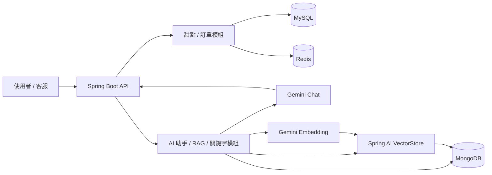

# 甜點訂購系統（redis-dessert）技術文件

> 本文件依目前原始碼與設定檔整理，描述「現在實際怎麼運作」，不是設計草案。  
> 範圍涵蓋 MySQL + Redis 的甜點 / 訂單主流程，以及 MongoDB + Spring AI 的 RAG、關鍵字回答與行為紀錄模組。

> **v6 異動**：`PUT /api/desserts/{id}` 新增 `name` 欄位唯讀檢查——建立（`POST`）後不可再修改甜點名稱，
> 傳入不同值會拋出 `ReadOnlyFieldException`，由 Controller 攔截回傳 `400 Bad Request`。
> 對應調整章節：3.1、4.1、4.5、10.2。

> **v7 異動**：`POST /api/orders` 成功回應改為統一回傳 `OrderResponseDTO`（新增
> `success`／`message`／`subtotal`／`shippingFee` 四個欄位，並用 `@JsonInclude(NON_NULL)`
> 讓 `GET` 查詢不受影響），取代原本手動組裝的 `Map<String, Object>`。
> ⚠️ **Breaking Change**：回應 JSON key 從 `orderId` 改為 `id`，`items[].name` 改為
> `items[].dessertName`，並新增 `phone`、`lineId` 欄位。對應調整章節：4.4、8、9、10.2。

---

## 1. 專案總覽

### 1.1 技術棧

| 類別 | 技術 |
|---|---|
| 框架 | Spring Boot 4.1.0 |
| Java | 21 |
| Web | Spring Boot Starter Web |
| 資料存取 | Spring Data JPA + Hibernate |
| 關聯式資料庫 | MySQL 8 |
| 快取 | Spring Data Redis |
| 文件資料庫 | MongoDB |
| AI / RAG | Spring AI 2.0.0 |
| 驗證 | Bean Validation |
| JSON | Jackson + `jackson-datatype-jsr310` |
| 樣板碼 | Lombok 1.18.46 |
| CSV 解析 | Apache Commons CSV |

### 1.2 功能範圍

目前專案可分成兩個主要域：

1. 甜點 / 訂單域
   - 甜點 CRUD
   - 單筆甜點 Redis 快取
   - 訂單 CRUD
   - 庫存原子扣減
   - 甜點軟刪除
   - 訂單明細快照保存


2. AI / 數據日誌域
   - RAG 知識匯入與查詢
   - 向量資料庫寫入與查詢
   - 關鍵字規則回答
   - CSV 匯入甜點知識、FAQ、關鍵字規則
   - 行為日誌、搜尋紀錄、評論、對話紀錄
   - MongoDB 非同步寫入

### 1.3 執行環境

`docker-compose.yml` 會啟動四個服務。MongoDB 服務使用 `mongodb/mongodb-atlas-local`，用來提供與 MongoDB Atlas 相容的本機環境；`app` 的預設向量庫模式為 `mongodb-atlas`。

| 服務 | 用途 | 主機對外埠 |
|---|---|---|
| `mysql` | 儲存甜點、訂單、訂單明細 | 3306 |
| `redis` | 快取單一甜點資料 | 6339 |
| `mongodb` | 儲存 AI / 行為紀錄資料，同時提供 Atlas 相容的向量庫後端 | 27017 |
| `app` | Spring Boot API | 8080 |

`app` 會等 MySQL、Redis、MongoDB 都通過 healthcheck 後才啟動。

### 1.4 系統架構



### 1.5 主要資料流

| API | 動作 | 實際寫入位置 | 使用技術 |
|---|---|---|---|
| `POST /api/admin/rag/knowledge/faq` | 匯入自由文字知識 | 向量資料庫（VectorStore） | Spring AI VectorStore |
| `POST /api/admin/rag/knowledge/desserts` | 匯入結構化甜點知識 | 向量資料庫（VectorStore） | Spring AI VectorStore |
| `POST /api/admin/rag/knowledge/csv/desserts` | 上傳甜點 CSV 並匯入 | 向量資料庫（VectorStore） | Commons CSV + Spring AI |
| `POST /api/admin/rag/knowledge/csv/faq` | 上傳 FAQ CSV 並匯入 | 向量資料庫（VectorStore） | Commons CSV + Spring AI |
| `POST /api/admin/rag/knowledge/csv/keyword-rules` | 上傳關鍵字規則 CSV | MySQL `keyword_rule` 表（整批覆蓋）→ 成功後刷新記憶體快取 | Commons CSV + Spring Data JPA |
| `POST /api/ai/chat` | AI 對話 | 1. 讀取 VectorStore / 關鍵字規則<br>2. 寫入 MongoDB（非同步儲存對話紀錄） | VectorStore + MongoDB |
| `GET /api/ai/chat?sessionId=...` | 查詢對話歷史 | MongoDB | Spring Data MongoDB |

---

## 2. 模組結構

### 2.1 套件分布

| 套件 | 職責 |
|---|---|
| `com.gtalent.redis.dessert.controller` | 甜點與訂單 API |
| `com.gtalent.redis.dessert.service` | 甜點商業邏輯與例外 |
| `com.gtalent.redis.dessert.repository` | MySQL Repository |
| `com.gtalent.redis.dessert.model` | MySQL Entity |
| `com.gtalent.redis.dessert.dto` | 訂單請求 / 回應 DTO |
| `com.gtalent.redis.dessert.ai.config` | Spring AI、非同步、VectorStore 設定 |
| `com.gtalent.redis.dessert.ai.controller` | RAG / CSV / AI 對話 API |
| `com.gtalent.redis.dessert.ai.message.chat` | AI 回答入口（相容舊版呼叫） |
| `com.gtalent.redis.dessert.ai.message.ingest` | CSV 解析 |
| `com.gtalent.redis.dessert.ai.message.keyword` | 關鍵字規則載入與比對 |
| `com.gtalent.redis.dessert.ai.service` | MongoDB / RAG / AI 主流程 |
| `com.gtalent.redis.dessert.ai.model` | MongoDB Document |
| `com.gtalent.redis.dessert.ai.repository` | MongoDB Repository |
| `com.gtalent.redis.dessert.ai.dto` | AI / 評分 / 知識 DTO |
| `com.gtalent.redis.dessert.ai.exception` | AI 例外 |

---

## 3. MySQL 資料模型

### 3.1 `Dessert`

| 欄位 | 型別 | 說明 |
|---|---|---|
| `id` | Long | 自增主鍵 |
| `name` | String | 品項名稱；**建立（POST）後即為唯讀，PUT 不可修改** |
| `price` | BigDecimal | 單價，必須大於 0 |
| `stock` | Integer | 庫存，不可為負 |
| `enabled` | Boolean | 是否上架 |
| `deleted` | Boolean | 軟刪除標記 |

行為重點：

1. 新增甜點時，`id` 會強制清空，由資料庫產生。
2. 新增甜點時，`deleted` 會強制設成 `false`。
3. 庫存扣到 0 時會自動下架。
4. 一般甜點刪除採軟刪除；另有管理用實體清除端點，使用前須注意歷史資料與 Redis 快取。
5. `name` 只在新增（`POST`）時可以設定，`PUT /api/desserts/{id}` 修改時若帶入與資料庫現有值不同的 `name`，會被擋下並回傳 `400 Bad Request`，避免品項名稱被隨意更改造成資料混亂（例如歷史訂單快照的名稱跟現在的甜點對不上）。詳見 4.5 節。

### 3.2 `Order`

| 欄位 | 型別 | 說明 |
|---|---|---|
| `id` | Long | 自增主鍵 |
| `customerName` | String | 客戶姓名 |
| `phone` | String | 電話 |
| `lineId` | String | LINE 帳號 |
| `totalAmount` | BigDecimal | 含運費總金額 |
| `orderTime` | LocalDateTime | 下單時間 |
| `deleted` | Boolean | 軟刪除標記（一般 CRUD `DELETE` 端點只標記此欄位） |
| `items` | `List<OrderItem>` | 訂單明細，`cascade = ALL`、`orphanRemoval = true`、`LAZY` |

### 3.3 `OrderItem`

訂單明細會做快照：

| 欄位 | 說明 |
|---|---|
| `dessertId` | 對應甜點 ID |
| `dessertName` | 下單當下的名稱快照 |
| `unitPrice` | 下單當下的單價快照 |
| `quantity` | 數量 |
| `lineTotal` | 小計 |

這樣即使甜點後續改名或調價，歷史訂單仍會保留原始資訊。

---

## 4. 甜點 / 訂單流程

### 4.1 甜點 API

| Method | Path | 功能 |
|---|---|---|
| POST | `/api/desserts` | 新增甜點 |
| GET | `/api/desserts` | 查詢全部甜點 |
| GET | `/api/desserts/{id}` | 查詢單一甜點 |
| PUT | `/api/desserts/{id}` | 修改甜點（`name` 建立後唯讀，傳入不同值回傳 `400`；詳見 3.1、4.5 節） |
| DELETE | `/api/desserts/{id}` | 軟刪除單一甜點 |
| DELETE | `/api/desserts` | 批次軟刪除全部甜點 |
| DELETE | `/api/admin/desserts/{id}/purge` | 管理用：實體刪除單一甜點 |

### 4.2 訂單 API

| Method | Path | 功能 |
|---|---|---|
| GET | `/api/orders` | 查詢全部訂單 |
| GET | `/api/orders/{id}` | 查詢單一訂單 |
| POST | `/api/orders` | 建立訂單 |
| DELETE | `/api/orders/{id}` | 軟刪除單一訂單 |
| DELETE | `/api/orders` | 批次軟刪除全部訂單 |
| DELETE | `/api/admin/orders/{id}/purge` | 管理用：實體刪除單一訂單及其明細 |

### 4.3 訂單建立流程

`POST /api/orders` 會做三層檢查：

1. Bean Validation
   - `customerName` 不可空
   - `phone` 必須符合台灣手機格式 `09xxxxxxxx`
   - `items` 不可為空
   - 每筆 `dessertId` / `quantity` 都要合法，且 `quantity >= 1`

2. 金額覆核
   - 後端重新從資料庫讀取甜點單價
   - 不信任前端傳來的金額
   - 小計達到 2000 元免運，否則加收 60 元

3. 庫存扣減
   - 每筆商品都呼叫 `deductStock(...)`
   - 由資料庫層原子 `UPDATE` 完成扣庫存

整個建立訂單流程包在 `@Transactional` 裡，只要其中一筆失敗，前面成功的扣庫存也會一起回滾。

### 4.4 訂單回應格式

查詢與建立訂單統一使用 `OrderResponseDTO` / `OrderItemResponseDTO`，避免直接序列化 JPA Entity：

- `GET /api/orders`
- `GET /api/orders/{id}`
- `POST /api/orders`

這三支 API 的回應格式現在都是同一個 `OrderResponseDTO`。

`OrderResponseDTO` 欄位：`success`、`message`、`id`、`customerName`、`phone`、`lineId`、
`subtotal`、`shippingFee`、`totalAmount`、`orderTime`、`items`。

- `GET` 查詢時，`success`／`message`／`subtotal`／`shippingFee` 這四個欄位一律為 `null`；
  DTO 標註了 `@JsonInclude(NON_NULL)`，序列化時會直接省略這幾個 key，`GET` 回應格式不受影響。
- `POST /api/orders` 成功時，這四個欄位都會帶實際值，用來回報下單結果與金額明細。

> ⚠️ **與舊版的差異（Breaking Change）**：`POST /api/orders` 舊版是手動組裝
> `Map<String, Object>`，key 是 `orderId`；改用 `OrderResponseDTO` 後 key 變成 `id`，
> 品項內的 `name` 也改成跟 `GET` 一致的 `dessertName`，且回應會多出 `phone`、`lineId` 欄位。
> 呼叫端若原本依賴舊 key 名稱解析，需要同步調整。完整範例見 10.2 節。

### 4.5 甜點服務核心邏輯

#### `create(Dessert dessert)`

- 強制 `id = null`
- 強制 `deleted = false`
- 以 `existsByNameAndDeletedFalse(...)` 檢查重複名稱

#### `findAll()`

- 只回傳 `deleted = false` 的資料
- 不走 Redis 快取

#### `getById(Long id)`

- 先查 Redis，key 格式為 `dessert:item:{id}`
- 沒命中才查 MySQL
- 查到後寫回 Redis，TTL 為 10 分鐘

#### `update(Long id, Dessert dessert)`

- **`name` 唯讀檢查（優先於其他邏輯執行）**：若前端傳入的 `name` 不是 `null`，且與資料庫現有值不同，直接拋出 `ReadOnlyFieldException`，不會更新任何欄位；由 Controller 攔截後回傳 `400 Bad Request`。若 `name` 為 `null` 或與現有值相同，則視為合法請求，`name` 一律沿用資料庫原值（不會被前端傳入值覆蓋）。
- 若原本庫存是 0，且本次更新後庫存變成正數，會強制 `enabled = true`
- 其他情況則照前端傳入的 `enabled`
- 更新後清掉對應快取

#### `delete(Long id)` / `deleteAll()`

- 採軟刪除
- 不會真的刪掉資料列
- `deleteAll()` 不會重置自增

#### 管理用實體清除

- `DELETE /api/admin/desserts/{id}/purge` 直接呼叫 `DessertRepository.deleteById(...)`；不會清除 `dessert:item:{id}` 快取，因此舊快取最多可能保留 10 分鐘。
- `DELETE /api/admin/orders/{id}/purge` 直接刪除訂單；`Order.items` 的 `cascade = ALL` 會一併刪除訂單明細。
- 兩支端點目前沒有權限保護，僅應用於受管控的測試或維運情境；正式環境應加入管理員授權。

#### `deductStock(Long id, Integer quantity)`

- Repository 直接執行原子 `UPDATE`
- 若更新筆數為 0，再查一次資料以區分：
   - 品項不存在 / 已刪除
   - 庫存不足
- 成功後清掉 Redis 快取

### 4.6 Repository 重點

`DessertRepository` 目前最重要的查詢與更新方法是：

| 方法 | 用途 |
|---|---|
| `deductStock(...)` | 原子扣庫存 |
| `existsByNameAndDeletedFalse(...)` | 檢查未刪除資料是否重名 |
| `findByDeletedFalse()` | 取出未刪除甜點清單 |
| `findByIdAndDeletedFalse(...)` | 取出未刪除甜點單筆 |

`existsByName(String)` 仍保留在介面中，但實際新增流程已改用 `existsByNameAndDeletedFalse(...)`。

### 4.7 訂單刪除策略

一般 CRUD 流程的訂單與甜點統一採軟刪除策略：

- `Order` 比照 `Dessert`，加上 `deleted` 欄位（預設 `false`）
- `DELETE /api/orders/{id}` 只把該筆訂單標記為 `deleted = true`，不做實體刪除
- `DELETE /api/orders` 整批把尚未刪除的訂單標記為 `deleted = true`
- 訂單明細（`OrderItem`）完全不受影響，資料列與外鍵關聯維持原樣
- 不再呼叫 `resetAutoIncrement()`：資料實際上仍留在資料庫，不需要（也不應該）重置自增計數器
- `GET /api/orders`、`GET /api/orders/{id}` 都改用 `findByDeletedFalse()` / `findByIdAndDeletedFalse(...)`，已軟刪除的訂單不會出現在查詢結果中

這樣設計是為了讓客戶對單、財務對帳、糾紛追查時，歷史訂單資料仍可在資料庫中查得到，
與甜點的軟刪除策略（4.5 節）保持一致。`resetAutoIncrement()` 方法仍保留在
`OrderRepository` / `OrderItemRepository`，供未來若有「真正物理清空」的管理功能使用，但目前的
CRUD 流程不會呼叫到它。

---
## 5. MongoDB / AI 模組

### 5.1 MongoDB Document

| 類別 | 用途 | Collection |
|---|---|---|
| `ActionLog` | 操作日誌 | `action_logs` |
| `SearchHistory` | 搜尋紀錄 | `search_history` |
| `ProductReview` | 商品評論 | `product_reviews` |
| `ChatMessageHistory` | AI 對話歷史 | `chat_message_history` |
| `SystemConfig` | 系統設定 | `system_configs` |

### 5.2 AI / 數據日誌服務

`MongoDataTrackingService` 是 MongoDB 寫入入口，負責：

- 記錄操作日誌
- 記錄搜尋紀錄
- 寫入商品評論
- 儲存 AI 對話歷史
- 查詢最近行為與對話

其中多數寫入都使用 `@Async("mongoLoggingExecutor")`，避免拖慢主流程。

### 5.3 AI 對話 API

| Method | Path | 功能 |
|---|---|---|
| POST | `/api/ai/chat` | 甜點 AI 顧問對話 |
| GET | `/api/ai/chat?sessionId=...` | 查詢某場對話的完整歷史 |

完整的 Request / Response JSON 範例見 10.2 節「AI 對話 API」。

這支 API 的流程是：

1. 先用 `KeywordChatService` 讀取關鍵字規則。
2. 若命中關鍵字規則，會把固定答案作為上下文，仍由 LLM 整理語氣後回覆。
3. 沒命中時，改走向量資料庫相似度檢索。
4. 有命中時，把檢索到的知識內容塞進 prompt。
5. 沒命中時，改用 fallback prompt，避免 AI 編造不存在的菜單資訊。
6. 對話完成後，把問答紀錄、搜尋紀錄與操作日誌寫入 MongoDB。

### 5.4 商品評論 API

目前對外開放一支評論提交端點：

| Method | Path | 功能 |
|---|---|---|
| POST | `/api/desserts/{dessertId}/reviews` | 提交指定甜點的評論 |

`ProductReviewController` 會先透過 MySQL `DessertRepository.findByIdAndDeletedFalse(...)`
確認甜點存在、未軟刪除且已上架；不符合條件時回傳 `404`，不會寫入 MongoDB。

Request body 使用 `ReviewRequestDTO`：

- `userId`：必填、不可空白。
- `rating`：必填，範圍為 1 到 5。
- `comment`：選填，最長 500 個字元。

成功時回傳 `201 Created` 與 `{ "success": true, "data": ... }`。新評論預設
`approved = false`，目前尚未開放評論查詢、審核或刪除端點。`userId` 直接由請求提供，
尚未串接登入身分驗證，正式環境應先補上授權與使用者身分核對。

### 5.5 關鍵字回答與 CSV 規則

`KeywordChatService` 目前負責四件事：

- **啟動種子（新增）**：`@PostConstruct` 時先檢查資料庫是否為空（`keywordRuleRepository.count() == 0`），
  若為空，從 `classpath:rag/keyword-rules.csv`（對應 `src/main/resources/rag/keyword-rules.csv`）
  自動載入一份預設規則寫入資料庫。這個判斷只在「資料庫完全沒有規則」時觸發，
  之後不論資料是種子寫入的還是使用者上傳蓋掉的，下次啟動都不會再被 classpath 檔案覆蓋。
  主要解決 `docker compose down -v` 把 MySQL volume 清空重建後，關鍵字規則變成空的、
  需要每次手動重新上傳的問題。
- 種子判斷完成後，一律從資料庫整批載入規則到記憶體快取（`refreshCacheFromDatabase()`）
- 接收上傳後的 `keyword-rules.csv`，在同一個 `@Transactional` 內先整批覆蓋資料庫（`deleteAllInBatch()` + `saveAll()`），成功後才刷新記憶體快取
- 提供 `match(String)` 與 `answer(String)` 供 AI 流程呼叫

`POST /api/admin/rag/knowledge/csv/keyword-rules` 會先整批覆蓋資料庫、再刷新記憶體快取，不需要重啟應用程式。

> 補充：這是持久化方式的一次轉變——舊版設計依賴外部檔案系統路徑（`classpath` / volume 掛載的 CSV），
> 現在改成 MySQL 承擔持久化，`docker compose down/up --build` 都不會影響規則資料，記憶體快取的角色純粹是「加速比對」，不是資料的唯一來源。
> `down -v` 這種會清空 volume 的情境是例外——資料庫本身被清空了，因此才需要上面的種子機制補回一份預設資料。

> ⚠️ 種子檔案 `src/main/resources/rag/keyword-rules.csv` 若讀取失敗（找不到檔案、格式錯誤），
> 只會記錄警告 / 錯誤 log，不會讓應用程式啟動失敗；此時資料庫仍是空的，
> 需要手動呼叫 `POST /api/admin/rag/knowledge/csv/keyword-rules` 補上資料。

### 5.6 RAG 知識匯入

目前已存在的管理 API：

| Method | Path | 功能 |
|---|---|---|
| POST | `/api/admin/rag/knowledge/faq` | 匯入自由文字知識 |
| POST | `/api/admin/rag/knowledge/desserts` | 批次匯入結構化甜點知識 |

> `GET /api/admin/rag/knowledge/desserts`、`GET /api/admin/rag/knowledge/faq`（依 keyword / dessertId 查詢已匯入知識）已移除。
> 對應的 `RagKnowledgeIngestionService.queryDessertKnowledge(...)` / `queryTextKnowledge(...)` 兩個方法也一併刪除，
> `RagKnowledgeIngestionService` 現在只保留寫入職責（`ingestText` / `ingestDessertKnowledge`）。

流程是：

1. Controller 收到知識內容
2. `RagDocumentService` 轉成 Spring AI `Document`
3. 依 chunk 規則切分
4. `RagKnowledgeIngestionService` 呼叫 `VectorStore.add(...)`
5. 由底層向量庫處理 embedding 寫入

### 5.7 CSV 匯入

CSV 匯入 API 目前有三支，都掛在 `CsvKnowledgeUploadController`（路徑前綴 `/api/admin/rag/knowledge/csv`）：

| Method | Path                                         | 功能 |
|---|----------------------------------------------|---|
| POST | `/api/admin/rag/knowledge/csv/desserts`      | 上傳甜點知識 CSV |
| POST | `/api/admin/rag/knowledge/csv/faq`           | 上傳 FAQ CSV |
| POST | `/api/admin/rag/knowledge/csv/keyword-rules` | 上傳關鍵字規則 CSV |

CSV 格式重點：

- `desserts.csv`: `dessertId,name,category,content,tags`
- `faq.csv`: `category,question,answer,source`
- `keyword-rules.csv`: `keywords,answer,category`

> ⚠️ **與 5.6 節路徑的差異（容易混淆，務必留意）**：`desserts` 與 `faq` 各自有「兩支」端點，
> 是刻意設計成兩種輸入介面，不是重複或冗餘：
>
> | 資料類型 | JSON 版（`RagAdminController`） | CSV 版（`CsvKnowledgeUploadController`） |
> |---|---|---|
> | 甜點知識 | `POST /api/admin/rag/knowledge/desserts`（`@RequestBody List<DessertKnowledgeItem>`） | `POST /api/admin/rag/knowledge/csv/desserts`（`multipart/form-data`，欄位 `file`） |
> | FAQ / 文字知識 | `POST /api/admin/rag/knowledge/faq`（`@RequestBody`，單筆） | `POST /api/admin/rag/knowledge/csv/faq`（CSV 檔案，可批次多筆） |
>
> 兩者最終都會呼叫同一個 `RagKnowledgeIngestionService`（`ingestDessertKnowledge` / `ingestText`），
> 差別只在輸入媒介：JSON 版給呼叫端已經是結構化資料時用（例如另一支後端服務直接傳陣列）；
> CSV 版是給「手上只有一份 CSV 檔案、不想自己寫轉換程式」時的懶人入口，
> Controller 內部會先用 `CsvKnowledgeParser` 解析成同樣的 `List<DessertKnowledgeItem>` 再丟給同一個 service。
> `keyword-rules` 沒有對應的 JSON 版，因為它不走向量庫，是直接更新 `KeywordChatService` 記憶體中的規則清單。

### 5.8 向量庫模式

`app.rag.vector-store.mode` 可切換兩種模式：

| 模式 | 說明 | 適用場景 |
|---|---|---|
| `mongodb-atlas` | 預設模式。使用 `MongoDBAtlasVectorStore`，透過 MongoDB URI 連到 MongoDB Atlas 或 Atlas 相容部署 | 正式環境、本機整合測試 |
| `simple` | 快速測試。使用記憶體向量庫 `SimpleVectorStore`，可從本地 JSON 檔案還原 / 落盤 | 單元測試、原型開發 |

**說明：**

- `mongodb-atlas` 是目前專案預設模式。
- 若透過 `docker-compose.yml` 啟動，本機會使用 `mongodb/mongodb-atlas-local` 容器提供 Atlas 相容後端，程式端仍然維持 `mongodb-atlas` mode。
- `simple` 模式下，Spring Boot 不會自動配置 `SimpleVectorStore`，由 `RagVectorStoreConfig` 手動建立，支援啟動時從本地 JSON 還原、關閉時寫回。

### 5.9 非同步設定

`AsyncConfig` 提供獨立執行緒池 `mongoLoggingExecutor`，用途是：

- 行為日誌
- 搜尋紀錄
- 對話紀錄
- 非同步評論寫入

這個執行緒池不覆蓋 Spring 預設的 `taskExecutor`，避免影響其他 `@Async` 用途。

---

## 6. 設定檔重點

### 6.1 `application.yml`

主要設定包括：

- **MySQL 連線**：`spring.datasource.url` / `username` / `password`
- **Redis 連線**：`spring.data.redis.host` / `port` / `password`
- **MongoDB 連線**：`spring.mongodb.uri`
- **Spring AI 設定**：Google GenAI API key、chat / embedding model
- **RAG 向量庫模式**：`app.rag.vector-store.mode`（預設 `mongodb-atlas`）
- **RAG 分塊規則**：`app.rag.chunk.*`
- **RAG 搜尋參數**：`app.rag.chat.*`

#### 關鍵配置範例

```yaml
spring:
   ai:
      google:
         genai:
            chat:
               options:
                  model: gemini-2.5-flash
            embedding:
               options:
                  model: gemini-embedding-001
                  dimensions: 768

app:
   rag:
      vector-store:
         mode: mongodb-atlas
      chunk:
         chunk-size: 500
         min-chunk-size-chars: 200
      chat:
         top-k: 4
         similarity-threshold: 0.5
```

#### 環境變數覆蓋

每個設定都可透過環境變數覆蓋：

| 配置項 | 環境變數 |
|---|---|
| `app.rag.vector-store.mode` | `APP_RAG_VECTORSTORE_MODE` |
| `spring.mongodb.uri` | `SPRING_DATA_MONGODB_URI` |
| `spring.ai.google.genai.api-key` | `GOOGLE_API_KEY` |

> `application.yml` 使用的設定鍵是 `spring.mongodb.uri`，但目前其值透過
> `${SPRING_DATA_MONGODB_URI:...}` placeholder 讀取；`docker-compose.yml` 也設定這個環境變數。
> 若要改用 `SPRING_MONGODB_URI`，需同步調整該 placeholder。

### 6.2 本機開發環境啟動

#### MongoDB 容器啟動

若要在本機使用預設的 `mongodb-atlas` 模式，直接啟動 `docker-compose.yml` 內建的 MongoDB 服務即可：

```bash
docker compose up -d mysql redis mongodb
```

#### 依賴服務檢查清單

啟動應用前，確保以下服務正常運行：

| 服務 | 主機:埠 | 帳號 | 密碼 | 說明 |
|---|---|---|---|---|
| MySQL | localhost:3306 | user | 123 | 交易型資料庫 |
| Redis | localhost:6339 | （無） | 123 | 單筆甜點快取 |
| MongoDB | localhost:27017 | root | 123 | 向量庫 + 對話紀錄 |

#### MongoDB URI 差異

這個專案在不同啟動方式下，MongoDB 資料庫名稱可能不同：

- `application.yml` 預設值使用 `dessert_ai_db`
- `docker-compose.yml` 注入的環境變數使用 `dessert_mongo_db`

實際連線時請以你啟動的方式為準。

### 6.3 已知設定行為

1. `open-in-view` 沒有在設定檔中明確關閉。
2. 訂單查詢已用 DTO 轉換，因此目前不依賴隱性的 session 行為。
3. RAG 知識匯入目前未看到獨立的權限控制，`/api/admin/rag/knowledge/*` 應視為管理介面，正式環境需要額外保護。
4. `server.error.include-message`、`include-stacktrace`、`include-binding-errors` 都是 `always`，方便開發除錯，但正式環境通常需要調整。

---

## 7. 測試方式

目前專案的測試分成兩層。唯一的測試 `contextLoads()` 標記為 `integration`，Maven Surefire 預設會排除這個 tag，因此一般 `mvn test` 不會執行任何測試，也不需要連線外部服務。

1. 自動化測試
   - 目前 `src/test/java/com/gtalent/redis/dessert/RedisDessertApplicationTests.java` 只有一個標記為 `@Tag("integration")` 的 `@SpringBootTest` `contextLoads()`
   - 以 `integration-test` profile 執行時，主要驗證 Spring 容器是否能在外部服務就緒後正常啟動，而不是完整的商業邏輯測試
   - 專案已引用 `spring-boot-starter-test`，後續可以再補 Repository、Service、Controller 的測試

2. 手動 / 整合測試
   - 透過啟動資料庫與 API，實際驗證甜點、訂單與 AI / RAG 流程

### 7.1 自動化測試執行方式

專案內已包含 Maven Wrapper，因此建議優先使用 Wrapper：

```bash
./mvnw test
```

Windows PowerShell 可用：

```powershell
.\mvnw.cmd test
```

如果本機已安裝 Maven，也可以直接執行：

```bash
mvn test
```

### 7.2 整合測試執行與前置條件

要執行被預設排除的 `contextLoads()`，使用：

```powershell
.\mvnw.cmd test -Pintegration-test
```

`@SpringBootTest` 會載入完整 Spring Context，因此整合測試需要以下服務可連線：

| 服務 | 預設位置 |
|---|---|
| MySQL | `localhost:3306` |
| Redis | `localhost:6339` |
| MongoDB | `localhost:27017` |

最簡單的啟動方式是先開啟依賴服務（指令同 6.2 節「MongoDB 容器啟動」）：`docker compose up -d mysql redis mongodb`

### 7.3 手動 API 驗證方式

啟動應用後，可用 Postman、curl 或 IDE REST Client 逐支確認：

| 功能 | 方法 | 路徑 |
|---|---|---|
| 查詢甜點 | GET | `/api/desserts` |
| 建立甜點 | POST | `/api/desserts` |
| 建立訂單 | POST | `/api/orders` |
| 查詢訂單 | GET | `/api/orders` |
| AI 對話 | POST | `/api/ai/chat` |
| 查詢對話歷史 | GET | `/api/ai/chat?sessionId=...` |
| 提交甜點評論 | POST | `/api/desserts/{dessertId}/reviews` |
| RAG 匯入 | POST | `/api/admin/rag/knowledge/faq` |
| CSV 匯入 | POST | `/api/admin/rag/knowledge/csv/desserts` |

建議的驗證順序：

1. 先確認 MySQL、Redis、MongoDB 都已啟動。
2. 啟動 Spring Boot API。
3. 先測甜點 CRUD，確認 MySQL 與 Redis 快取流程正常。
4. 再測訂單建立，確認庫存扣減與交易回滾正常。
5. 最後測 AI / RAG 相關 API，確認 MongoDB 與向量庫流程正常。

### 7.4 目前測試範圍限制

目前自動化測試覆蓋度偏低；在 `integration-test` profile 下已知只驗證：

- Spring Boot 應用是否能成功起來
- 依賴注入與設定檔是否能順利載入

尚未包含：

- Dessert Service 的庫存與重名規則測試
- Order 建立流程的交易測試
- Redis 快取命中 / 失效測試
- MongoDB 非同步寫入測試
- AI / RAG API 的整合測試

---

## 8. 目前的設計取捨

以下不是立即性 bug，但屬於目前程式碼的明確取捨：

1. `Dessert.name` 沒有資料庫層 unique constraint，重名保護靠 Service 層。
2. `MethodArgumentNotValidException` 仍使用 Spring Boot 預設錯誤格式，未統一成 `{success, message}`。
3. `existsByName(String)` 還留在 Repository 介面中，屬於保留的舊方法。
4. `source` 與 `target` 若殘留舊版 AI 類別，可能造成 bean 衝突；建議切換分支或拉新版本後先清理再建置。
5. **`Order` 相關邏輯目前沒有獨立的 `OrderService`**，`DessertOrderController` 直接注入
   `OrderRepository`／`DessertRepository` 並呼叫查詢、軟刪除、新增、管理用實體刪除等方法，
   未經過 Service 層。這跟 `Dessert` 那條線（Controller → DessertService → DessertRepository）
   的分層方式不一致，屬於目前架構上明確的技術債，非立即性 bug。
6. **`purgeDessert()`（`DELETE /api/admin/desserts/{id}/purge`）繞過 `DessertService.delete()`**，
   直接呼叫 `dessertRepository.deleteById()`，不會清除對應的 Redis 快取
   （key: `dessert:item:{id}`）。若該筆快取尚未過期，`GET /api/desserts/{id}`
   在 TTL 10 分鐘內仍可能回傳「已被刪除」的舊資料。此端點目前也未加上管理員權限檢查
   （`purgeDessert()`、`purgeOrder()` 皆同），正式環境上線前需補上。

### 8.1 已修正紀錄（原「已知 bug」，已於後續版本修正）

> 以下項目曾記錄為已知 bug，經比對目前原始碼與設定檔，已全數修正。保留紀錄供追蹤，
> 若未來重構時發現又跑掉，可作為回歸測試的參考點。

1. **`AiChatService.modelName` 讀取的設定路徑** —— 已修正
   目前 `AiChatService.java` 為 `@Value("${spring.ai.google.genai.chat.options.model:unknown}")`，
   與 `application.yml` 的 `spring.ai.google.genai.chat.options.model` 路徑一致，
   `modelName` 能正確取得實際使用的模型名稱（例如 `gemini-2.5-flash`），
   寫入 `ChatMessageHistory.modelName` 的紀錄不再是永遠的 `"unknown"`。

2. **免運門檻：AI 知識庫內容與實際訂單邏輯** —— 已一致
   `keyword-rules.csv`（`免運|運費多少|運費門檻` 規則）與 `DessertOrderController.FREE_SHIPPING_THRESHOLD`
   目前都是 **2000** 元，兩邊金額一致，AI 客服回答與實際結帳門檻不會有落差。
   （`faq.csv` 目前未包含免運門檻相關的 FAQ 條目，若後續新增，記得比照 2000 元維護。）

3. **`application.yml` 殘留已停用的關鍵字規則檔案路徑設定** —— 已清除
   目前 `application.yml` 已不含 `app.rag.keyword-rules.path` 這段死設定，
   關鍵字規則的持久化與載入完全依賴 MySQL（見 5.4 節），設定檔與程式碼行為一致。

4. **訂單刪除策略與甜點不一致** —— 已統一
   原本訂單採實體刪除、甜點採軟刪除，兩者策略不一致（曾記錄於本節第 2 項取捨）。
   目前 `Order` 已比照 `Dessert` 加上 `deleted` 欄位，`DELETE /api/orders/{id}`、
   `DELETE /api/orders` 都改為軟刪除，`resetAutoIncrement()` 不再被呼叫，
   詳見 4.7 節。

5. **`POST /api/orders` 成功回應格式和 `GET /api/orders*` 不同** —— 已統一
   原本 `POST /api/orders` 是手動組裝 `Map<String, Object>`（曾記錄於本節第 1 項取捨），
   跟 `GET` 系列使用的 `OrderResponseDTO` 是兩套格式。目前已改成三支 API
   （`GET /api/orders`、`GET /api/orders/{id}`、`POST /api/orders`）統一回傳
   `OrderResponseDTO`，`OrderResponseDTO` 新增 `success`／`message`／`subtotal`／
   `shippingFee` 四個欄位（搭配 `@JsonInclude(NON_NULL)`，`GET` 查詢時這幾個欄位為
   `null` 會被自動省略，不影響原本查詢格式）。
   ⚠️ 這次調整屬於 Breaking Change：`POST` 回應的 key 從 `orderId` 改為 `id`，
   品項的 `name` 改為 `dessertName`，並新增 `phone`、`lineId` 欄位，詳見 4.4、10.2 節。

---

## 9. 建議後續工作

1. 補一個全域 `@ControllerAdvice`，統一驗證失敗與例外格式。
2. 視需求加上 RAG 管理 API 的權限保護。
3. 若確定不再使用 `existsByName(String)`，可移除死碼並同步清理註解。
4. 若後續要強化 CI，建議補上 `DessertService`、`Order`、`KeywordChatService` 與 RAG ingest 的測試。
5. 建議在 CSV 知識庫（`faq.csv`／`keyword-rules.csv`）補上「免運門檻」的獨立 FAQ 條目，
   避免只有 `keyword-rules.csv` 有這筆資訊，日後維護時漏改其中一邊。
6. 視需求補一個 `OrderService`，把目前散落在 `DessertOrderController` 裡的訂單查詢／
   軟刪除／新增邏輯搬進去，讓 `Order` 與 `Dessert` 兩條線的分層方式一致。
7. `purgeDessert()` 建議改成呼叫 `DessertService` 提供的刪除方法（或在 Controller 內
   補上清除 Redis 快取的邏輯），避免刪除後短時間內仍讀到快取的舊資料；
   `purgeDessert()`、`purgeOrder()` 上線前需補上管理員權限檢查（例如 `@PreAuthorize`）。

---

## 10. API 測試手冊（Postman 用）

> 本機預設啟動位置為 `http://localhost:8080`，透過 `docker-compose.yml` 啟動亦同（`app` 對外埠為 8080）。
> 下方 10.1 為所有 API 的簡化總覽表，10.2 統一收錄各 API 對應的 Request Body JSON 範本，
> 兩節搭配使用即可在 Postman 完整測試。

### 10.1 API 一覽表

#### (1) 甜點 API

| Method | 功能 | URL |
|---|---|---|
| POST | 新增甜點 | `http://localhost:8080/api/desserts` |
| GET | 查詢全部甜點 | `http://localhost:8080/api/desserts` |
| GET | 查詢單一甜點 | `http://localhost:8080/api/desserts/1001` |
| PUT | 修改甜點 | `http://localhost:8080/api/desserts/1001` |
| DELETE | 軟刪除單一甜點 | `http://localhost:8080/api/desserts/1001` |
| DELETE | 軟刪除全部甜點 | `http://localhost:8080/api/desserts` |
| DELETE | 管理用實體清除甜點 | `http://localhost:8080/api/admin/desserts/1001/purge` |
| POST | 提交甜點評論 | `http://localhost:8080/api/desserts/1001/reviews` |

#### (2) 訂單 API

| Method | 功能 | URL |
|---|---|---|
| POST | 建立訂單 | `http://localhost:8080/api/orders` |
| GET | 查詢全部訂單 | `http://localhost:8080/api/orders` |
| GET | 查詢單一訂單 | `http://localhost:8080/api/orders/1` |
| DELETE | 軟刪除單一訂單 | `http://localhost:8080/api/orders/1` |
| DELETE | 軟刪除全部訂單 | `http://localhost:8080/api/orders` |
| DELETE | 管理用實體清除訂單 | `http://localhost:8080/api/admin/orders/1/purge` |

#### (3) AI 對話 API

| Method | 功能 | URL |
|---|---|---|
| POST | 發送對話訊息 | `http://localhost:8080/api/ai/chat` |
| GET | 查詢對話歷史 | `http://localhost:8080/api/ai/chat?sessionId=demo-session-001` |

#### (4) RAG 知識匯入管理 API

| Method | 功能 | URL |
|---|---|---|
| POST | 匯入自由文字知識 | `http://localhost:8080/api/admin/rag/knowledge/faq` |
| POST | 批次匯入結構化甜點知識 | `http://localhost:8080/api/admin/rag/knowledge/desserts` |

#### (5) CSV 匯入 API

| Method | 功能 | URL                                                           | Body 型態 |
|---|---|---------------------------------------------------------------|---|
| POST | 上傳甜點知識 CSV | `http://localhost:8080/api/admin/rag/knowledge/csv/desserts`      | form-data，Key=`file` |
| POST | 上傳 FAQ CSV | `http://localhost:8080/api/admin/rag/knowledge/csv/faq`          | form-data，Key=`file` |
| POST | 上傳關鍵字規則 CSV | `http://localhost:8080/api/admin/rag/knowledge/csv/keyword-rules` | form-data，Key=`file` |

> CSV 三支在 Postman 都要選 **Body → form-data**，Key 固定填 `file`、型別切換成 **File**，不要選 raw/JSON。
> RAG 相關 API（10.1 第 4、5 類）目前無權限保護，正式環境需另外加上管理員驗證。

---

### 10.2 JSON 範本（依上表順序對應）

#### 甜點 API

**新增甜點**（`POST /api/desserts`）

```json
{
  "name": "70% 苦甜巧克力布朗尼",
  "price": 120,
  "stock": 50,
  "enabled": true
}
```

> `id` 不需傳（新增時會強制清空由資料庫產生）；`deleted` 不需傳（新增時強制為 `false`）。

**修改甜點**（`PUT /api/desserts/{id}`）

```json
{
  "name": "70% 苦甜巧克力布朗尼",
  "price": 135,
  "stock": 40,
  "enabled": true
}
```

> `name` 建立後即為唯讀：`PUT` 時的 `name` 必須跟資料庫現有值完全一致（或不傳 / 傳 `null`），
> 否則會回傳 `400 Bad Request`，不會更新任何欄位。實際可修改的是 `price`、`stock`、`enabled`。

若 `name` 傳入與現有值不同，錯誤回應範例：

```json
{
  "success": false,
  "message": "甜點名稱建立後不可修改，目前名稱為「70% 苦甜巧克力布朗尼」，不可改為「XXX」"
}
```

其餘甜點 API（查詢全部／查詢單一／軟刪除／管理用實體清除）皆無 Request Body。

**提交甜點評論**（`POST /api/desserts/{dessertId}/reviews`）

```json
{
  "userId": "user-001",
  "rating": 5,
  "comment": "布朗尼口感濕潤，會再回購。"
}
```

> 甜點必須存在、未軟刪除且為上架狀態；成功會回傳 `201 Created`，新評論預設為待審核（`approved: false`）。

---

#### 訂單 API

**建立訂單**（`POST /api/orders`）

```json
{
  "customerName": "王小明",
  "phone": "0912345678",
  "lineId": "wang_dessert",
  "items": [
    { "dessertId": 1001, "quantity": 2 },
    { "dessertId": 1002, "quantity": 1 }
  ]
}
```

> `phone` 須符合 `09xxxxxxxx` 格式；金額由後端計算，不需傳金額欄位。

預期回應（`OrderResponseDTO`，格式與 `GET /api/orders/{id}` 一致，只是多帶 `success`／`message`／`subtotal`／`shippingFee`）：

```json
{
  "success": true,
  "message": "下單成功",
  "id": 1,
  "customerName": "王小明",
  "phone": "0912345678",
  "lineId": "wang_dessert",
  "subtotal": 295,
  "shippingFee": 60,
  "totalAmount": 355,
  "orderTime": "2026-07-17T10:30:00",
  "items": [
    { "dessertId": 1001, "dessertName": "70% 苦甜巧克力布朗尼", "unitPrice": 120, "quantity": 2, "lineTotal": 240 },
    { "dessertId": 1002, "dessertName": "法式馬卡龍", "unitPrice": 55, "quantity": 1, "lineTotal": 55 }
  ]
}
```

> ⚠️ 若您手上還留有舊版文件或前端程式碼，注意 key 已從 `orderId` 改成 `id`，
> 品項的 `name` 改成 `dessertName`，新增了 `phone`、`lineId`。詳見 4.4 節。

其餘訂單 API（查詢全部／查詢單一／軟刪除／管理用實體清除）皆無 Request Body。

> 補充：`DELETE /api/orders/{id}`、`DELETE /api/orders` 目前為軟刪除，只會把 `Order.deleted`
> 標記為 `true`，資料與訂單明細仍留在 MySQL，不會真的被砍掉；刪除後再用
> `GET /api/orders/{id}` 查詢會回傳 `404 Not Found`（等同「找不到」，行為與甜點一致）。
>
> `DELETE /api/admin/desserts/{id}/purge` 與 `DELETE /api/admin/orders/{id}/purge` 則是實體清除端點。兩者目前未加權限保護；甜點實體清除也不會同步清除 Redis 快取，請只用於受控維運情境。

---

#### AI 對話 API

**發送對話訊息**（`POST /api/ai/chat`）

```json
{
  "sessionId": "demo-session-001",
  "message": "有推薦的巧克力甜點嗎？"
}
```

> `message` 長度上限 1000 字。

預期回應：

```json
{
  "success": true,
  "data": {
    "sessionId": "demo-session-001",
    "reply": "推薦您試試 70% 苦甜巧克力布朗尼，口感濃郁扎實，是店內招牌喔！",
    "ragHit": true,
    "contextDocCount": 1,
    "timestamp": "2026-07-17T10:35:00"
  }
}
```

**查詢對話歷史**（`GET /api/ai/chat?sessionId=...`）無 Request Body。

---

#### RAG 知識匯入管理 API

**匯入自由文字知識**（`POST /api/admin/rag/knowledge/faq`）

```json
{
  "content": "布朗尼是店內招牌，採用 70% 苦甜巧克力製成，口感濃郁扎實，適合心情低落、想要療癒系甜點的顧客。",
  "metadata": {
    "category": "巧克力系",
    "source": "admin"
  }
}
```

**批次匯入結構化甜點知識**（`POST /api/admin/rag/knowledge/desserts`，JSON 陣列）

```json
[
  {
    "dessertId": 1001,
    "name": "70% 苦甜巧克力布朗尼",
    "category": "巧克力系",
    "content": "布朗尼是店內招牌，採用 70% 苦甜巧克力製成，口感濃郁扎實，適合心情低落、想要療癒系甜點的顧客。",
    "tags": ["巧克力", "濃郁", "療癒", "送禮"]
  },
  {
    "dessertId": 1002,
    "name": "法式馬卡龍",
    "category": "輕食系",
    "content": "馬卡龍外殼酥脆、內裡濕潤綿密，口味多變，適合搭配下午茶或作為精緻小禮。",
    "tags": ["法式", "精緻", "下午茶", "送禮"]
  }
]
```

兩支預期回應格式皆為：

```json
{
  "status": "success",
  "itemCount": 2,
  "chunkCount": 2
}
```

---

#### CSV 匯入 API

三支皆為 `multipart/form-data`，無 JSON body，Postman 設定與 curl 對照如下：

| CSV | Postman Body | curl |
|---|---|---|
| `desserts.csv` | form-data，Key=`file`，Type=File | `curl -X POST http://localhost:8080/api/admin/rag/knowledge/csv/desserts -F "file=@desserts.csv"` |
| `faq.csv` | form-data，Key=`file`，Type=File | `curl -X POST http://localhost:8080/api/admin/rag/knowledge/csv/faq -F "file=@faq.csv"` |
| `keyword-rules.csv` | form-data，Key=`file`，Type=File | `curl -X POST http://localhost:8080/api/admin/rag/knowledge/csv/keyword-rules -F "file=@keyword-rules.csv"` |

預期回應範例（以 `keyword-rules.csv` 為例）：

```json
{
  "status": "success",
  "ruleCount": 5
}
```

---

### 10.3 建議測試順序

1. 先跑 **甜點 API** 的「新增甜點」，確認 MySQL / Redis 正常。
2. 跑 **CSV 匯入 API** 把 `desserts.csv`、`faq.csv`、`keyword-rules.csv` 都匯入一次，作為 AI 對話的知識基礎。
3. 跑 **AI 對話 API**，先問一個會命中關鍵字規則的問題（例如「營業時間」），確認 `ragHit: true` 且回覆內容符合 CSV 設定；再問一個甜點相關問題（例如「有推薦的巧克力甜點嗎？」），確認向量檢索有正確命中。
4. 跑 **訂單 API** 的「建立訂單」，確認庫存扣減、金額計算與免運門檻（2000 元）符合預期。
5. 最後用 **AI 對話 API 的查詢對話歷史** 與 **甜點／訂單 API 的查詢類端點** 交叉確認資料是否都正確落地。
